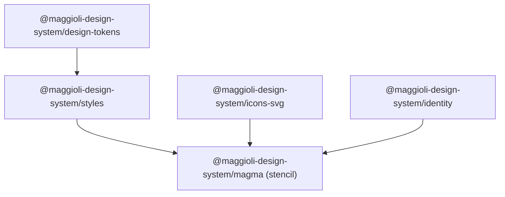
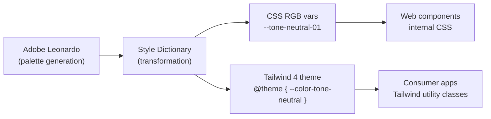

# ARCHITECTURE.md

## 1. System Overview

Magma is a monorepo managed with NX and Yarn workspaces. It is composed of five independent sub-projects, each published as a separate npm package under the `@maggioli-design-system` scope. Sub-projects have a strict one-directional dependency graph: no circular dependencies are allowed.



**Required build order**: `design-tokens` → `styles` → `icons` → `stencil`

---

## 2. Sub-projects

### 2.1 `design-tokens`

Generates design tokens for colors, typography, spacing, borders and other platform-agnostic values.

- Built on **Adobe Leonardo** (color palette generation with WCAG contrast ratios) and **Style Dictionary** (token transformation and output)
- Outputs tokens in multiple formats: CSS custom properties, Tailwind 4 theme, Flutter/Dart, JSON
- Color palette categories: `tone` (neutrals), `status` (info/success/warning/error), `label` (semantic accent colors), `variant` (primary/secondary/ai), `brand`
- Token levels: **primitive** (raw values) → **semantic** (role-based) → **component** (component-scoped CSS vars)
- Exposes a CLI (`npx magma-design-tokens`) to generate custom palettes from a config file

Key output files consumed by other sub-projects:
```
dist/css/colors-rgb-*.css           # RGB color vars (required by Tailwind and web components)
dist/css/colors-hex-*.css           # HEX color vars (plain CSS usage)
dist/css/tailwind-theme-color.css
dist/css/tailwind-theme-typography.css
```

### 2.2 `identity`

Static brand assets: logos, avatars, and brand imagery for all Maggioli Group products. Read-only from consumer projects — never modify these assets directly.

Asset categories:
- `resources/brand/` — logos per brand (gruppo-maggioli, maggioli-editore, rnd, magma)
- `resources/avatar/` — avatar illustrations per brand

### 2.3 `svg-icons`

The full SVG icon library. Icons are referenced by filename slug inside components via the `icon` prop. The `mds-icon` component fetches them at runtime from a path configured via `sessionStorage`.

```javascript
// Required setup in every consumer application
window.sessionStorage.setItem('mdsIconSvgPath', 'assets/img/svg/');
```

Icons follow a semantic slug naming convention (e.g. `action-email-send`, `status-warning`). See `projects/svg-icons/svg/` for the full list.

### 2.4 `styles`

CSS and Tailwind 4 styles consumed by the web component library and consumer applications.

| Output file | Purpose |
|---|---|
| `dist/css/globals.css` | Global CSS custom properties (`--magma-*` design decisions) |
| `dist/css/reset.css` | Opinionated CSS reset |
| `dist/css/colors-rgb-*.css` | RGB color tokens (required for Tailwind and web components) |
| `dist/css/hydrated.css` | FOUC prevention for StencilJS |
| `dist/css/animations.css` | Shared animations |
| `dist/tailwind/` | Tailwind 4 layers: base, typography, utilities |

CSS cascade layer order (consumer apps must respect this):
```
reset → vendor → theme → base → components → utilities → overrides
```

Dark mode is handled via palette-level CSS custom properties. Activation classes on `<html>`:
- `dark-mode` — manual dark mode
- `system-mode` — follows OS preference
- `pref-theme-scheme-dark / light / all` — fine-grained control

Global design decisions overridable via CSS custom properties on `:root`:
- `--magma-corner-shape` — controls corner shape globally (default: `squircle`)
- `--magma-disabled-opacity` — default: `0.5`
- `--magma-outline-focus` — focus ring style
- Z-index scale: header `1000` → notification `2000` → modal `3000` → backdrop `4000` → dropdown `5000` → tooltip `6000` → theme-overlay `7000` → context-menu `8000`

### 2.5 `stencil`

The web component library. ~115 components built with StencilJS, compiled to standard Custom Elements. Also outputs framework-specific wrappers:

- `@maggioli-design-system/magma` — vanilla JS / HTML
- `@maggioli-design-system/magma-react` — React wrapper
- `@maggioli-design-system/magma-angular` — Angular wrapper

---

## 3. Component Architecture

### 3.1 Shadow DOM vs Scoped

Most components use `shadow: true` (full Shadow DOM encapsulation). Form-associated components (e.g. `mds-input`, `mds-input-select`) use `scoped: true` so the native `<input>` participates in form submission natively.

### 3.2 Component categories

| Category | Description | Examples |
|---|---|---|
| **Primitive** | Atomic building blocks, used internally by other components | `mds-text`, `mds-icon`, `mds-spinner` |
| **Atom** | Single-purpose UI element | `mds-button`, `mds-badge`, `mds-avatar` |
| **Molecule** | Composed of atoms, single concern | `mds-input`, `mds-chip`, `mds-breadcrumb` |
| **Compound** | Parent + required child component pair | `mds-accordion` + `mds-accordion-item`, `mds-card` + `mds-card-header/content/footer/media` |
| **Organism** | Complex layout component | `mds-table`, `mds-modal`, `mds-header` |
| **Preference** | User preference controls (theme, contrast, animation) | `mds-pref`, `mds-pref-theme`, `mds-pref-contrast` |

### 3.3 Compound component pattern

Several components work exclusively as parent/child pairs. The child must always be a direct slot child of the parent:

```html
<!-- correct -->
<mds-accordion>
  <mds-accordion-item>...</mds-accordion-item>
</mds-accordion>

<!-- correct -->
<mds-card>
  <mds-card-header slot="header">...</mds-card-header>
  <mds-card-content slot="content">...</mds-card-content>
  <mds-card-footer slot="footer">...</mds-card-footer>
</mds-card>

<!-- incorrect — never wrap compound children in arbitrary elements -->
<mds-accordion>
  <div>
    <mds-accordion-item>...</mds-accordion-item>
  </div>
</mds-accordion>
```

### 3.4 Tone system

Components that carry visual weight expose both a `variant` (color role) and a `tone` (visual intensity) prop. These two axes are independent:

| Tone | Description |
|---|---|
| `strong` | Filled, high contrast (default) |
| `weak` | Tinted background, lower contrast |
| `outline` | Border only, transparent background |
| `text` | No background or border, text-only |

> ⚠️ Magma 2.0 breaking rename: `ghost` → `outline`, `quiet` → `text`. Old names are not supported.

### 3.5 CSS custom properties per component

Every component exposes scoped CSS custom properties for controlled overrides (e.g. `--mds-button-radius`, `--mds-button-background`). These are the **only supported way** to style components from the outside. Never write CSS that targets internal shadow DOM nodes directly.

---

## 4. Token Flow



Color values in CSS must always use the RGB format with the `rgb()` wrapper:

```css
/* correct — supports opacity modifiers */
color: rgb(var(--tone-neutral-03));

/* incorrect — hex vars cannot be used with opacity */
color: var(--tone-neutral-03);
```

---

## 5. Consumer Application Setup

Minimum required imports for a consumer application:

```css
/* 1. Color tokens — RGB format required */
@import '@maggioli-design-system/styles/dist/css/colors-rgb-tones.css';
@import '@maggioli-design-system/styles/dist/css/colors-rgb-status.css';
@import '@maggioli-design-system/styles/dist/css/colors-rgb-label.css';
@import '@maggioli-design-system/styles/dist/css/colors-rgb-brand.css';

/* 2. Global design decisions and resets */
@import '@maggioli-design-system/styles/dist/css/globals.css';
@import '@maggioli-design-system/styles/dist/css/reset.css';

/* 3. FOUC prevention — must load before components render */
@import '@maggioli-design-system/styles/dist/css/hydrated.css';
```

```javascript
// Register all web components
import { defineCustomElements } from '@maggioli-design-system/magma/loader';
defineCustomElements();

// Set icon path — required for mds-icon to work
window.sessionStorage.setItem('mdsIconSvgPath', 'assets/img/svg/');
```