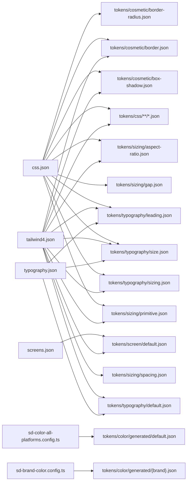
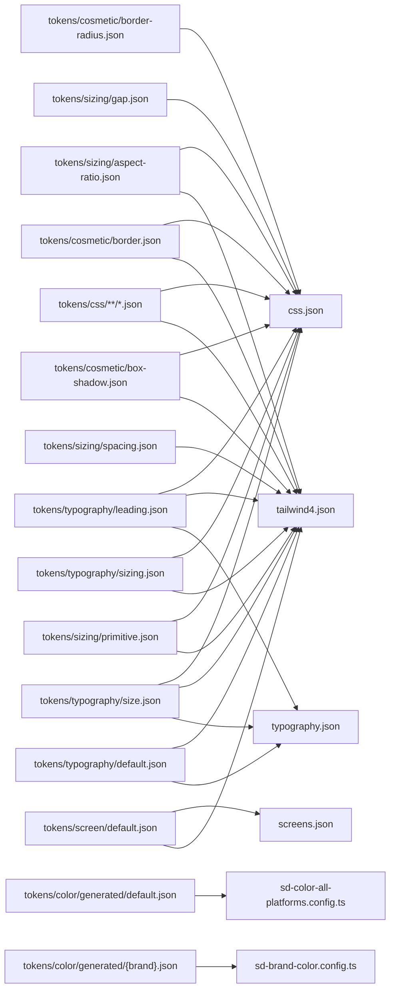

Di seguito è rappresentato l'uso dei tokens e delle relative configurazioni di styledictionary per la creazione delle variabili nei corrispettivi formati.

> Nota: le configurazioni in ts usano in maniera dinamica i colori generati dalla build della palette nella cartella tokens/color/generated

### Configurazioni → File usati

### File → Configurazioni che lo usano

