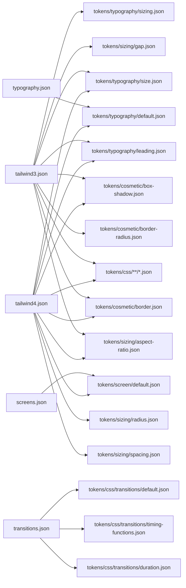
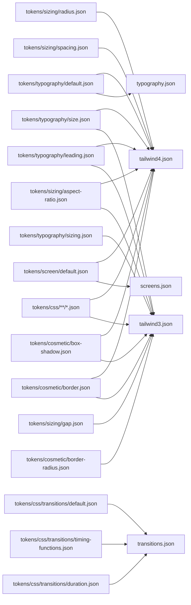

Di seguito l'uso dei token e delle configurazioni di Style Dictionary che li trasformano nei formati di output. `scripts/build.ts` le esegue in quest'ordine: colori, `typography.json`, `tailwind3.json`, `screens.json`, `tailwind4.json`, `transitions.json`.

> Nota: le due configurazioni in ts (`sd-color-all-platforms.config.ts`, `sd-brand-color.config.ts`) non leggono file: ricevono l'albero dei colori in memoria da `createColorTokens` (`src/lib/color.mts`), il primo intero, il secondo un gruppo di export alla volta. I file in `tokens/color/generated/` sono SCRITTI dalla build (per `generate-figma-tokens` e come baseline del diff del playground), non letti da queste configurazioni.

### Configurazioni -> file usati

```mermaid
flowchart LR
  typography_json["typography.json"] --> tokens_typography_default_json["tokens/typography/default.json"]
  tailwind3_json["tailwind3.json"] --> tokens_cosmetic_border_radius_json["tokens/cosmetic/border-radius.json"]
  tailwind3_json["tailwind3.json"] --> tokens_cosmetic_border_json["tokens/cosmetic/border.json"]
  tailwind3_json["tailwind3.json"] --> tokens_cosmetic_box_shadow_json["tokens/cosmetic/box-shadow.json"]
  tailwind3_json["tailwind3.json"] --> tokens_css______json["tokens/css/**/*.json"]
  tailwind3_json["tailwind3.json"] --> tokens_sizing_aspect_ratio_json["tokens/sizing/aspect-ratio.json"]
  tailwind3_json["tailwind3.json"] --> tokens_sizing_gap_json["tokens/sizing/gap.json"]
  tailwind3_json["tailwind3.json"] --> tokens_typography_leading_json["tokens/typography/leading.json"]
  tailwind3_json["tailwind3.json"] --> tokens_typography_size_json["tokens/typography/size.json"]
  tailwind3_json["tailwind3.json"] --> tokens_typography_sizing_json["tokens/typography/sizing.json"]
  screens_json["screens.json"] --> tokens_screen_default_json["tokens/screen/default.json"]
  tailwind4_json["tailwind4.json"] --> tokens_sizing_spacing_json["tokens/sizing/spacing.json"]
  tailwind4_json["tailwind4.json"] --> tokens_sizing_aspect_ratio_json["tokens/sizing/aspect-ratio.json"]
  tailwind4_json["tailwind4.json"] --> tokens_sizing_radius_json["tokens/sizing/radius.json"]
  tailwind4_json["tailwind4.json"] --> tokens_typography_default_json["tokens/typography/default.json"]
  tailwind4_json["tailwind4.json"] --> tokens_typography_leading_json["tokens/typography/leading.json"]
  tailwind4_json["tailwind4.json"] --> tokens_typography_size_json["tokens/typography/size.json"]
  tailwind4_json["tailwind4.json"] --> tokens_css______json["tokens/css/**/*.json"]
  tailwind4_json["tailwind4.json"] --> tokens_cosmetic_border_json["tokens/cosmetic/border.json"]
  tailwind4_json["tailwind4.json"] --> tokens_cosmetic_box_shadow_json["tokens/cosmetic/box-shadow.json"]
  tailwind4_json["tailwind4.json"] --> tokens_screen_default_json["tokens/screen/default.json"]
  transitions_json["transitions.json"] --> tokens_css_transitions_duration_json["tokens/css/transitions/duration.json"]
  transitions_json["transitions.json"] --> tokens_css_transitions_timing_functions_json["tokens/css/transitions/timing-functions.json"]
  transitions_json["transitions.json"] --> tokens_css_transitions_default_json["tokens/css/transitions/default.json"]
```

### File -> configurazioni che lo usano

```mermaid
flowchart LR
  tokens_typography_default_json["tokens/typography/default.json"] --> typography_json["typography.json"]
  tokens_typography_default_json["tokens/typography/default.json"] --> tailwind4_json["tailwind4.json"]
  tokens_cosmetic_border_radius_json["tokens/cosmetic/border-radius.json"] --> tailwind3_json["tailwind3.json"]
  tokens_cosmetic_border_json["tokens/cosmetic/border.json"] --> tailwind3_json["tailwind3.json"]
  tokens_cosmetic_border_json["tokens/cosmetic/border.json"] --> tailwind4_json["tailwind4.json"]
  tokens_cosmetic_box_shadow_json["tokens/cosmetic/box-shadow.json"] --> tailwind3_json["tailwind3.json"]
  tokens_cosmetic_box_shadow_json["tokens/cosmetic/box-shadow.json"] --> tailwind4_json["tailwind4.json"]
  tokens_css______json["tokens/css/**/*.json"] --> tailwind3_json["tailwind3.json"]
  tokens_css______json["tokens/css/**/*.json"] --> tailwind4_json["tailwind4.json"]
  tokens_sizing_aspect_ratio_json["tokens/sizing/aspect-ratio.json"] --> tailwind3_json["tailwind3.json"]
  tokens_sizing_aspect_ratio_json["tokens/sizing/aspect-ratio.json"] --> tailwind4_json["tailwind4.json"]
  tokens_sizing_gap_json["tokens/sizing/gap.json"] --> tailwind3_json["tailwind3.json"]
  tokens_typography_leading_json["tokens/typography/leading.json"] --> tailwind3_json["tailwind3.json"]
  tokens_typography_leading_json["tokens/typography/leading.json"] --> tailwind4_json["tailwind4.json"]
  tokens_typography_size_json["tokens/typography/size.json"] --> tailwind3_json["tailwind3.json"]
  tokens_typography_size_json["tokens/typography/size.json"] --> tailwind4_json["tailwind4.json"]
  tokens_typography_sizing_json["tokens/typography/sizing.json"] --> tailwind3_json["tailwind3.json"]
  tokens_screen_default_json["tokens/screen/default.json"] --> screens_json["screens.json"]
  tokens_screen_default_json["tokens/screen/default.json"] --> tailwind4_json["tailwind4.json"]
  tokens_sizing_spacing_json["tokens/sizing/spacing.json"] --> tailwind4_json["tailwind4.json"]
  tokens_sizing_radius_json["tokens/sizing/radius.json"] --> tailwind4_json["tailwind4.json"]
  tokens_css_transitions_duration_json["tokens/css/transitions/duration.json"] --> transitions_json["transitions.json"]
  tokens_css_transitions_timing_functions_json["tokens/css/transitions/timing-functions.json"] --> transitions_json["transitions.json"]
  tokens_css_transitions_default_json["tokens/css/transitions/default.json"] --> transitions_json["transitions.json"]
```

### Configurazioni -> output (sotto `dist/`)

| Configurazione | Output |
| --- | --- |
| `sd-color-all-platforms.config.ts` | la palette intera: `css/colors-{hex,rgb}.css`, `js/colors-css-vars.js`, `js/tailwind-colors-css-vars.js`, `css/tailwind-theme-color.css`, e i formati nativi e di design (flutter, android, ios, scss, gimp, json) |
| `sd-brand-color.config.ts` | un gruppo di export per volta: `css/colors-{hex,rgb}-<gruppo>.css`, `flutter/colors-<gruppo>.dart` |
| `typography.json` | `js/tailwind-font-family.js`, `js/tailwind-font-size.js`, `js/tailwind-leading.js`, `flutter/fonts.dart` |
| `tailwind3.json` | `js/tailwind-props.js` |
| `screens.json` | `js/tailwind-screens.js` |
| `tailwind4.json` | `css/tailwind-theme-typography.css`, `css/typography.css` |
| `transitions.json` | `css/transitions.css` |
