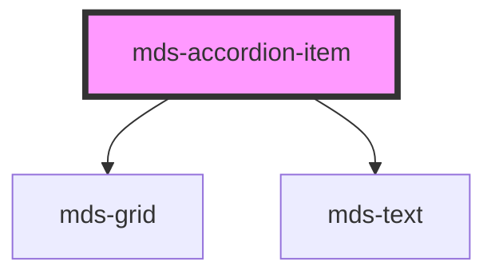

# mds-accordion-item

<!-- Auto Generated Below -->

## Properties

| Property                   | Attribute     | Description                                                      | Type                                                       | Default     |
| -------------------------- | ------------- | ---------------------------------------------------------------- | ---------------------------------------------------------- | ----------- |
| `description` _(required)_ | `description` | Specifies the title shown when the accordion is closed or opened | `string`                                                   | `undefined` |
| `opened`                   | `opened`      | Specifies if the accordion item is opened or not                 | `boolean`                                                  | `undefined` |
| `typography`               | `typography`  | Specifies the typography of the element                          | `"action" \| "h1" \| "h2" \| "h3" \| "h4" \| "h5" \| "h6"` | `'h5'`      |

## Events

| Event         | Description                        | Type                  |
| ------------- | ---------------------------------- | --------------------- |
| `openedEvent` | Emits when the accordion is opened | `CustomEvent<string>` |

## CSS Custom Properties

| Name             | Description                                          |
| ---------------- | ---------------------------------------------------- |
| `--border-color` | Sets the color of the border that separates elements |
| `--color`        | Sets the text-color of the element                   |

## Dependencies

### Depends on

- [mds-grid](../mds-grid)
- [mds-text](../mds-text)

### Graph

----------------------------------------------

Built with love @ **Maggioli Informatica / R&D Department**
