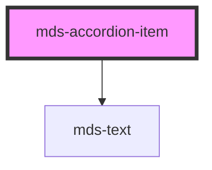

# mds-accordion-item


This is a web-component from Maggioli Design System [Magma](https://magma.maggiolicloud.it), built with StencilJS, TypeScript, Storybook. It's based on the web-component standard and it's designed to be agnostic from the JavaScript framework you are using.

<!-- Auto Generated Below -->


## Usage

### 1. Description

The `<mds-accordion-item>` web component is a single collapsible panel of the Magma Design System, designed to be slotted inside its parent [`<mds-accordion>`](../../mds-accordion). It renders a header button paired with an expandable content region; the parent controls which items are open.

#### Semantic Behavior

- **Compound child only**: Must be placed as a direct default-slot child of `<mds-accordion>`; it is not used standalone, and the parent's slot should hold only `mds-accordion-item` elements, not mixed child types.
- **Parent-driven selection**: Clicking the header requests a toggle, but the authoritative open/closed state is resolved by the parent - in single mode opening one item closes its siblings, while in `multiple` mode each item toggles independently.
- **Emitted events**: `mdsAccordionItemSelect` on open, `mdsAccordionItemUnselect` on close, and `mdsAccordionItemChange` on any toggle, each carrying `{ id, selected }`.
- **Default slot**: Holds the collapsible body content (text, HTML, or components).

#### Properties & Visual Configurations

- **`label`** sets the always-visible header text shown whether the item is open or closed.
- **`selected`** controls whether the panel is expanded; leave it to the parent to manage in coordinated accordions, or set it initially to have a panel start open.
- **`typography`** picks the title style applied to the header label, defaulting to `h5`. Choose a heavier heading level (`h1`–`h4`) for more prominent section headers or `action` for a compact, control-like header; match it to the document's heading hierarchy so the accordion reads correctly to assistive technology.


### 2. Pattern

Correct and idiomatic ways to use the `<mds-accordion-item>` component, ordered from most common to most specialized. Patterns assume a working knowledge of compound component rules documented in [`docs/COMPONENTS.md`](../../../../../../docs/COMPONENTS.md) and the generic stencil rules in [`projects/stencil/SPEC.md`](../../../../SPEC.md).

#### Basic Accordion

The canonical form. Place one or more `<mds-accordion-item>` elements as direct children of [`<mds-accordion>`](../../mds-accordion). Provide `label` for the header text and put the body content in the default slot.

```html
<mds-accordion>
  <mds-accordion-item label="Cos'e' Magma?">
    <mds-text>Magma e' il design system di Maggioli, basato su web components.</mds-text>
  </mds-accordion-item>
  <mds-accordion-item label="Come si installa?">
    <mds-text>Importa il loader e chiama defineCustomElements() nell'entry point.</mds-text>
  </mds-accordion-item>
  <mds-accordion-item label="E' compatibile con React?">
    <mds-text>Si', usa il pacchetto @maggioli-design-system/magma-react.</mds-text>
  </mds-accordion-item>
</mds-accordion>
```

#### Panel Open by Default

Set `selected` on the item you want pre-expanded. The parent resolves conflicts on load in single mode, so only set it on one item unless `multiple` is also set on the parent.

```html
<mds-accordion>
  <mds-accordion-item label="Introduzione" selected>
    <mds-text>Questa sezione e' aperta per impostazione predefinita.</mds-text>
  </mds-accordion-item>
  <mds-accordion-item label="Prerequisiti">
    <mds-text>Node.js 18+ e un package manager npm o pnpm.</mds-text>
  </mds-accordion-item>
</mds-accordion>
```

#### Multiple Panels Open Simultaneously

Add `multiple` to `<mds-accordion>` so the user can expand more than one panel at once. Individual items do not change - the parent mode governs the behaviour.

```html
<mds-accordion multiple>
  <mds-accordion-item label="Configurazione di base">
    <mds-text>Imposta i token di colore e il tema nell'entry point dell'applicazione.</mds-text>
  </mds-accordion-item>
  <mds-accordion-item label="Configurazione avanzata" selected>
    <mds-text>Personalizza i CSS custom properties per adattare il tema al brand.</mds-text>
  </mds-accordion-item>
  <mds-accordion-item label="Integrazione CI/CD" selected>
    <mds-text>Configura il job di build per generare documentation.json e readme.md.</mds-text>
  </mds-accordion-item>
</mds-accordion>
```

#### Non-closable Accordion

Set the parent `closable` prop to `false` via JavaScript to prevent the user from collapsing an open panel. An open item then stays open until another item is clicked (single mode only). Because `closable` defaults to `true`, do not set it via the HTML attribute - assign it through the element property instead.

```html
<mds-accordion id="steps">
  <mds-accordion-item label="Passo 1 - Installazione" selected>
    <mds-text>Esegui npm install @maggioli-design-system/magma per aggiungere il pacchetto.</mds-text>
  </mds-accordion-item>
  <mds-accordion-item label="Passo 2 - Configurazione">
    <mds-text>Importa defineCustomElements e registra i componenti nell'app.</mds-text>
  </mds-accordion-item>
</mds-accordion>

<script>
  document.querySelector('#steps').closable = false;
</script>
```

#### Typography for Section Headers

Use `typography` to match the panel header to the surrounding document hierarchy. Default is `h5`; use `h3` or `h4` for top-level FAQ sections, `action` for compact control-bar items.

```html
<!-- FAQ section at heading level 3 -->
<mds-accordion>
  <mds-accordion-item label="Come gestisco gli aggiornamenti?" typography="h3">
    <mds-text>Ogni release e' documentata nel changelog con note di migrazione.</mds-text>
  </mds-accordion-item>
  <mds-accordion-item label="Posso personalizzare i colori?" typography="h3">
    <mds-text>Si', tramite i CSS custom properties esposti da ogni componente.</mds-text>
  </mds-accordion-item>
</mds-accordion>
```

#### Rich Slot Content

The default slot accepts any HTML or components - not just text. Use it for structured content such as lists, forms, or nested components.

```html
<mds-accordion>
  <mds-accordion-item label="Dettagli del progetto">
    <mds-text typography="h6">Tecnologie utilizzate</mds-text>
    <mds-list>
      <mds-list-item label="StencilJS"></mds-list-item>
      <mds-list-item label="TypeScript"></mds-list-item>
      <mds-list-item label="Storybook"></mds-list-item>
    </mds-list>
  </mds-accordion-item>
  <mds-accordion-item label="Contatti del team">
    <mds-text>Scrivi a design-system@maggioli.it per supporto tecnico.</mds-text>
  </mds-accordion-item>
</mds-accordion>
```

#### Listening to Item Events

`mdsAccordionItemChange` fires on every toggle; `mdsAccordionItemSelect` fires only on open; `mdsAccordionItemUnselect` fires only on close. Use `mdsAccordionItemChange` when you only need to react to any state change, or the specific event when you need to handle open and close differently.

```html
<mds-accordion id="faq">
  <mds-accordion-item id="item-faq-1" label="Domanda frequente 1">
    <mds-text>Risposta alla prima domanda.</mds-text>
  </mds-accordion-item>
  <mds-accordion-item id="item-faq-2" label="Domanda frequente 2">
    <mds-text>Risposta alla seconda domanda.</mds-text>
  </mds-accordion-item>
</mds-accordion>

<script>
  document.querySelector('#faq').addEventListener('mdsAccordionItemChange', (e) => {
    console.log('item changed:', e.detail.id, 'selected:', e.detail.selected);
  });

  document.querySelector('#item-faq-1').addEventListener('mdsAccordionItemSelect', (e) => {
    console.log('faq-1 opened');
  });
</script>
```

#### Styling Customization

Style each item only through its documented `--mds-accordion-item-*` CSS custom properties. Setting vars on the parent `<mds-accordion>` propagates to all children via the `--mds-accordion-*` cascade variables the items consume.

```css
/* Customize all items via the parent */
mds-accordion {
  --mds-accordion-border-color: rgb(var(--variant-primary-05));
  --mds-accordion-border-width: 1px;
  --mds-accordion-duration: 200ms;
}

/* Or target a single item directly */
.sidebar mds-accordion-item {
  --mds-accordion-item-color: rgb(var(--tone-neutral-02));
  --mds-accordion-item-padding-selected: 1.5rem 0 2.5rem 0;
  --mds-accordion-item-padding-unselected: 1rem 0;
}
```


### 3. Antipattern

Common incorrect uses of `<mds-accordion-item>`. Each entry pairs the wrong form with the right one and a one-line reason. System-wide rules (boolean-as-string, shadow piercing, Tailwind color utilities, raw native event listening) live in [`docs/COMPONENTS.md`](../../../../../../docs/COMPONENTS.md#system-level-anti-patterns) - they apply here too but are not repeated.

#### Do Not Use `mds-accordion-item` Outside `mds-accordion`

The item relies on the parent to assign its `id`, manage sibling state, and emit coordinated change events. Placing it standalone breaks selection, event coordination, and accessibility labelling.

```html
<!-- 🚫 INCORRECT -->
<mds-accordion-item label="Sezione autonoma">
  <mds-text>Contenuto senza accordeon genitore.</mds-text>
</mds-accordion-item>

<!-- ✅ CORRECT -->
<mds-accordion>
  <mds-accordion-item label="Sezione autonoma">
    <mds-text>Contenuto all'interno del genitore corretto.</mds-text>
  </mds-accordion-item>
</mds-accordion>
```

#### Do Not Wrap `mds-accordion-item` in Extra Elements

The parent queries its children directly with `querySelectorAll('mds-accordion-item')`; an intervening wrapper breaks that query, so items are never assigned an `id` and events are never coordinated.

```html
<!-- 🚫 INCORRECT -->
<mds-accordion>
  <div class="group">
    <mds-accordion-item label="FAQ 1">
      <mds-text>Risposta alla prima domanda.</mds-text>
    </mds-accordion-item>
  </div>
</mds-accordion>

<!-- ✅ CORRECT -->
<mds-accordion>
  <mds-accordion-item label="FAQ 1">
    <mds-text>Risposta alla prima domanda.</mds-text>
  </mds-accordion-item>
</mds-accordion>
```

#### Do Not Set `label` via the Default Slot

`label` is a required prop that drives the header button text, `aria-expanded`, and keyboard focus; the default slot holds only the collapsible body content. Putting header text in the slot places it inside the body region and leaves the required `label` prop empty, breaking both layout and accessibility.

```html
<!-- 🚫 INCORRECT -->
<mds-accordion>
  <mds-accordion-item>
    Dettagli dell'ordine
  </mds-accordion-item>
</mds-accordion>

<!-- ✅ CORRECT -->
<mds-accordion>
  <mds-accordion-item label="Dettagli dell'ordine">
    <mds-text>Numero ordine: 12345, data: 01/06/2026.</mds-text>
  </mds-accordion-item>
</mds-accordion>
```

#### Do Not Override Open/Close State by Piercing the Shadow DOM

`selected` is reflected as a host attribute and is writable via JavaScript. Targeting the internal `.content` div or `.icon` element via `::part()`, `>>>`, or undocumented class names to show/hide content manually bypasses the coordinated state machine and breaks sibling sync.

```css
/* 🚫 INCORRECT */
mds-accordion-item::part(content) {
  display: block !important;
}
mds-accordion-item >>> .content {
  grid-template-rows: 1fr;
}
```

```js
/* ✅ CORRECT - toggle via the reflected property */
const item = document.querySelector('mds-accordion-item#item-0');
item.selected = true;
```

#### Do Not Listen for Native `click` or `change` Events Instead of the Documented `mds*` Events

The header click is handled inside the shadow DOM; the native `click` event does not bubble out reliably. The documented events `mdsAccordionItemChange`, `mdsAccordionItemSelect`, and `mdsAccordionItemUnselect` are the designed surface.

```html
<!-- 🚫 INCORRECT -->
<mds-accordion id="faq">
  <mds-accordion-item id="q1" label="Domanda 1">
    <mds-text>Risposta 1.</mds-text>
  </mds-accordion-item>
</mds-accordion>

<script>
  document.querySelector('#q1').addEventListener('click', () => {
    console.log('clicked - unreliable from outside shadow DOM');
  });
</script>

<!-- ✅ CORRECT -->
<script>
  document.querySelector('#q1').addEventListener('mdsAccordionItemChange', (e) => {
    console.log('stato:', e.detail.selected);
  });
</script>
```

#### Do Not Use `<details>`/`<summary>` Inside the Slot as a Second Disclosure Layer

The item already is a styled disclosure widget. Nesting a native `<details>` inside the slot creates redundant expand/collapse semantics, duplicates keyboard interactions, and produces conflicting visual states.

```html
<!-- 🚫 INCORRECT -->
<mds-accordion>
  <mds-accordion-item label="Configurazione">
    <details>
      <summary>Mostra dettagli</summary>
      <p>Parametri avanzati di configurazione.</p>
    </details>
  </mds-accordion-item>
</mds-accordion>

<!-- ✅ CORRECT - put content directly in the slot -->
<mds-accordion>
  <mds-accordion-item label="Configurazione">
    <mds-text typography="h6">Parametri avanzati</mds-text>
    <mds-text>Descrizione dei parametri di configurazione avanzata.</mds-text>
  </mds-accordion-item>
</mds-accordion>
```


## Properties

| Property             | Attribute    | Description                                                        | Type                                                                    | Default     |
| -------------------- | ------------ | ------------------------------------------------------------------ | ----------------------------------------------------------------------- | ----------- |
| `label` _(required)_ | `label`      | Specifies the title shown when the component is closed or selected | `string`                                                                | `undefined` |
| `selected`           | `selected`   | Specifies if the component item is selected or not                 | `boolean \| undefined`                                                  | `undefined` |
| `typography`         | `typography` | Specifies the typography of the element                            | `"action" \| "h1" \| "h2" \| "h3" \| "h4" \| "h5" \| "h6" \| undefined` | `'h5'`      |


## Events

| Event                      | Description                                            | Type                                       |
| -------------------------- | ------------------------------------------------------ | ------------------------------------------ |
| `mdsAccordionItemChange`   | Emits when the component attribute selected is changed | `CustomEvent<MdsAccordionItemEventDetail>` |
| `mdsAccordionItemSelect`   | Emits when the component is selected                   | `CustomEvent<MdsAccordionItemEventDetail>` |
| `mdsAccordionItemUnselect` | Emits when the component is unselected                 | `CustomEvent<MdsAccordionItemEventDetail>` |


## Slots

| Slot        | Description                                                                    |
| ----------- | ------------------------------------------------------------------------------ |
| `"default"` | Add contents like `text string`, `HTML elements` or `components` to this slot. |


## Shadow Parts

| Part        | Description                               |
| ----------- | ----------------------------------------- |
| `"content"` | the content wrapper of the `default` slot |
| `"icon"`    | The arrow icon of the component           |
| `"label"`   | The text label of the component           |


## CSS Custom Properties

| Name                                      | Description                                                               |
| ----------------------------------------- | ------------------------------------------------------------------------- |
| `--mds-accordion-item-border-color`       | Sets the border-color of the component                                    |
| `--mds-accordion-item-border-width`       | Sets the border-width of the separators of the component                  |
| `--mds-accordion-item-color`              | Sets the text-color of the component                                      |
| `--mds-accordion-item-description-color`  | Sets the color of the always visible title description                    |
| `--mds-accordion-item-duration`           | Sets the transition duration of the close/open animation of the component |
| `--mds-accordion-item-padding-selected`   | Sets the vertical padding of the component when it's selected             |
| `--mds-accordion-item-padding-unselected` | Sets the vertical padding of the component when it's unselected           |


## Dependencies

### Depends on

- [mds-text](../mds-text)

### Graph


----------------------------------------------

Built with love @ [Gruppo Maggioli](https://www.maggioli.com) from [R&D Department](https://www.maggioli.com/it-it/chi-siamo/ricerca-sviluppo)
