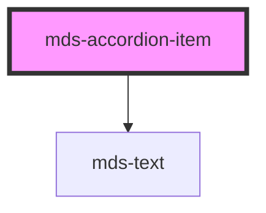

# mds-accordion-item

<!-- Auto Generated Below -->

## Properties

| Property                   | Attribute     | Description                                                        | Type                                                                    | Default     |
| -------------------------- | ------------- | ------------------------------------------------------------------ | ----------------------------------------------------------------------- | ----------- |
| `description` _(required)_ | `description` | Specifies the title shown when the component is closed or selected | `string`                                                                | `undefined` |
| `selected`                 | `selected`    | Specifies if the component item is selected or not                 | `boolean \| undefined`                                                  | `undefined` |
| `typography`               | `typography`  | Specifies the typography of the element                            | `"action" \| "h1" \| "h2" \| "h3" \| "h4" \| "h5" \| "h6" \| undefined` | `'h5'`      |

## Events

| Event                      | Description                                            | Type                                       |
| -------------------------- | ------------------------------------------------------ | ------------------------------------------ |
| `mdsAccordionItemChange`   | Emits when the component attribute selected is changed | `CustomEvent<MdsAccordionItemEventDetail>` |
| `mdsAccordionItemSelect`   | Emits when the component is selected                   | `CustomEvent<MdsAccordionItemEventDetail>` |
| `mdsAccordionItemUnselect` | Emits when the component is unselected                 | `CustomEvent<MdsAccordionItemEventDetail>` |

## CSS Custom Properties

| Name                                     | Description                                            |
| ---------------------------------------- | ------------------------------------------------------ |
| `--mds-accordion-item-border-color`      | Sets the border-color of the element                   |
| `--mds-accordion-item-color`             | Sets the text-color of the element                     |
| `--mds-accordion-item-description-color` | Sets the color of the always visible title description |

## Dependencies

### Depends on

- [mds-text](../mds-text)

### Graph

----------------------------------------------

Built with love @ **Maggioli Informatica / R&D Department**
