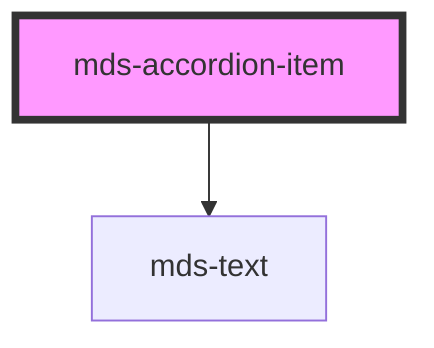

# mds-accordion-item

This is a web-component from Maggioli Design System [Magma](https://magma.maggiolicloud.it), built with StencilJS, TypeScript, Storybook. It's based on the web-component standard and it's designed to be agnostic from the JavaScript framework you are using.

<!-- Auto Generated Below -->

## Usage

### 1. Description

The `<mds-accordion-item>` web component is a single collapsible panel of the Magma Design System, designed to be slotted inside its parent [`<mds-accordion>`](../../mds-accordion). It renders a header button paired with an expandable content region, replacing the native `
`/`
` pairing while delegating open/close orchestration to the parent.

#### Semantic Behavior

- **Compound child only**: Must be placed as a direct default-slot child of `<mds-accordion>`; it is never used standalone, and the parent's slot is meant to hold only `mds-accordion-item` elements, not mixed child types.
- **Header is a button**: The clickable header renders with `role="button"`, `tabindex="0"`, and `aria-expanded` reflecting the open state; the content region uses `role="region"` labelled by the header via `aria-labelledby`.
- **Parent-driven selection**: Clicking the header flips `selected` locally and emits its events, but the authoritative open/closed state is resolved by the parent — in single mode the parent closes sibling items and reopens the clicked one, while in `multiple` mode each item toggles independently.
- **Selection is reflected**: `selected` is `mutable` and reflected to the `selected` attribute, so the parent can read and write it directly to coordinate siblings.
- **ID assignment by parent**: The host `id` is assigned by the parent on load (`item-{index}`); item events carry this `id` so the parent can identify which item changed.
- **Bubbling events**: Emits `mdsAccordionItemSelect` on open, `mdsAccordionItemUnselect` on close, and `mdsAccordionItemChange` on any toggle, each carrying `{ id, selected }`; the parent listens for these to drive `closable` and `multiple` logic.
- **Default slot**: The default slot holds the collapsible body content (text, HTML, or components) and lives inside the animated content region.

#### Properties & Visual Configurations

- **`label`** sets the always-visible header text shown whether the item is open or closed.
- **`selected`** controls whether the panel is expanded; leave it to the parent to manage in coordinated accordions, or set it initially to have a panel start open.
- **`typography`** picks the title style applied to the header label, defaulting to `h5`. Choose a heavier heading level (`h1`–`h4`) for more prominent section headers or `action` for a compact, control-like header; match it to the document's heading hierarchy so the accordion reads correctly to assistive technology.

## Properties

| Property             | Attribute    | Description                                                        | Type                                                                    | Default     |
| -------------------- | ------------ | ------------------------------------------------------------------ | ----------------------------------------------------------------------- | ----------- |
| `label` _(required)_ | `label`      | Specifies the title shown when the component is closed or selected | `string`                                                                | `undefined` |
| `selected`           | `selected`   | Specifies if the component item is selected or not                 | `boolean \| undefined`                                                  | `undefined` |
| `typography`         | `typography` | Specifies the typography of the element                            | `"action" \| "h1" \| "h2" \| "h3" \| "h4" \| "h5" \| "h6" \| undefined` | `'h5'`      |

## Events

| Event                      | Description                                            | Type                                       |
| -------------------------- | ------------------------------------------------------ | ------------------------------------------ |
| `mdsAccordionItemChange`   | Emits when the component attribute selected is changed | `CustomEvent<MdsAccordionItemEventDetail>` |
| `mdsAccordionItemSelect`   | Emits when the component is selected                   | `CustomEvent<MdsAccordionItemEventDetail>` |
| `mdsAccordionItemUnselect` | Emits when the component is unselected                 | `CustomEvent<MdsAccordionItemEventDetail>` |

## Slots

| Slot        | Description                                                                    |
| ----------- | ------------------------------------------------------------------------------ |
| `"default"` | Add contents like `text string`, `HTML elements` or `components` to this slot. |

## Shadow Parts

| Part        | Description                               |
| ----------- | ----------------------------------------- |
| `"content"` | the content wrapper of the `default` slot |
| `"icon"`    | The arrow icon of the component           |
| `"label"`   | The text label of the component           |

## CSS Custom Properties

| Name                                      | Description                                                               |
| ----------------------------------------- | ------------------------------------------------------------------------- |
| `--mds-accordion-item-border-color`       | Sets the border-color of the component                                    |
| `--mds-accordion-item-border-width`       | Sets the border-width of the separators of the component                  |
| `--mds-accordion-item-color`              | Sets the text-color of the component                                      |
| `--mds-accordion-item-description-color`  | Sets the color of the always visible title description                    |
| `--mds-accordion-item-duration`           | Sets the transition duration of the close/open animation of the component |
| `--mds-accordion-item-padding-selected`   | Sets the vertical padding of the component when it's selected             |
| `--mds-accordion-item-padding-unselected` | Sets the vertical padding of the component when it's unselected           |

## Dependencies

### Depends on

- [mds-text](../mds-text)

### Graph

----------------------------------------------

Built with love @ [Gruppo Maggioli](https://www.maggioli.com) from [R&D Department](https://www.maggioli.com/it-it/chi-siamo/ricerca-sviluppo)
