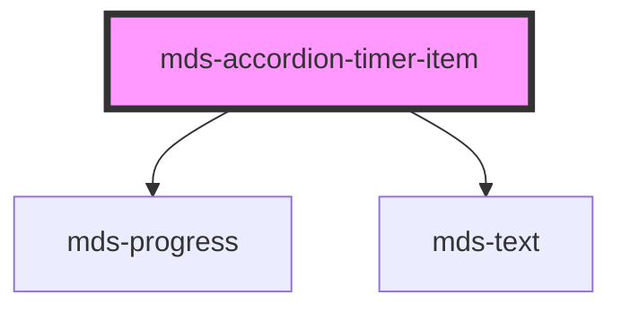

# mds-accordion-timer-item

<!-- Auto Generated Below -->

## Properties

| Property                   | Attribute     | Description                                                             | Type                                                       | Default     |
| -------------------------- | ------------- | ----------------------------------------------------------------------- | ---------------------------------------------------------- | ----------- |
| `active`                   | `active`      | Specifies if the accordion item is opened or not                        | `boolean`                                                  | `undefined` |
| `description` _(required)_ | `description` | Specifies the title shown when the accordion is closed or opened        | `string`                                                   | `undefined` |
| `progress`                 | `progress`    | A value between 0 and 100 that rapresents the status progress           | `number`                                                   | `0`         |
| `typography`               | `typography`  | Specifies the typography of the element                                 | `"action" \| "h1" \| "h2" \| "h3" \| "h4" \| "h5" \| "h6"` | `'h5'`      |
| `uuid`                     | `uuid`        | Used automatically by MdsAccordionTimer wrapper to handle it's siblings | `number`                                                   | `0`         |

## Events

| Event              | Description                                      | Type                  |
| ------------------ | ------------------------------------------------ | --------------------- |
| `clickActive`      | Emits when the accordion is clicked by the mouse | `CustomEvent<string>` |
| `mouseEnterActive` | Emits when the accordion is hovered by the mouse | `CustomEvent<string>` |
| `mouseLeaveActive` | Emits when the accordion is hovered by the mouse | `CustomEvent<string>` |

## CSS Custom Properties

| Name                        | Description                                                             |
| --------------------------- | ----------------------------------------------------------------------- |
| `--color`                   | Sets the text color of the component                                    |
| `--progress-bar-background` | Sets the background-color of the progress bar when the item is selected |
| `--progress-bar-color`      | Sets the color of the progress bar when the item is selected            |
| `--progress-bar-thickness`  | Sets thickness of the progress bar                                      |

## Dependencies

### Depends on

- [mds-progress](../mds-progress)
- [mds-text](../mds-text)

### Graph

----------------------------------------------

Built with love @ **Maggioli Informatica / R&D Department**
