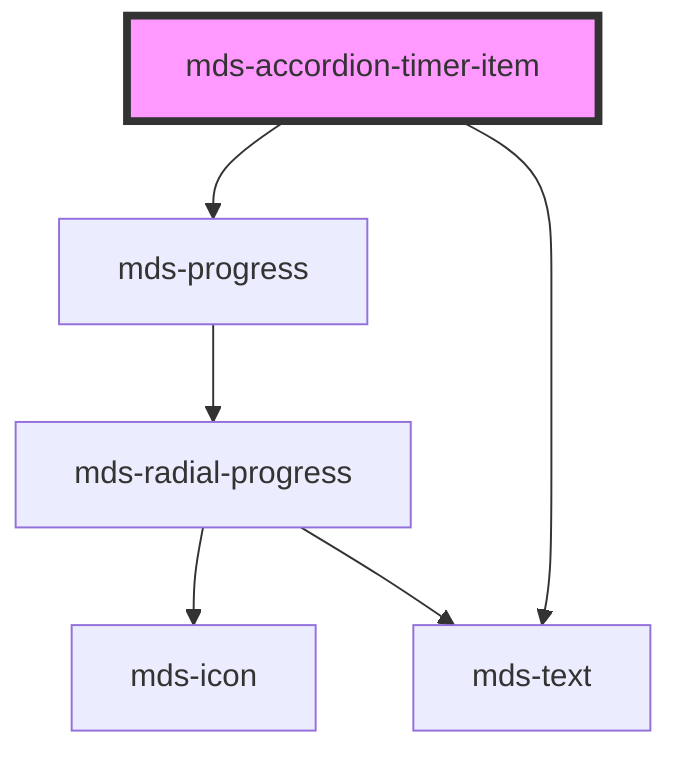

# mds-accordion-timer-item


This is a web-component from Maggioli Design System [Magma](https://magma.maggiolicloud.it), built with StencilJS, TypeScript, Storybook. It's based on the web-component standard and it's designed to be agnostic from the JavaScript framework you are using.

<!-- Auto Generated Below -->


## Usage

### 1. Description

The `<mds-accordion-timer-item>` web component is the single collapsible panel of a timed, auto-advancing accordion, designed to live exclusively inside its parent [`<mds-accordion-timer>`](../../mds-accordion-timer). It renders a header button paired with a progress bar and a region that reveals the slotted content while the item is selected.

#### Semantic Behavior

- **Compound child only**: Must be placed as a direct default-slot child of `<mds-accordion-timer>`, alongside other `<mds-accordion-timer-item>` siblings. It is not used standalone or mixed with other child types, since the parent drives the rotating timer across the items.
- **Selection is parent-orchestrated**: `selected` represents the open state, but only one sibling is open at a time - the parent advances selection on the timer or on a user click.
- **Click toggles and reports up**: Clicking the header toggles `selected` and, when opening, emits `mdsAccordionTimerItemClickSelect` so the parent can pause and re-anchor its timer on this item.
- **Programmatic selection**: Setting `selected` from code emits `mdsAccordionTimerItemSelect` - distinct from the click event so the parent can restart (rather than pause) the countdown.
- **Hover pauses the countdown**: While selected, pointer enter/leave emit `mdsAccordionTimerItemMouseEnterSelect` / `mdsAccordionTimerItemMouseLeaveSelect`, which the parent uses to pause and resume the timer. These fire only when the item is currently selected.

#### Properties & Visual Configurations

- **`description`** (required): the title text shown on the header in both open and closed states; it also supplies the accessible label of the content region.
- **`typography`**: picks the heading scale for the header text - defaults to `h5`; choose a larger title token only to match surrounding hierarchy.
- **`selected`**: marks this item as the open one. You normally set it on a single item to define the initial open panel; thereafter the parent owns it.
- **`duration`**: an optional per-item override (in ms) for how long this item stays open before the parent auto-advances, overriding the parent's global `duration` for this item only.
- **`progress`** and **`uuid`** are managed by the parent at runtime; do not set them manually.


### 2. Pattern

Correct and idiomatic ways to use the `<mds-accordion-timer-item>` component, ordered from most common to most specialized. Patterns assume a working knowledge of the compound component rules documented in [`docs/COMPONENTS.md`](../../../../../../docs/COMPONENTS.md) and the generic stencil rules in [`projects/stencil/SPEC.md`](../../../../SPEC.md).

#### Basic Timed Accordion

The canonical form. Always place `<mds-accordion-timer-item>` as a direct child of [`<mds-accordion-timer>`](../../mds-accordion-timer). Provide a `description` for each item - it becomes the header label and the accessible name for the content region.

```html
<mds-accordion-timer>
  <mds-accordion-timer-item description="Introduzione al progetto">
    <mds-text>Contenuto dell'introduzione al progetto.</mds-text>
  </mds-accordion-timer-item>
  <mds-accordion-timer-item description="Obiettivi principali">
    <mds-text>Elenco degli obiettivi principali del progetto.</mds-text>
  </mds-accordion-timer-item>
  <mds-accordion-timer-item description="Conclusioni">
    <mds-text>Riepilogo e prossimi passi.</mds-text>
  </mds-accordion-timer-item>
</mds-accordion-timer>
```

#### Setting the Initially Open Item

Mark one item `selected` to define which panel is open on load. The parent reads this state at `componentDidLoad` to anchor its timer on that item. Mark at most one item; the parent will enforce exclusive selection after load.

```html
<mds-accordion-timer>
  <mds-accordion-timer-item description="Fase uno" selected>
    <mds-text>Descrizione della fase uno.</mds-text>
  </mds-accordion-timer-item>
  <mds-accordion-timer-item description="Fase due">
    <mds-text>Descrizione della fase due.</mds-text>
  </mds-accordion-timer-item>
</mds-accordion-timer>
```

#### Per-Item Duration Override

Set `duration` (in milliseconds) on a single item to give it a different display time than the global `duration` set on the parent. Omit `duration` on items that should use the parent's default.

```html
<mds-accordion-timer duration="5000">
  <mds-accordion-timer-item description="Panoramica rapida" duration="2000">
    <mds-text>Questa sezione scorre piu velocemente delle altre.</mds-text>
  </mds-accordion-timer-item>
  <mds-accordion-timer-item description="Dettagli tecnici" duration="12000">
    <mds-text>Questa sezione richiede piu tempo per la lettura.</mds-text>
  </mds-accordion-timer-item>
  <mds-accordion-timer-item description="Contatti">
    <mds-text>Usa la durata globale di 5000 ms.</mds-text>
  </mds-accordion-timer-item>
</mds-accordion-timer>
```

#### Adjusting the Header Typography

Use `typography` to match the heading hierarchy of the surrounding page. Defaults to `h5`; choose a higher-level token only when the accordion sits inside a section that itself uses a smaller heading.

```html
<mds-accordion-timer>
  <mds-accordion-timer-item description="Argomento principale" typography="h4">
    <mds-text>Contenuto dell'argomento principale.</mds-text>
  </mds-accordion-timer-item>
  <mds-accordion-timer-item description="Sotto-argomento" typography="h4">
    <mds-text>Approfondimento del sotto-argomento.</mds-text>
  </mds-accordion-timer-item>
</mds-accordion-timer>
```

#### Rich Slotted Content

The default slot accepts HTML elements and components, not only plain text. Use it to compose images, lists, or nested components inside the disclosure panel.

```html
<mds-accordion-timer>
  <mds-accordion-timer-item description="Caratteristiche del prodotto">
    <mds-img src="/images/prodotto.jpg" alt="Foto del prodotto"></mds-img>
    <mds-text>
      Il prodotto include le seguenti funzionalita: gestione utenti, reportistica avanzata e
      integrazione con i sistemi esistenti.
    </mds-text>
  </mds-accordion-timer-item>
  <mds-accordion-timer-item description="Prezzi e licenze">
    <mds-text>Contatta il nostro team commerciale per un preventivo personalizzato.</mds-text>
    <mds-button label="Richiedi preventivo" variant="primary" tone="strong"></mds-button>
  </mds-accordion-timer-item>
</mds-accordion-timer>
```

#### Reacting to Item Changes

Listen for `mdsAccordionTimerItemClickSelect` to detect user-initiated selection (hover state pauses the timer and triggers the event when the user manually opens an item). To detect code-driven or timer-driven advances, listen for `mdsAccordionTimerItemSelect` on the item, or listen for `mdsAccordionTimerChange` on the parent instead.

```html
<mds-accordion-timer id="timer">
  <mds-accordion-timer-item description="Notizie in evidenza" id="item-0">
    <mds-text>Prima notizia in evidenza della giornata.</mds-text>
  </mds-accordion-timer-item>
  <mds-accordion-timer-item description="Aggiornamenti recenti" id="item-1">
    <mds-text>Ultimi aggiornamenti disponibili.</mds-text>
  </mds-accordion-timer-item>
</mds-accordion-timer>

<script>
  document.getElementById('item-0').addEventListener('mdsAccordionTimerItemClickSelect', (e) => {
    console.log('selezione manuale', e.detail);
  });

  document.getElementById('timer').addEventListener('mdsAccordionTimerChange', (e) => {
    console.log('avanzamento automatico, indice:', e.detail.index);
  });
</script>
```

#### Styling Customization

Style the item only through its documented `--mds-accordion-timer-item-*` CSS custom properties. Use Magma color tokens wrapped in `rgb(var(...))` so dark mode and high-contrast modes keep working. Note that these custom properties are also inherited from the parent's `--mds-accordion-timer-*` counterparts - setting them on the parent applies to all items at once.

```css
/* Customise a single item by targeting its host */
.featured-section mds-accordion-timer-item {
  --mds-accordion-timer-item-color: rgb(var(--variant-primary-02));
  --mds-accordion-timer-item-progress-bar-color: rgb(var(--variant-primary-04));
  --mds-accordion-timer-item-progress-bar-background: rgb(var(--tone-neutral-09));
  --mds-accordion-timer-item-progress-bar-thickness: 4px;
  --mds-accordion-timer-item-duration: 300ms;
}
```


### 3. Antipattern

Common incorrect uses of `<mds-accordion-timer-item>`. Each entry pairs the wrong form with the right one and a one-line reason. System-wide rules (boolean-as-string, shadow piercing, Tailwind color utilities, raw native event listening) live in [`docs/COMPONENTS.md`](../../../../../../docs/COMPONENTS.md#system-level-anti-patterns) - they apply here too but are not repeated.

#### Do Not Use the Item Outside Its Parent

`<mds-accordion-timer-item>` is a compound child and relies on [`<mds-accordion-timer>`](../../mds-accordion-timer) to assign `uuid`, write `progress`, and drive selection. Standalone use produces a static, non-advancing disclosure with no progress bar updates.

```html
<!-- 🚫 INCORRECT -->
<mds-accordion-timer-item description="Dettagli">
  <mds-text>Contenuto.</mds-text>
</mds-accordion-timer-item>

<!-- ✅ CORRECT -->
<mds-accordion-timer>
  <mds-accordion-timer-item description="Dettagli">
    <mds-text>Contenuto.</mds-text>
  </mds-accordion-timer-item>
</mds-accordion-timer>
```

#### Do Not Mix with `mds-accordion-item`

`<mds-accordion-timer-item>` and [`<mds-accordion-item>`](../../mds-accordion-item) are siblings in different compound families and must not be placed in the same parent. The timer accordion expects only `mds-accordion-timer-item` children; mixing types breaks the parent's indexing and timer logic.

```html
<!-- 🚫 INCORRECT -->
<mds-accordion-timer>
  <mds-accordion-item label="Primo">
    <mds-text>Contenuto.</mds-text>
  </mds-accordion-item>
  <mds-accordion-timer-item description="Secondo">
    <mds-text>Contenuto.</mds-text>
  </mds-accordion-timer-item>
</mds-accordion-timer>

<!-- ✅ CORRECT -->
<mds-accordion-timer>
  <mds-accordion-timer-item description="Primo">
    <mds-text>Contenuto.</mds-text>
  </mds-accordion-timer-item>
  <mds-accordion-timer-item description="Secondo">
    <mds-text>Contenuto.</mds-text>
  </mds-accordion-timer-item>
</mds-accordion-timer>
```

#### Do Not Set `progress` or `uuid` Manually

Both props are reserved for the parent's runtime orchestration. Setting them by hand breaks the timer's internal state tracking and produces incorrect progress bar rendering.

```html
<!-- 🚫 INCORRECT -->
<mds-accordion-timer>
  <mds-accordion-timer-item description="Primo" uuid="0" progress="50">
    <mds-text>Contenuto.</mds-text>
  </mds-accordion-timer-item>
</mds-accordion-timer>

<!-- ✅ CORRECT -->
<mds-accordion-timer>
  <mds-accordion-timer-item description="Primo">
    <mds-text>Contenuto.</mds-text>
  </mds-accordion-timer-item>
</mds-accordion-timer>
```

#### Do Not Mark More Than One Item `selected`

The parent enforces single-selection at load time, but marking multiple items `selected` in markup means only the first one the parent encounters will drive the timer - the intended initial state becomes ambiguous and may vary by browser.

```html
<!-- 🚫 INCORRECT -->
<mds-accordion-timer>
  <mds-accordion-timer-item description="Primo" selected>
    <mds-text>Contenuto.</mds-text>
  </mds-accordion-timer-item>
  <mds-accordion-timer-item description="Secondo" selected>
    <mds-text>Contenuto.</mds-text>
  </mds-accordion-timer-item>
</mds-accordion-timer>

<!-- ✅ CORRECT -->
<mds-accordion-timer>
  <mds-accordion-timer-item description="Primo" selected>
    <mds-text>Contenuto.</mds-text>
  </mds-accordion-timer-item>
  <mds-accordion-timer-item description="Secondo">
    <mds-text>Contenuto.</mds-text>
  </mds-accordion-timer-item>
</mds-accordion-timer>
```

#### Do Not Pierce Shadow Parts for Styling

The documented customization surface is `--mds-accordion-timer-item-*` CSS custom properties plus the four shadow parts (`content`, `icon`, `label`, `progress`). Targeting undocumented internals couples code to the implementation and will break on minor releases.

```css
/* 🚫 INCORRECT */
mds-accordion-timer-item >>> .action {
  font-weight: bold;
}
mds-accordion-timer-item::part(spinner) {
  color: red;
}

/* ✅ CORRECT */
mds-accordion-timer-item {
  --mds-accordion-timer-item-color: rgb(var(--variant-primary-02));
  --mds-accordion-timer-item-progress-bar-color: rgb(var(--variant-primary-04));
}
mds-accordion-timer-item::part(label) {
  font-weight: 600;
}
```

#### Do Not Omit `description`

`description` is a required prop. It is the only text source for the header label and the accessible name of the content region. Omitting it leaves the button unlabelled and fails accessibility audits.

```html
<!-- 🚫 INCORRECT -->
<mds-accordion-timer>
  <mds-accordion-timer-item>
    <mds-text>Contenuto senza titolo.</mds-text>
  </mds-accordion-timer-item>
</mds-accordion-timer>

<!-- ✅ CORRECT -->
<mds-accordion-timer>
  <mds-accordion-timer-item description="Titolo della sezione">
    <mds-text>Contenuto della sezione.</mds-text>
  </mds-accordion-timer-item>
</mds-accordion-timer>
```


## Properties

| Property                   | Attribute     | Description                                                                                                   | Type                                                       | Default     |
| -------------------------- | ------------- | ------------------------------------------------------------------------------------------------------------- | ---------------------------------------------------------- | ----------- |
| `description` _(required)_ | `description` | Specifies the title shown when the accordion is closed or opened                                              | `string`                                                   | `undefined` |
| `duration`                 | `duration`    | Specifies the duration of the single component when selected, it overrides the global duration of itself only | `number \| undefined`                                      | `undefined` |
| `progress`                 | `progress`    | A value between 0 and 100 that rapresents the status progress                                                 | `number`                                                   | `0`         |
| `selected`                 | `selected`    | Specifies if the accordion item is opened or not                                                              | `boolean`                                                  | `false`     |
| `typography`               | `typography`  | Specifies the typography of the element                                                                       | `"action" \| "h1" \| "h2" \| "h3" \| "h4" \| "h5" \| "h6"` | `'h5'`      |
| `uuid`                     | `uuid`        | Used automatically by MdsAccordionTimer wrapper to handle it's siblings                                       | `number`                                                   | `0`         |


## Events

| Event                                   | Description                                      | Type                                            |
| --------------------------------------- | ------------------------------------------------ | ----------------------------------------------- |
| `mdsAccordionTimerItemClickSelect`      | Emits when the accordion is clicked by the mouse | `CustomEvent<MdsAccordionTimerItemEventDetail>` |
| `mdsAccordionTimerItemMouseEnterSelect` | Emits when the accordion is hovered by the mouse | `CustomEvent<MdsAccordionTimerItemEventDetail>` |
| `mdsAccordionTimerItemMouseLeaveSelect` | Emits when the accordion is hovered by the mouse | `CustomEvent<MdsAccordionTimerItemEventDetail>` |
| `mdsAccordionTimerItemSelect`           | Emits when the accordion is changed from code    | `CustomEvent<MdsAccordionTimerItemEventDetail>` |


## Slots

| Slot        | Description                                                                  |
| ----------- | ---------------------------------------------------------------------------- |
| `"default"` | Add content like `text string`, `HTML elements` or `components` to this slot |


## Shadow Parts

| Part         | Description                               |
| ------------ | ----------------------------------------- |
| `"content"`  | the content wrapper of the `default` slot |
| `"icon"`     | The arrow icon of the component           |
| `"label"`    | The text label of the component           |
| `"progress"` | The progress bar of the component         |


## CSS Custom Properties

| Name                                                 | Description                                                             |
| ---------------------------------------------------- | ----------------------------------------------------------------------- |
| `--mds-accordion-timer-item-color`                   | Sets the text color of the component                                    |
| `--mds-accordion-timer-item-duration`                | Sets the transition duration of open/close animation                    |
| `--mds-accordion-timer-item-progress-bar-background` | Sets the background-color of the progress bar when the item is selected |
| `--mds-accordion-timer-item-progress-bar-color`      | Sets the color of the progress bar when the item is selected            |
| `--mds-accordion-timer-item-progress-bar-thickness`  | Sets thickness of the progress bar                                      |


## Dependencies

### Depends on

- [mds-progress](../mds-progress)
- [mds-text](../mds-text)

### Graph


----------------------------------------------

Built with love @ [Gruppo Maggioli](https://www.maggioli.com) from [R&D Department](https://www.maggioli.com/it-it/chi-siamo/ricerca-sviluppo)
