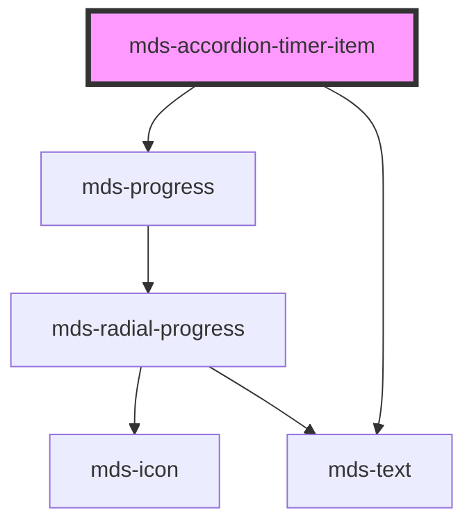

# mds-accordion-timer-item

This is a web-component from Maggioli Design System [Magma](https://magma.maggiolicloud.it), built with StencilJS, TypeScript, Storybook. It's based on the web-component standard and it's designed to be agnostic from the JavaScript framework you are using.

<!-- Auto Generated Below -->

## Usage

### 1. Description

The `<mds-accordion-timer-item>` web component is the single collapsible panel of a timed, auto-advancing accordion, designed to live exclusively inside its parent [`<mds-accordion-timer>`](../../mds-accordion-timer). It renders a header button paired with a progress bar and a region that reveals the slotted content while the item is selected, replacing a hand-rolled `<button>` + disclosure `
` pairing.

#### Semantic Behavior

- **Compound child only**: Must be placed as a direct default-slot child of `<mds-accordion-timer>`, alongside other `<mds-accordion-timer-item>` siblings. It is never used standalone or mixed with other child types, since the parent indexes the items, assigns each a `uuid`, and drives the rotating timer.
- **Disclosure semantics**: The header renders a `<button role="button">` with `aria-expanded` bound to `selected` and `aria-controls` pointing at the content region; the revealed content is wrapped in a `role="region"` labelled by `description`.
- **Selection is parent-orchestrated**: `selected` reflects to an attribute and represents the open state, but only one sibling is open at a time — the parent flips `selected` on every item when the timer advances or a user clicks, and resets `progress` to `0` on each transition.
- **Click toggles and reports up**: Clicking the header toggles `selected` locally, zeroes `progress`, and (when opening) emits `mdsAccordionTimerItemClickSelect` so the parent can pause and re-anchor its timer on this item.
- **Programmatic vs. user changes**: A `@Watch` on `selected` zeroes `progress` and, when opening, emits `mdsAccordionTimerItemSelect` — this is the channel for code-driven selection, distinct from the click event so the parent can restart (rather than pause) the countdown.
- **Hover pauses the countdown**: While selected, pointer enter/leave on the host emit `mdsAccordionTimerItemMouseEnterSelect` / `mdsAccordionTimerItemMouseLeaveSelect`, which the parent uses to pause and resume the timer. These fire only when the item is currently selected.
- **Progress is externally fed**: The parent continuously writes `progress` (0–100) onto the selected item from its interval loop; the item only renders it through the vertical `mds-progress` bar and does not advance it on its own.

#### Properties & Visual Configurations

- **`description`** (required): the title text shown on the header in both open and closed states; it also supplies the accessible label of the content region.
- **`typography`**: picks the heading scale for the header text — defaults to `h5`; choose a larger title token only to match surrounding hierarchy.
- **`selected`**: marks this item as the open one. You normally set it on a single item to define the initial open panel; thereafter the parent owns it.
- **`duration`**: an optional per-item override (in ms) for how long this item stays open before the parent auto-advances, overriding the parent's global `duration` for this item only.
- **`progress`** and **`uuid`** are managed by the parent at runtime (`uuid` is assigned automatically on load); do not set them manually.

## Properties

| Property                   | Attribute     | Description                                                                                                   | Type                                                       | Default     |
| -------------------------- | ------------- | ------------------------------------------------------------------------------------------------------------- | ---------------------------------------------------------- | ----------- |
| `description` _(required)_ | `description` | Specifies the title shown when the accordion is closed or opened                                              | `string`                                                   | `undefined` |
| `duration`                 | `duration`    | Specifies the duration of the single component when selected, it overrides the global duration of itself only | `number \| undefined`                                      | `undefined` |
| `progress`                 | `progress`    | A value between 0 and 100 that rapresents the status progress                                                 | `number`                                                   | `0`         |
| `selected`                 | `selected`    | Specifies if the accordion item is opened or not                                                              | `boolean`                                                  | `false`     |
| `typography`               | `typography`  | Specifies the typography of the element                                                                       | `"action" \| "h1" \| "h2" \| "h3" \| "h4" \| "h5" \| "h6"` | `'h5'`      |
| `uuid`                     | `uuid`        | Used automatically by MdsAccordionTimer wrapper to handle it's siblings                                       | `number`                                                   | `0`         |

## Events

| Event                                   | Description                                      | Type                                            |
| --------------------------------------- | ------------------------------------------------ | ----------------------------------------------- |
| `mdsAccordionTimerItemClickSelect`      | Emits when the accordion is clicked by the mouse | `CustomEvent<MdsAccordionTimerItemEventDetail>` |
| `mdsAccordionTimerItemMouseEnterSelect` | Emits when the accordion is hovered by the mouse | `CustomEvent<MdsAccordionTimerItemEventDetail>` |
| `mdsAccordionTimerItemMouseLeaveSelect` | Emits when the accordion is hovered by the mouse | `CustomEvent<MdsAccordionTimerItemEventDetail>` |
| `mdsAccordionTimerItemSelect`           | Emits when the accordion is changed from code    | `CustomEvent<MdsAccordionTimerItemEventDetail>` |

## Slots

| Slot        | Description                                                                  |
| ----------- | ---------------------------------------------------------------------------- |
| `"default"` | Add content like `text string`, `HTML elements` or `components` to this slot |

## Shadow Parts

| Part         | Description                               |
| ------------ | ----------------------------------------- |
| `"content"`  | the content wrapper of the `default` slot |
| `"icon"`     | The arrow icon of the component           |
| `"label"`    | The text label of the component           |
| `"progress"` | The progress bar of the component         |

## CSS Custom Properties

| Name                                                 | Description                                                             |
| ---------------------------------------------------- | ----------------------------------------------------------------------- |
| `--mds-accordion-timer-item-color`                   | Sets the text color of the component                                    |
| `--mds-accordion-timer-item-duration`                | Sets the transition duration of open/close animation                    |
| `--mds-accordion-timer-item-progress-bar-background` | Sets the background-color of the progress bar when the item is selected |
| `--mds-accordion-timer-item-progress-bar-color`      | Sets the color of the progress bar when the item is selected            |
| `--mds-accordion-timer-item-progress-bar-thickness`  | Sets thickness of the progress bar                                      |

## Dependencies

### Depends on

- [mds-progress](../mds-progress)
- [mds-text](../mds-text)

### Graph

----------------------------------------------

Built with love @ [Gruppo Maggioli](https://www.maggioli.com) from [R&D Department](https://www.maggioli.com/it-it/chi-siamo/ricerca-sviluppo)
