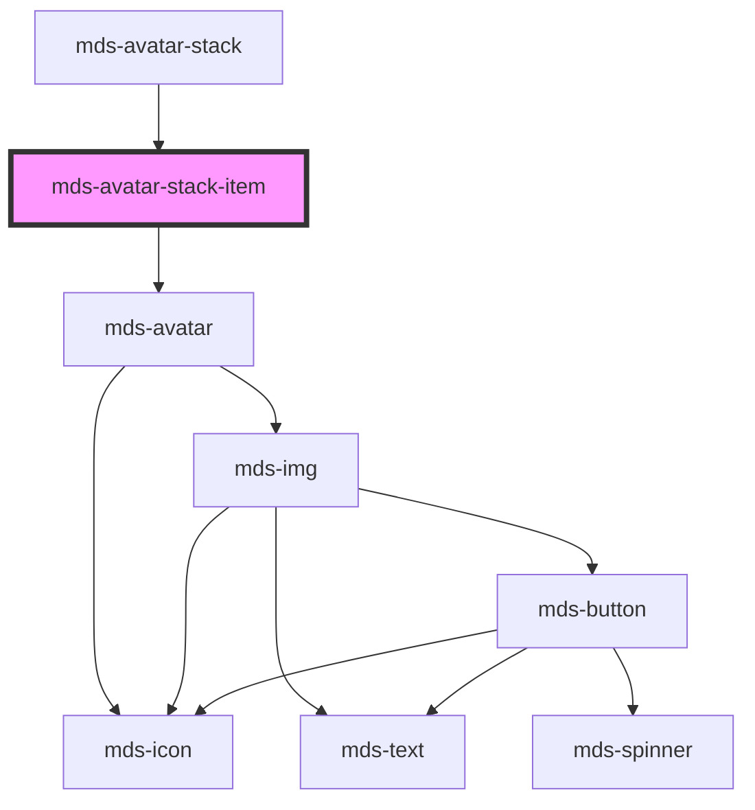

# mds-avatar-stack-item

<!-- Auto Generated Below -->

## Properties

| Property   | Attribute  | Description                                                                                                                                          | Type                                                                                                                                                                                    | Default     |
| ---------- | ---------- | ---------------------------------------------------------------------------------------------------------------------------------------------------- | --------------------------------------------------------------------------------------------------------------------------------------------------------------------------------------- | ----------- |
| `count`    | `count`    | Specifies number of total avatars, the total number will be subtracted by the slotted ones                                                           | `number \| undefined`                                                                                                                                                                   | `undefined` |
| `initials` | `initials` | The user's inizials displayed if there's no image available, initials will override tone and variant senttings to keep user recognizable from others | `string \| undefined`                                                                                                                                                                   | `undefined` |
| `src`      | `src`      | Specifies the path to the image                                                                                                                      | `string \| undefined`                                                                                                                                                                   | `undefined` |
| `tone`     | `tone`     | Specifies the color tone of the component                                                                                                            | `"strong" \| "weak" \| undefined`                                                                                                                                                       | `'weak'`    |
| `variant`  | `variant`  | Specifies the color variant of the component                                                                                                         | `"amaranth" \| "aqua" \| "blue" \| "error" \| "green" \| "info" \| "lime" \| "orange" \| "orchid" \| "primary" \| "sky" \| "success" \| "violet" \| "warning" \| "yellow" \| undefined` | `undefined` |

## CSS Custom Properties

| Name                                             | Description                                              |
| ------------------------------------------------ | -------------------------------------------------------- |
| `--mds-avatar-stack-item-background`             | The background color of each avatar in the stack         |
| `--mds-avatar-stack-item-border`                 | Computed active border (based on selected size)          |
| `--mds-avatar-stack-item-count-background-color` | Background color of the count badge in the stack         |
| `--mds-avatar-stack-item-count-color`            | Text color for the count badge in the stack              |
| `--mds-avatar-stack-item-lg-border`              | Border width for large avatars                           |
| `--mds-avatar-stack-item-lg-offset`              | Overlap factor for large avatars (higher = more overlap) |
| `--mds-avatar-stack-item-lg-size`                | Size of large avatars in the stack                       |
| `--mds-avatar-stack-item-md-border`              | Border width for medium avatars                          |
| `--mds-avatar-stack-item-md-offset`              | Overlap factor for medium avatars                        |
| `--mds-avatar-stack-item-md-size`                | Size of medium avatars in the stack                      |
| `--mds-avatar-stack-item-offset`                 | Computed active offset (based on selected size)          |
| `--mds-avatar-stack-item-offset-margin`          | Computed margin for overlapping avatars                  |
| `--mds-avatar-stack-item-size`                   | Computed active size (based on selected size)            |
| `--mds-avatar-stack-item-sm-border`              | Border width for small avatars                           |
| `--mds-avatar-stack-item-sm-offset`              | Overlap factor for small avatars                         |
| `--mds-avatar-stack-item-sm-size`                | Size of small avatars in the stack                       |

## Dependencies

### Used by

 - [mds-avatar-stack](../mds-avatar-stack)

### Depends on

- [mds-avatar](../mds-avatar)

### Graph

----------------------------------------------

Built with love @ [Gruppo Maggioli](https://www.maggioli.com) from [R&D Department](https://www.maggioli.com/it-it/chi-siamo/ricerca-sviluppo)
