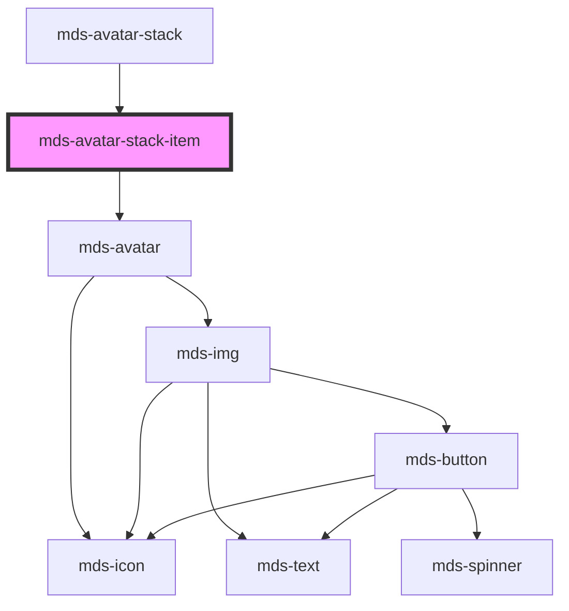

# mds-avatar-stack-item


<!-- Auto Generated Below -->


## Usage

### 1. Description

The `<mds-avatar-stack-item>` web component is a compound child that represents a single avatar inside an [`<mds-avatar-stack>`](../../mds-avatar-stack), wrapping an internal `<mds-avatar>` so individual avatars can be overlapped, sized, and counted as a group rather than rendered standalone.

#### Semantic Behavior

- **Compound child only**: It must be a direct slot child of `<mds-avatar-stack>`. It is not meant to be used standalone or mixed with other child types in the stack.
- **Parent-driven sizing**: The visual size of each item is governed by the parent's `size` (`sm` / `md` / `lg`) - the child exposes no `size` prop of its own.
- **Overflow / count badge**: When `count` is set, the item renders as a numeric badge instead of a person. The parent uses this for the trailing "+N" indicator, computed from its `total`.
- **Pass-through to mds-avatar**: It forwards `count`, `initials`, `src`, `tone`, and `variant` straight to its internal `<mds-avatar>`; it adds no events, state, focus, or ARIA of its own.
- **Initials override color**: When `initials` are shown (no image available), they take precedence over `tone` and `variant` so each user stays visually distinguishable within the stack.

#### Properties & Visual Configurations

The shared `tone` / `variant` ladders are defined in [`projects/stencil/SPEC.md`](../../../../SPEC.md#tone-and-variant-system); `tone` accepts only the minimal set (`weak` default, `strong`) and `variant` accepts the avatar color set.

- **`src`**: Use for the primary case - a real user photo. When absent the avatar falls back to `initials`, and only when neither is provided do `tone` / `variant` define the placeholder appearance.
- **`initials`**: Provide a short identifier when no image exists; prefer it over relying on color alone, since it both labels and visually separates users in a dense stack.
- **`count`**: Set only to render an explicit overflow badge manually. In most cases this is computed for you by the parent's `total`, so set it directly only when building the overflow indicator yourself.


### 2. Pattern

Correct and idiomatic ways to use the `<mds-avatar-stack-item>` component, ordered from most common to most specialized. Patterns assume a working knowledge of the compound-component rules documented in [`docs/COMPONENTS.md`](../../../../../../docs/COMPONENTS.md) and the generic stencil rules in [`projects/stencil/SPEC.md`](../../../../SPEC.md).

#### Basic Stack with Initials

The most common form: place one item per participant inside [`mds-avatar-stack`](../../mds-avatar-stack). Use `initials` for users without a photo; the stack applies uniform sizing and overlap automatically.

```html
<mds-avatar-stack>
  <mds-avatar-stack-item initials="mr"></mds-avatar-stack-item>
  <mds-avatar-stack-item initials="ac"></mds-avatar-stack-item>
  <mds-avatar-stack-item initials="er"></mds-avatar-stack-item>
</mds-avatar-stack>
```

#### Stack with Photos

Use `src` when a real user photo is available. The avatar falls back to `initials` when the image cannot be loaded, and to the tone/variant placeholder when neither is provided.

```html
<mds-avatar-stack>
  <mds-avatar-stack-item src="/avatars/mario-rossi.jpg" initials="mr"></mds-avatar-stack-item>
  <mds-avatar-stack-item src="/avatars/anna-conti.jpg" initials="ac"></mds-avatar-stack-item>
  <mds-avatar-stack-item initials="er"></mds-avatar-stack-item>
</mds-avatar-stack>
```

#### Tone and Variant for Placeholder Color

When no image or initials are provided, `tone` and `variant` determine the placeholder background. Use distinct variant values to keep users visually distinguishable. `tone` defaults to `weak`; use `strong` for higher contrast.

```html
<mds-avatar-stack>
  <mds-avatar-stack-item variant="blue" tone="weak"></mds-avatar-stack-item>
  <mds-avatar-stack-item variant="green" tone="weak"></mds-avatar-stack-item>
  <mds-avatar-stack-item variant="orchid" tone="strong"></mds-avatar-stack-item>
</mds-avatar-stack>
```

#### Overflow Counter via Parent `total`

Set `total` on the parent to let it append the overflow badge automatically. The badge value is `total` minus the number of slotted items - do not set `count` on the items yourself for this use case.

```html
<mds-avatar-stack total="12">
  <mds-avatar-stack-item initials="mr"></mds-avatar-stack-item>
  <mds-avatar-stack-item initials="ac"></mds-avatar-stack-item>
  <mds-avatar-stack-item initials="er"></mds-avatar-stack-item>
</mds-avatar-stack>
```

#### Manual Overflow Badge via `count`

Use `count` directly on a trailing item only when you are building the overflow indicator yourself and the parent does not own the total. This is rarely needed outside of fully custom stacks.

```html
<mds-avatar-stack>
  <mds-avatar-stack-item initials="mr"></mds-avatar-stack-item>
  <mds-avatar-stack-item initials="ac"></mds-avatar-stack-item>
  <mds-avatar-stack-item count="8"></mds-avatar-stack-item>
</mds-avatar-stack>
```

#### Size Controlled by the Parent

Size is not set per item - it is set once on the parent with `size` (`sm`, `md`, `lg`). All items in the stack scale together.

```html
<!-- Small stack: dense lists, table cells -->
<mds-avatar-stack size="sm">
  <mds-avatar-stack-item initials="mr"></mds-avatar-stack-item>
  <mds-avatar-stack-item initials="ac"></mds-avatar-stack-item>
</mds-avatar-stack>

<!-- Large stack: profile overviews, hero sections -->
<mds-avatar-stack size="lg">
  <mds-avatar-stack-item initials="er"></mds-avatar-stack-item>
  <mds-avatar-stack-item initials="mt"></mds-avatar-stack-item>
</mds-avatar-stack>
```

#### Styling Customization

Style individual items through their documented `--mds-avatar-stack-item-*` CSS custom properties, or control the whole stack at once via the parent's `--mds-avatar-stack-*` counterparts (the item vars inherit from those). Use Magma color tokens with `rgb(var(--<token>))` so dark mode keeps working.

```css
/* Override the separator ring color for the whole stack */
.collab-panel mds-avatar-stack {
  --mds-avatar-stack-background: rgb(var(--tone-neutral-09));
}

/* Override count badge colors for a specific stack */
.collab-panel mds-avatar-stack {
  --mds-avatar-stack-count-background-color: rgb(var(--variant-primary-03));
  --mds-avatar-stack-count-color: rgb(var(--tone-kaolin-10));
}
```


### 3. Antipattern

Common incorrect uses of `<mds-avatar-stack-item>`. Each entry pairs the wrong form with the right one and a one-line reason. System-wide rules (boolean-as-string, shadow piercing, Tailwind color utilities, raw native event listening) live in [`docs/COMPONENTS.md`](../../../../../../docs/COMPONENTS.md#system-level-anti-patterns) - they apply here too but are not repeated.

#### Do Not Use Outside `mds-avatar-stack`

`<mds-avatar-stack-item>` is a compound child and relies on its parent for sizing and overlap CSS custom properties. Used standalone, it renders with undefined dimensions and no overlap offset.

```html
<!-- 🚫 INCORRECT -->
<mds-avatar-stack-item initials="mr"></mds-avatar-stack-item>

<!-- ✅ CORRECT -->
<mds-avatar-stack>
  <mds-avatar-stack-item initials="mr"></mds-avatar-stack-item>
</mds-avatar-stack>
```

#### Do Not Set `size` on the Item

The child has no `size` prop; setting it as an attribute has no effect. Control the scale of every item in the stack with the `size` prop on the parent.

```html
<!-- 🚫 INCORRECT -->
<mds-avatar-stack>
  <mds-avatar-stack-item initials="mr" size="lg"></mds-avatar-stack-item>
</mds-avatar-stack>

<!-- ✅ CORRECT -->
<mds-avatar-stack size="lg">
  <mds-avatar-stack-item initials="mr"></mds-avatar-stack-item>
</mds-avatar-stack>
```

#### Do Not Duplicate `count` When Using `total`

When `total` is set on the parent it auto-appends the overflow item. Adding a manual `count` item on top produces a double overflow indicator.

```html
<!-- 🚫 INCORRECT -->
<mds-avatar-stack total="12">
  <mds-avatar-stack-item initials="mr"></mds-avatar-stack-item>
  <mds-avatar-stack-item initials="ac"></mds-avatar-stack-item>
  <mds-avatar-stack-item count="10"></mds-avatar-stack-item>
</mds-avatar-stack>

<!-- ✅ CORRECT - let the parent compute and render the overflow badge -->
<mds-avatar-stack total="12">
  <mds-avatar-stack-item initials="mr"></mds-avatar-stack-item>
  <mds-avatar-stack-item initials="ac"></mds-avatar-stack-item>
</mds-avatar-stack>
```

#### Do Not Wrap Items in a Div

The parent queries `:scope > mds-avatar-stack-item` to count children and compute the overflow. Wrapping items in a `<div>` or any other element breaks that query and also breaks the overlap layout driven by `:not(:first-child)` margin rules.

```html
<!-- 🚫 INCORRECT -->
<mds-avatar-stack total="5">
  <div>
    <mds-avatar-stack-item initials="mr"></mds-avatar-stack-item>
    <mds-avatar-stack-item initials="ac"></mds-avatar-stack-item>
  </div>
</mds-avatar-stack>

<!-- ✅ CORRECT - items must be direct slot children -->
<mds-avatar-stack total="5">
  <mds-avatar-stack-item initials="mr"></mds-avatar-stack-item>
  <mds-avatar-stack-item initials="ac"></mds-avatar-stack-item>
</mds-avatar-stack>
```

#### Do Not Use `tone` and `variant` as the Only Differentiator

`tone` and `variant` style the placeholder background but are overridden by `initials` and ignored when `src` is present. Relying on color alone to identify users is not accessible. Always provide `initials` or `src`.

```html
<!-- 🚫 INCORRECT - color-only identity, no label for screen readers -->
<mds-avatar-stack>
  <mds-avatar-stack-item variant="blue"></mds-avatar-stack-item>
  <mds-avatar-stack-item variant="green"></mds-avatar-stack-item>
</mds-avatar-stack>

<!-- ✅ CORRECT - initials provide a visible and screen-reader-friendly label -->
<mds-avatar-stack>
  <mds-avatar-stack-item initials="mr" variant="blue"></mds-avatar-stack-item>
  <mds-avatar-stack-item initials="ac" variant="green"></mds-avatar-stack-item>
</mds-avatar-stack>
```

#### Do Not Use an Invalid `tone` Value

`tone` on this component accepts only `weak` (default) and `strong` - the `ToneMinimalVariantType` set. Values like `outline` or `text`, valid on other components, are silently ignored here.

```html
<!-- 🚫 INCORRECT (tone="outline" is not in ToneMinimalVariantType) -->
<mds-avatar-stack>
  <mds-avatar-stack-item initials="mr" tone="outline"></mds-avatar-stack-item>
</mds-avatar-stack>

<!-- ✅ CORRECT -->
<mds-avatar-stack>
  <mds-avatar-stack-item initials="mr" tone="strong"></mds-avatar-stack-item>
</mds-avatar-stack>
```


## Properties

| Property   | Attribute  | Description                                                                                                                                          | Type                                                                                                                                                                                                         | Default     |
| ---------- | ---------- | ---------------------------------------------------------------------------------------------------------------------------------------------------- | ------------------------------------------------------------------------------------------------------------------------------------------------------------------------------------------------------------ | ----------- |
| `count`    | `count`    | Specifies number of total avatars, the total number will be subtracted by the slotted ones                                                           | `number \| undefined`                                                                                                                                                                                        | `undefined` |
| `initials` | `initials` | The user's inizials displayed if there's no image available, initials will override tone and variant senttings to keep user recognizable from others | `string \| undefined`                                                                                                                                                                                        | `undefined` |
| `src`      | `src`      | Specifies the path to the image                                                                                                                      | `string \| undefined`                                                                                                                                                                                        | `undefined` |
| `tone`     | `tone`     | Specifies the color tone of the component                                                                                                            | `"strong" \| "weak" \| undefined`                                                                                                                                                                            | `'weak'`    |
| `variant`  | `variant`  | Specifies the color variant of the component                                                                                                         | `"amaranth" \| "aqua" \| "blue" \| "error" \| "green" \| "info" \| "lime" \| "orange" \| "orchid" \| "primary" \| "purple" \| "red" \| "sky" \| "success" \| "violet" \| "warning" \| "yellow" \| undefined` | `undefined` |


## CSS Custom Properties

| Name                                             | Description                                              |
| ------------------------------------------------ | -------------------------------------------------------- |
| `--mds-avatar-stack-item-background`             | The background color of each avatar in the stack         |
| `--mds-avatar-stack-item-border`                 | Computed active border (based on selected size)          |
| `--mds-avatar-stack-item-count-background-color` | Background color of the count badge in the stack         |
| `--mds-avatar-stack-item-count-color`            | Text color for the count badge in the stack              |
| `--mds-avatar-stack-item-lg-border`              | Border width for large avatars                           |
| `--mds-avatar-stack-item-lg-offset`              | Overlap factor for large avatars (higher = more overlap) |
| `--mds-avatar-stack-item-lg-size`                | Size of large avatars in the stack                       |
| `--mds-avatar-stack-item-md-border`              | Border width for medium avatars                          |
| `--mds-avatar-stack-item-md-offset`              | Overlap factor for medium avatars                        |
| `--mds-avatar-stack-item-md-size`                | Size of medium avatars in the stack                      |
| `--mds-avatar-stack-item-offset`                 | Computed active offset (based on selected size)          |
| `--mds-avatar-stack-item-offset-margin`          | Computed margin for overlapping avatars                  |
| `--mds-avatar-stack-item-size`                   | Computed active size (based on selected size)            |
| `--mds-avatar-stack-item-sm-border`              | Border width for small avatars                           |
| `--mds-avatar-stack-item-sm-offset`              | Overlap factor for small avatars                         |
| `--mds-avatar-stack-item-sm-size`                | Size of small avatars in the stack                       |


## Dependencies

### Used by

 - [mds-avatar-stack](../mds-avatar-stack)

### Depends on

- [mds-avatar](../mds-avatar)

### Graph


----------------------------------------------

Built with love @ [Gruppo Maggioli](https://www.maggioli.com) from [R&D Department](https://www.maggioli.com/it-it/chi-siamo/ricerca-sviluppo)
