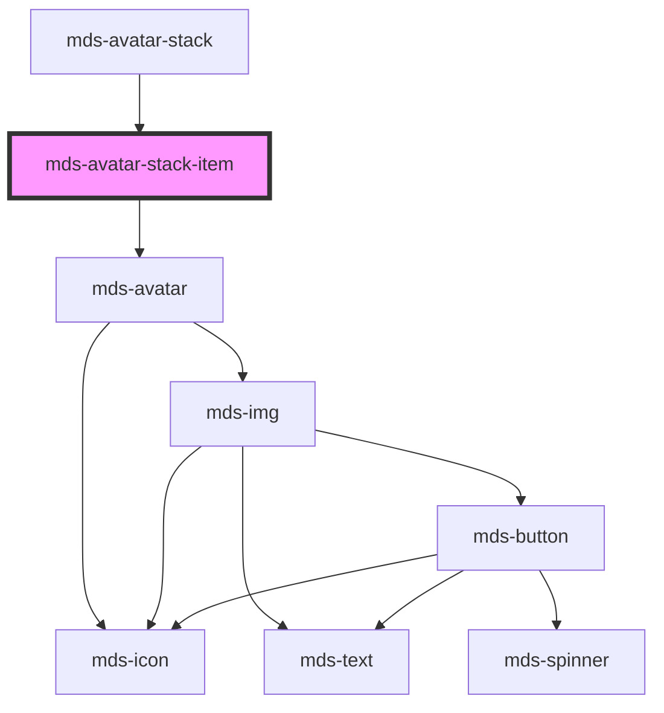

# mds-avatar-stack-item

<!-- Auto Generated Below -->

## Properties

| Property   | Attribute  | Description                                                                                                                                          | Type                                                                                                                                                                                    | Default     |
| ---------- | ---------- | ---------------------------------------------------------------------------------------------------------------------------------------------------- | --------------------------------------------------------------------------------------------------------------------------------------------------------------------------------------- | ----------- |
| `count`    | `count`    | Specifies number of total avatars, the total number will be subtracted by the slotted ones                                                           | `number \| undefined`                                                                                                                                                                   | `undefined` |
| `initials` | `initials` | The user's inizials displayed if there's no image available, initials will override tone and variant senttings to keep user recognizable from others | `string \| undefined`                                                                                                                                                                   | `undefined` |
| `src`      | `src`      | Specifies the path to the image                                                                                                                      | `string \| undefined`                                                                                                                                                                   | `undefined` |
| `tone`     | `tone`     | Specifies the color tone of the component                                                                                                            | `"strong" \| "weak" \| undefined`                                                                                                                                                       | `'weak'`    |
| `variant`  | `variant`  | Specifies the color variant of the component                                                                                                         | `"amaranth" \| "aqua" \| "blue" \| "error" \| "green" \| "info" \| "lime" \| "orange" \| "orchid" \| "primary" \| "sky" \| "success" \| "violet" \| "warning" \| "yellow" \| undefined` | `undefined` |

## Dependencies

### Used by

 - [mds-avatar-stack](../mds-avatar-stack)

### Depends on

- [mds-avatar](../mds-avatar)

### Graph

----------------------------------------------

Built with love @ [Gruppo Maggioli](https://www.maggioli.com) from [R&D Department](https://www.maggioli.com/it-it/chi-siamo/ricerca-sviluppo)
