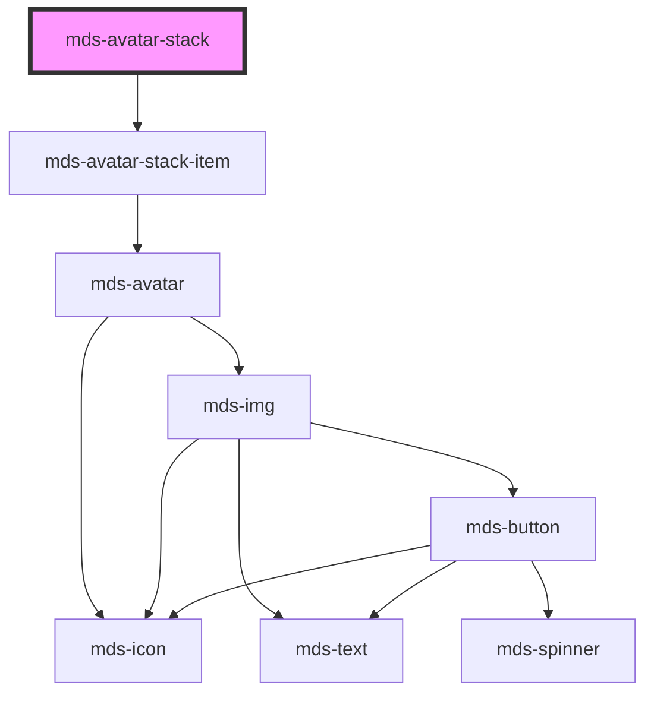

# mds-avatar-stack

<!-- Auto Generated Below -->

## Properties

| Property | Attribute | Description                                        | Type                                | Default     |
| -------- | --------- | -------------------------------------------------- | ----------------------------------- | ----------- |
| `size`   | `size`    | Specifies the size of the slotted avatars elements | `"lg" \| "md" \| "sm" \| undefined` | `undefined` |
| `total`  | `total`   | Specifies the size of the slotted avatars elements | `number \| undefined`               | `undefined` |

## CSS Custom Properties

| Name                                        | Description                                          |
| ------------------------------------------- | ---------------------------------------------------- |
| `--mds-avatar-stack-background`             | Background color for the avatar stack container      |
| `--mds-avatar-stack-count-background-color` | Background color of the count indicator (e.g., "+3") |
| `--mds-avatar-stack-count-color`            | Text color of the count indicator                    |
| `--mds-avatar-stack-lg-border`              | Border width for large avatar stack items            |
| `--mds-avatar-stack-lg-offset`              | Horizontal overlap offset for large avatars          |
| `--mds-avatar-stack-lg-size`                | Size of large avatars in the stack                   |
| `--mds-avatar-stack-md-border`              | Border width for medium avatar stack items           |
| `--mds-avatar-stack-md-offset`              | Horizontal overlap offset for medium avatars         |
| `--mds-avatar-stack-md-size`                | Size of medium avatars in the stack                  |
| `--mds-avatar-stack-sm-border`              | Border width for small avatar stack items            |
| `--mds-avatar-stack-sm-offset`              | Horizontal overlap offset for small avatars          |
| `--mds-avatar-stack-sm-size`                | Size of small avatars in the stack                   |

## Dependencies

### Depends on

- [mds-avatar-stack-item](../mds-avatar-stack-item)

### Graph

----------------------------------------------

Built with love @ [Gruppo Maggioli](https://www.maggioli.com) from [R&D Department](https://www.maggioli.com/it-it/chi-siamo/ricerca-sviluppo)
