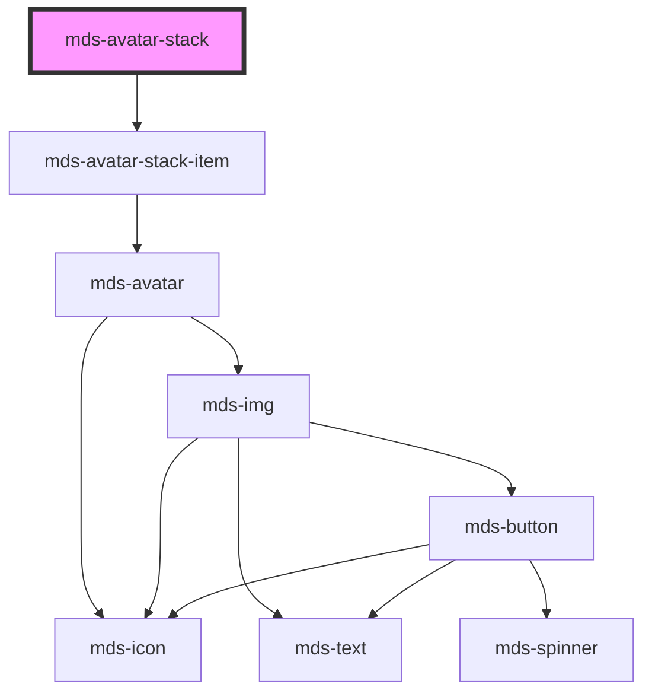

# mds-avatar-stack

<!-- Auto Generated Below -->

## Usage

### 1. Description

The `<mds-avatar-stack>` web component groups a set of overlapping `<mds-avatar-stack-item>` children into a single horizontal cluster, the Magma Design System pattern for showing the people associated with an entity (assignees, participants, collaborators) in a compact, space-saving row.

#### Semantic Behavior

- **Compound parent**: It is the container half of a compound component; its visible content is the default slot of `<mds-avatar-stack-item>` children, each of which wraps an `<mds-avatar>`.
- **Size propagation**: `size` is reflected to the host and drives, through CSS custom properties, the dimensions, border and horizontal overlap offset of every slotted item, so the whole stack stays visually consistent without sizing each avatar individually.
- **Overflow counter**: At load the component counts its direct `mds-avatar-stack-item` children; when `total` is set and exceeds that count it appends one extra item rendering the remainder (e.g. "+3"), so the stack can represent a larger group than it physically shows.
- **Static composition**: Children are read once in `componentWillLoad` and `total` is resolved against that initial count, so the overflow indicator reflects the markup present at first render rather than reacting to later DOM mutations.

#### Properties & Visual Configurations

- **`size`** selects the avatar scale (`'sm'`, `'md'`, `'lg'`) for the entire stack; pick it to match the surrounding density, since it governs not just avatar diameter but also the overlap offset and ring border between stacked avatars.
- **`total`** is the logical headcount of the represented group. Set it higher than the number of slotted avatars to surface a trailing count item for the hidden members; leave it unset (or equal to the child count) to show only the avatars in the markup with no counter.

This component does not use the shared `variant` / `tone` ladders; per-avatar appearance (tone, variant, initials, image source) is configured on each `<mds-avatar-stack-item>` instead.

## Properties

| Property | Attribute | Description                                        | Type                                | Default     |
| -------- | --------- | -------------------------------------------------- | ----------------------------------- | ----------- |
| `size`   | `size`    | Specifies the size of the slotted avatars elements | `"lg" \| "md" \| "sm" \| undefined` | `undefined` |
| `total`  | `total`   | Specifies the size of the slotted avatars elements | `number \| undefined`               | `undefined` |

## CSS Custom Properties

| Name                                        | Description                                          |
| ------------------------------------------- | ---------------------------------------------------- |
| `--mds-avatar-stack-background`             | Background color for the avatar stack container      |
| `--mds-avatar-stack-count-background-color` | Background color of the count indicator (e.g., "+3") |
| `--mds-avatar-stack-count-color`            | Text color of the count indicator                    |
| `--mds-avatar-stack-lg-border`              | Border width for large avatar stack items            |
| `--mds-avatar-stack-lg-offset`              | Horizontal overlap offset for large avatars          |
| `--mds-avatar-stack-lg-size`                | Size of large avatars in the stack                   |
| `--mds-avatar-stack-md-border`              | Border width for medium avatar stack items           |
| `--mds-avatar-stack-md-offset`              | Horizontal overlap offset for medium avatars         |
| `--mds-avatar-stack-md-size`                | Size of medium avatars in the stack                  |
| `--mds-avatar-stack-sm-border`              | Border width for small avatar stack items            |
| `--mds-avatar-stack-sm-offset`              | Horizontal overlap offset for small avatars          |
| `--mds-avatar-stack-sm-size`                | Size of small avatars in the stack                   |

## Dependencies

### Depends on

- [mds-avatar-stack-item](../mds-avatar-stack-item)

### Graph

----------------------------------------------

Built with love @ [Gruppo Maggioli](https://www.maggioli.com) from [R&D Department](https://www.maggioli.com/it-it/chi-siamo/ricerca-sviluppo)
