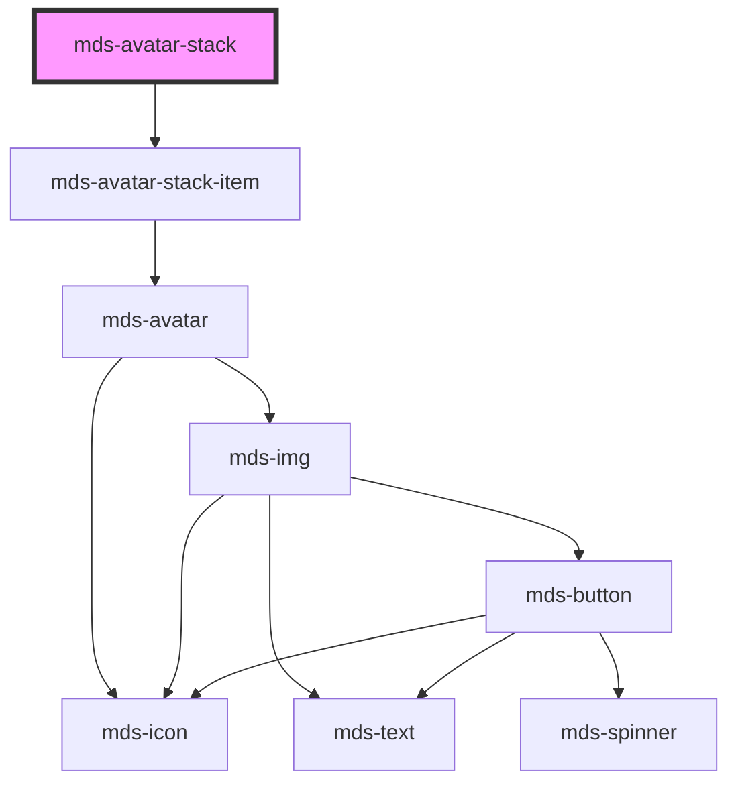

# mds-avatar-stack


<!-- Auto Generated Below -->


## Usage

### 1. Description

The `<mds-avatar-stack>` web component groups a set of overlapping `<mds-avatar-stack-item>` children into a single horizontal cluster, the Magma Design System pattern for showing the people associated with an entity (assignees, participants, collaborators) in a compact, space-saving row.

#### Semantic Behavior

- **Compound parent**: It is the container half of a compound component; its visible content is the default slot of `<mds-avatar-stack-item>` children, each of which wraps an `<mds-avatar>`.
- **Size propagation**: `size` drives the dimensions, border, and horizontal overlap of every slotted item, so the whole stack stays visually consistent without sizing each avatar individually.
- **Overflow counter**: When `total` is set and exceeds the number of slotted children, the stack appends one extra item rendering the remainder (e.g. "+3"), so it can represent a larger group than it physically shows.
- **Static composition**: Children and `total` are resolved at first render; the overflow indicator reflects the markup present then rather than reacting to later DOM changes.

#### Properties & Visual Configurations

- **`size`** selects the avatar scale (`'sm'`, `'md'`, `'lg'`) for the entire stack; pick it to match the surrounding density, since it governs not just avatar diameter but also the overlap offset and ring border between stacked avatars.
- **`total`** is the logical headcount of the represented group. Set it higher than the number of slotted avatars to surface a trailing count item for the hidden members; leave it unset (or equal to the child count) to show only the avatars in the markup with no counter.

This component does not use the shared `variant` / `tone` ladders; per-avatar appearance (tone, variant, initials, image source) is configured on each `<mds-avatar-stack-item>` instead.


### 2. Pattern

Correct and idiomatic ways to use the `<mds-avatar-stack>` component, ordered from most common to most specialized. Patterns assume a working knowledge of the compound component rules documented in [`docs/COMPONENTS.md`](../../../../../../docs/COMPONENTS.md) and the generic stencil rules in [`projects/stencil/SPEC.md`](../../../../SPEC.md).

#### Basic Avatar Stack

The canonical form. Slot one [`<mds-avatar-stack-item>`](../../mds-avatar-stack-item) per person directly inside the stack. Each item wraps an internal avatar; no extra wrapper elements are needed.

```html
<mds-avatar-stack>
  <mds-avatar-stack-item initials="mr" tone="weak"></mds-avatar-stack-item>
  <mds-avatar-stack-item initials="ac" tone="weak"></mds-avatar-stack-item>
  <mds-avatar-stack-item initials="er" tone="weak"></mds-avatar-stack-item>
</mds-avatar-stack>
```

#### Avatar Stack with Profile Images

Use `src` on each item when real user photos are available. The avatar falls back to `initials` automatically if the image fails to load.

```html
<mds-avatar-stack>
  <mds-avatar-stack-item
    src="/avatars/mario-rossi.jpg"
    initials="mr"
    tone="weak"
  ></mds-avatar-stack-item>
  <mds-avatar-stack-item
    src="/avatars/anna-conti.jpg"
    initials="ac"
    tone="weak"
  ></mds-avatar-stack-item>
  <mds-avatar-stack-item
    src="/avatars/elena-ricci.jpg"
    initials="er"
    tone="weak"
  ></mds-avatar-stack-item>
</mds-avatar-stack>
```

#### Sizing the Stack

Use the `size` prop on the parent to scale the whole stack at once. Do not set individual sizes on the items - the parent drives dimensions, overlap, and border for all children.

```html
<!-- Small - compact lists, comment threads -->
<mds-avatar-stack size="sm">
  <mds-avatar-stack-item initials="mr" tone="weak"></mds-avatar-stack-item>
  <mds-avatar-stack-item initials="ac" tone="weak"></mds-avatar-stack-item>
</mds-avatar-stack>

<!-- Medium (default) -->
<mds-avatar-stack size="md">
  <mds-avatar-stack-item initials="mr" tone="weak"></mds-avatar-stack-item>
  <mds-avatar-stack-item initials="ac" tone="weak"></mds-avatar-stack-item>
</mds-avatar-stack>

<!-- Large - hero areas, team pages -->
<mds-avatar-stack size="lg">
  <mds-avatar-stack-item initials="mr" tone="weak"></mds-avatar-stack-item>
  <mds-avatar-stack-item initials="ac" tone="weak"></mds-avatar-stack-item>
</mds-avatar-stack>
```

#### Overflow Counter via `total`

When the represented group is larger than the number of visible avatars, set `total` to the real headcount. The component automatically appends a trailing "+N" badge for the hidden members.

```html
<!-- 5 visible avatars out of a team of 12: shows "+7" badge -->
<mds-avatar-stack total="12">
  <mds-avatar-stack-item initials="mr" tone="weak"></mds-avatar-stack-item>
  <mds-avatar-stack-item initials="ac" tone="weak"></mds-avatar-stack-item>
  <mds-avatar-stack-item initials="er" tone="weak"></mds-avatar-stack-item>
  <mds-avatar-stack-item initials="mt" tone="weak"></mds-avatar-stack-item>
  <mds-avatar-stack-item initials="jb" tone="weak"></mds-avatar-stack-item>
</mds-avatar-stack>
```

#### Per-Item Variant Colors

Each [`<mds-avatar-stack-item>`](../../mds-avatar-stack-item) accepts its own `variant` to visually distinguish users when initials alone are not enough. `tone` accepts `strong` or `weak` (default).

```html
<mds-avatar-stack>
  <mds-avatar-stack-item initials="mr" variant="primary" tone="strong"></mds-avatar-stack-item>
  <mds-avatar-stack-item initials="ac" variant="success" tone="weak"></mds-avatar-stack-item>
  <mds-avatar-stack-item initials="er" variant="warning" tone="weak"></mds-avatar-stack-item>
  <mds-avatar-stack-item initials="mt" variant="info" tone="weak"></mds-avatar-stack-item>
</mds-avatar-stack>
```

#### Size and Overflow Combined

Combine `size` and `total` to produce a large, labelled stack for team-overview sections.

```html
<mds-avatar-stack size="lg" total="25">
  <mds-avatar-stack-item initials="mr" tone="weak"></mds-avatar-stack-item>
  <mds-avatar-stack-item initials="ac" tone="weak"></mds-avatar-stack-item>
  <mds-avatar-stack-item initials="er" tone="weak"></mds-avatar-stack-item>
  <mds-avatar-stack-item initials="mt" tone="weak"></mds-avatar-stack-item>
</mds-avatar-stack>
```

#### Styling Customization

Style the stack only through its documented `--mds-avatar-stack-*` CSS custom properties. Set them on the host or a parent selector; use Magma color tokens via `rgb(var(--<token>))` so dark mode keeps working.

```css
/* Custom ring color and overlap for a card-hero section */
.team-hero mds-avatar-stack {
  --mds-avatar-stack-background: rgb(var(--variant-secondary-01));
  --mds-avatar-stack-count-background-color: rgb(var(--tone-neutral-08));
  --mds-avatar-stack-count-color: rgb(var(--tone-neutral-02));
  --mds-avatar-stack-lg-offset: 2.5;
}
```


### 3. Antipattern

Common incorrect uses of `<mds-avatar-stack>`. Each entry pairs the wrong form with the right one and a one-line reason. System-wide rules (boolean-as-string, shadow piercing, Tailwind color utilities, raw native event listening) live in [`docs/COMPONENTS.md`](../../../../../../docs/COMPONENTS.md#system-level-anti-patterns) - they apply here too but are not repeated.

#### Do Not Place `<mds-avatar-stack-item>` Inside a Wrapper Element

The parent counts its **direct** `mds-avatar-stack-item` children via `:scope > mds-avatar-stack-item`. An intermediate wrapper breaks that query, so the overflow counter is wrong and size propagation may not work.

```html
<!-- 🚫 INCORRECT -->
<mds-avatar-stack total="10">
  <div class="group">
    <mds-avatar-stack-item initials="mr"></mds-avatar-stack-item>
    <mds-avatar-stack-item initials="ac"></mds-avatar-stack-item>
  </div>
</mds-avatar-stack>

<!-- ✅ CORRECT -->
<mds-avatar-stack total="10">
  <mds-avatar-stack-item initials="mr" tone="weak"></mds-avatar-stack-item>
  <mds-avatar-stack-item initials="ac" tone="weak"></mds-avatar-stack-item>
</mds-avatar-stack>
```

#### Do Not Slot a Raw `<mds-avatar>` Directly

[`<mds-avatar-stack-item>`](../../mds-avatar-stack-item) is the correct child for this compound component - it handles sizing, border, overlap offset, and count badge rendering. Slotting a bare `<mds-avatar>` skips all of that wiring.

```html
<!-- 🚫 INCORRECT -->
<mds-avatar-stack>
  <mds-avatar initials="mr"></mds-avatar>
  <mds-avatar initials="ac"></mds-avatar>
</mds-avatar-stack>

<!-- ✅ CORRECT -->
<mds-avatar-stack>
  <mds-avatar-stack-item initials="mr" tone="weak"></mds-avatar-stack-item>
  <mds-avatar-stack-item initials="ac" tone="weak"></mds-avatar-stack-item>
</mds-avatar-stack>
```

#### Do Not Set `total` Lower Than or Equal to the Child Count

When `total` does not exceed the number of slotted items, no overflow badge is rendered. Setting `total` lower than the child count is also misleading about group size and produces no visible effect.

```html
<!-- 🚫 INCORRECT - total equals child count, badge never appears -->
<mds-avatar-stack total="3">
  <mds-avatar-stack-item initials="mr" tone="weak"></mds-avatar-stack-item>
  <mds-avatar-stack-item initials="ac" tone="weak"></mds-avatar-stack-item>
  <mds-avatar-stack-item initials="er" tone="weak"></mds-avatar-stack-item>
</mds-avatar-stack>

<!-- ✅ CORRECT - total exceeds slotted count by the hidden members -->
<mds-avatar-stack total="10">
  <mds-avatar-stack-item initials="mr" tone="weak"></mds-avatar-stack-item>
  <mds-avatar-stack-item initials="ac" tone="weak"></mds-avatar-stack-item>
  <mds-avatar-stack-item initials="er" tone="weak"></mds-avatar-stack-item>
</mds-avatar-stack>
```

#### Do Not Add `count` Manually When `total` Is Set

`count` on `<mds-avatar-stack-item>` is reserved for the auto-generated overflow badge; the parent computes and appends it when `total` is provided. Adding a `count` item by hand alongside `total` results in a duplicate badge.

```html
<!-- 🚫 INCORRECT -->
<mds-avatar-stack total="10">
  <mds-avatar-stack-item initials="mr" tone="weak"></mds-avatar-stack-item>
  <mds-avatar-stack-item initials="ac" tone="weak"></mds-avatar-stack-item>
  <mds-avatar-stack-item count="8"></mds-avatar-stack-item>
</mds-avatar-stack>

<!-- ✅ CORRECT - let the parent handle the badge -->
<mds-avatar-stack total="10">
  <mds-avatar-stack-item initials="mr" tone="weak"></mds-avatar-stack-item>
  <mds-avatar-stack-item initials="ac" tone="weak"></mds-avatar-stack-item>
</mds-avatar-stack>
```

#### Do Not Size Individual Items - Size the Parent

[`<mds-avatar-stack-item>`](../../mds-avatar-stack-item) exposes no `size` prop; dimensions are driven by the parent's `size`. Overriding size with inline CSS on individual items breaks the uniform overlap geometry the component calculates.

```html
<!-- 🚫 INCORRECT -->
<mds-avatar-stack>
  <mds-avatar-stack-item initials="mr" style="width: 48px; height: 48px;"></mds-avatar-stack-item>
  <mds-avatar-stack-item initials="ac" style="width: 48px; height: 48px;"></mds-avatar-stack-item>
</mds-avatar-stack>

<!-- ✅ CORRECT -->
<mds-avatar-stack size="lg">
  <mds-avatar-stack-item initials="mr" tone="weak"></mds-avatar-stack-item>
  <mds-avatar-stack-item initials="ac" tone="weak"></mds-avatar-stack-item>
</mds-avatar-stack>
```

#### Customize via Documented Vars, Not Internal Selectors

The supported customization surface is the `--mds-avatar-stack-*` CSS custom properties on the parent. Targeting shadow internals via `>>>` or undocumented `::part()` names couples your code to the implementation and will break on minor releases.

```css
/* 🚫 INCORRECT */
mds-avatar-stack >>> .avatar {
  border-color: blue;
}

/* ✅ CORRECT */
mds-avatar-stack {
  --mds-avatar-stack-background: rgb(var(--variant-primary-01));
  --mds-avatar-stack-count-background-color: rgb(var(--tone-neutral-08));
}
```


## Properties

| Property | Attribute | Description                                        | Type                                | Default     |
| -------- | --------- | -------------------------------------------------- | ----------------------------------- | ----------- |
| `size`   | `size`    | Specifies the size of the slotted avatars elements | `"lg" \| "md" \| "sm" \| undefined` | `undefined` |
| `total`  | `total`   | Specifies the size of the slotted avatars elements | `number \| undefined`               | `undefined` |


## Dependencies

### Depends on

- [mds-avatar-stack-item](../mds-avatar-stack-item)

### Graph


----------------------------------------------

Built with love @ [Gruppo Maggioli](https://www.maggioli.com) from [R&D Department](https://www.maggioli.com/it-it/chi-siamo/ricerca-sviluppo)
