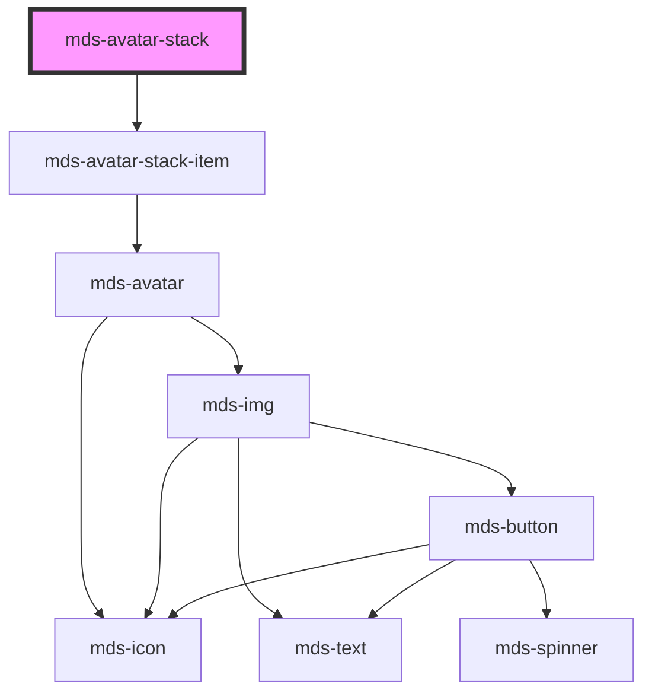

# mds-avatar-stack

<!-- Auto Generated Below -->

## Properties

| Property | Attribute | Description                                        | Type                                | Default     |
| -------- | --------- | -------------------------------------------------- | ----------------------------------- | ----------- |
| `size`   | `size`    | Specifies the size of the slotted avatars elements | `"lg" \| "md" \| "sm" \| undefined` | `undefined` |
| `total`  | `total`   | Specifies the size of the slotted avatars elements | `number \| undefined`               | `undefined` |

## Dependencies

### Depends on

- [mds-avatar-stack-item](../mds-avatar-stack-item)

### Graph

----------------------------------------------

Built with love @ [Gruppo Maggioli](https://www.maggioli.com) from [R&D Department](https://www.maggioli.com/it-it/chi-siamo/ricerca-sviluppo)
