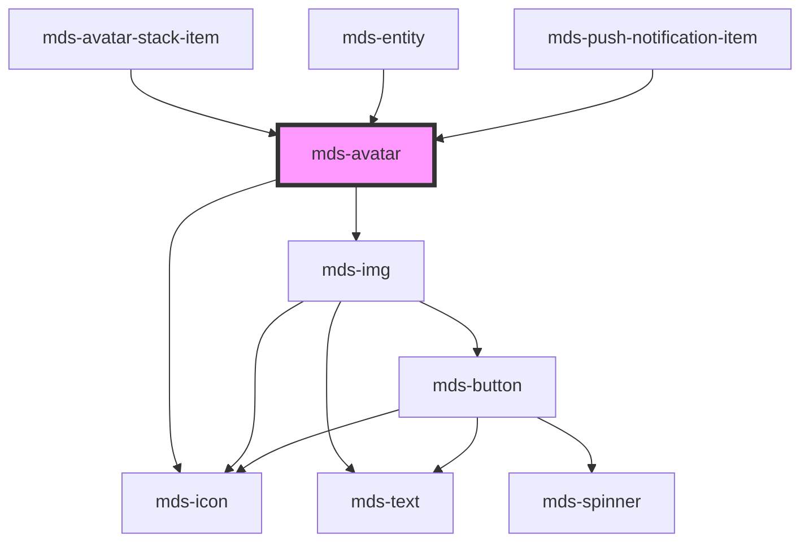

# mds-avatar

<!-- Start script-generated Magma Docs -->

# Install

Install the component via `npm` by running the following command

```bash
npm install @maggioli-design-system/mds-avatar
```

This package works also with yarn:

```bash
yarn add @maggioli-design-system/mds-avatar
```

### Import

Import the component in your project via `TypeScript` as follows:

```typescript
import { defineCustomElements as dceMdsAvatar } from '@maggioli-design-system/mds-avatar/loader'

dceMdsAvatar()
```

If you need to support older browsers (i.e. IE or early version of Edge), you can wrap the `defineCustomElements` in another utility awailable in the same package:

```typescript
import { applyPolyfills as apMdsAvatar, defineCustomElements as dceMdsAvatar } from '@maggioli-design-system/mds-avatar/loader'

apMdsAvatar().then(dceMdsAvatar())
```

Use alias for `defineCustomElements` method to initialize multiple web components in the same place:

```typescript
import { defineCustomElements as dceMdsComponentOne } from '@maggioli-design-system/mds-component-one/loader'
import { defineCustomElements as dceMdsComponentTwo } from '@maggioli-design-system/mds-component-two/loader'

dceMdsComponentOne()
dceMdsComponentTwo()
```

You can check how browser support works at [this page][stencil-browser-support].

# Integration

<!-- This section is useful to describe usages and configurations -->

#### How to use it in HTML

<!-- Add information about HTML usage here -->

`MdsAvatar` accepts a path to an image to be displayed via the `src` attribute, or if missing accepts the initials to be displayed via the `initials` attribute. Beware that the text passed via `initials` attribute will be trimmed and truncated up to the second character, so if `cya` is the value passed to the attribute, the final result displayed will be `CY` (the text will be transformed to uppercase via a css class).

An example follows:

```html
<mds-avatar src="https://placehold.co/80" initials="ap"></mds-avatar>
```

You can try it out on the component's [Storybook website][storybook]!

<!-- TODO set correct storybook link, `ui` may need to be changed into something else -->
[storybook]: https://magma.maggiolicloud.it/storybook/?path=/story/ui-avatar--default
[stencil-browser-support]: https://stenciljs.com/docs/browser-support

<!-- End script-generated Magma Docs -->

---

This is a web-component from Maggioli Design System [Magma](https://magma.maggiolicloud.it), built with StencilJS, TypeScript, Storybook. It's based on the web-component standard and it's designed to be agnostic from the JavaScript framework you are using.

<!-- Auto Generated Below -->


## Usage

### 1. Description

The `<mds-avatar>` web component renders a compact, circular representation of a user or entity in the Magma Design System. It resolves a single visual from whichever input is provided — a profile image, textual initials, a numeric overflow count, or an icon — and falls back to a generic person glyph when nothing usable is supplied.

#### Semantic Behavior

- **Content resolution priority**: Exactly one visual is shown at a time, resolved in order — `src` image, `initials` text, `count` overflow badge, `icon` glyph — and the generic person fallback covers the empty case.
- **Deterministic identity color**: When `initials` (or `count`) are set, the component overrides `variant` with a color derived from the characters' char codes, so the same person always maps to the same color and stays distinguishable from others.
- **Image load fallback**: If the `src` image fails to load, the host automatically swaps to the generic person fallback icon; on success the avatar leaves its pending state.
- **Pending state**: While a `src` image is loading the wrapper carries a pending style (driven by `--mds-avatar-background-color-pending`) until the image resolves.
- **Auto-fitting initials**: Initials and count text are dynamically scaled to fit the avatar via a resize observer, so they stay legible across every avatar size.
- **Initials normalization**: The `initials` value is stripped of non-alphanumeric characters, uppercased, and truncated to the first two characters before display.

#### Properties & Visual Configurations

The shared `variant` / `tone` ladders are defined in [`projects/stencil/SPEC.md`](../../../../SPEC.md#tone-and-variant-system). Note that `tone` is limited to the minimal set (`'strong'` / `'weak'`), and any explicit `variant` is ignored whenever `initials` or `count` are present, since identity color takes precedence.

#### Other behavioral props

- **`src`** is the path to a profile image and is the highest-priority visual; prefer it when a real photo is available.
- **`initials`** carries the textual stand-in for a user when no image exists; it drives the deterministic identity color.
- **`count`** renders a `+N` overflow badge and is intended for stacked/grouped avatar scenarios rather than individual users.
- **`icon`** is an SVG filename slug from the Magma icon library, used when the avatar represents a non-personal entity rather than a human.


## Properties

| Property   | Attribute  | Description                                                                                                                                          | Type                                                                                                                                                                                                         | Default     |
| ---------- | ---------- | ---------------------------------------------------------------------------------------------------------------------------------------------------- | ------------------------------------------------------------------------------------------------------------------------------------------------------------------------------------------------------------ | ----------- |
| `count`    | `count`    | The user's inizials displayed if there's no image available, initials will override tone and variant senttings to keep user recognizable from others | `number \| undefined`                                                                                                                                                                                        | `undefined` |
| `icon`     | `icon`     | Specifies the path to the icon                                                                                                                       | `string \| undefined`                                                                                                                                                                                        | `undefined` |
| `initials` | `initials` | The user's inizials displayed if there's no image available, initials will override tone and variant senttings to keep user recognizable from others | `string \| undefined`                                                                                                                                                                                        | `undefined` |
| `src`      | `src`      | Specifies the path to the image                                                                                                                      | `string \| undefined`                                                                                                                                                                                        | `undefined` |
| `tone`     | `tone`     | Specifies the color tone of the component                                                                                                            | `"strong" \| "weak" \| undefined`                                                                                                                                                                            | `undefined` |
| `variant`  | `variant`  | Specifies the color variant of the component                                                                                                         | `"amaranth" \| "aqua" \| "blue" \| "error" \| "green" \| "info" \| "lime" \| "orange" \| "orchid" \| "primary" \| "purple" \| "red" \| "sky" \| "success" \| "violet" \| "warning" \| "yellow" \| undefined` | `undefined` |


## Shadow Parts

| Part        | Description                                |
| ----------- | ------------------------------------------ |
| `"icon"`    | The selected icon of the avatar            |
| `"media"`   | The media displayed                        |
| `"wrapper"` | The wrapper which contains media displayed |


## CSS Custom Properties

| Name                                    | Description                                        |
| --------------------------------------- | -------------------------------------------------- |
| `--mds-avatar-background-color`         | The background-color of the component              |
| `--mds-avatar-background-color-pending` | The background-color when an image is loading      |
| `--mds-avatar-color`                    | The color of the placeholder icon                  |
| `--mds-avatar-initials-padding`         | Sets the padding of the initials inside the avatar |
| `--mds-avatar-radius`                   | The border-radius of the element                   |


## Dependencies

### Used by

 - [mds-avatar-stack-item](../mds-avatar-stack-item)
 - [mds-entity](../mds-entity)
 - [mds-push-notification-item](../mds-push-notification-item)

### Depends on

- [mds-img](../mds-img)
- [mds-icon](../mds-icon)

### Graph


----------------------------------------------

Built with love @ [Gruppo Maggioli](https://www.maggioli.com) from [R&D Department](https://www.maggioli.com/it-it/chi-siamo/ricerca-sviluppo)
