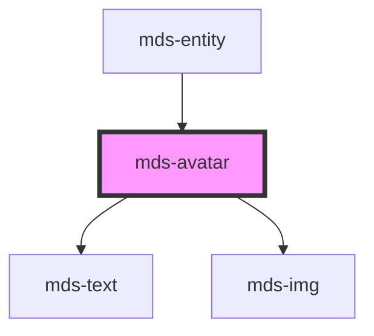

# mds-avatar

<!-- Auto Generated Below -->

## Properties

| Property   | Attribute  | Description                                                 | Type                  | Default     |
| ---------- | ---------- | ----------------------------------------------------------- | --------------------- | ----------- |
| `initials` | `initials` | The user's inizials displayed if there's no image available | `string`              | `''`        |
| `src`      | `src`      | Specifies the path to the image                             | `string \| undefined` | `undefined` |

## CSS Custom Properties

| Name                                        | Description                                   |
| ------------------------------------------- | --------------------------------------------- |
| `--mds-avatar-background-color-pending`     | The background-color when an image is loading |
| `--mds-avatar-background-color-placeholder` | The background-color of the placeholder icon  |
| `--mds-avatar-color-placeholder`            | The color of the placeholder icon             |
| `--mds-avatar-radius`                       | The border-radius of the element              |

## Dependencies

### Used by

 - [mds-entity](../mds-entity)

### Depends on

- [mds-text](../mds-text)
- [mds-img](../mds-img)

### Graph

----------------------------------------------

Built with love @ **Maggioli Informatica / R&D Department**
