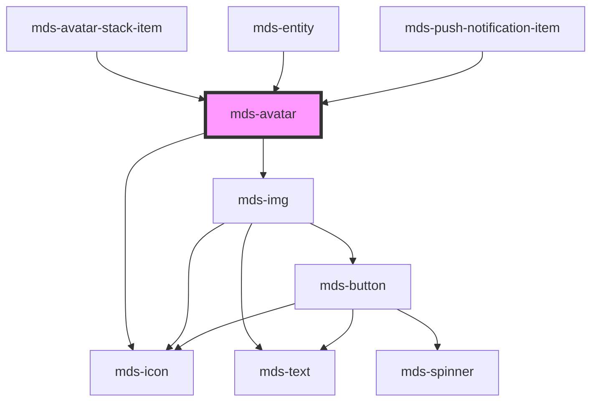

# mds-avatar

<!-- Start script-generated Magma Docs -->

# Install

Install the component via `npm` by running the following command

```bash
npm install @maggioli-design-system/mds-avatar
```

This package works also with yarn:

```bash
yarn add @maggioli-design-system/mds-avatar
```

### Import

Import the component in your project via `TypeScript` as follows:

```typescript
import { defineCustomElements as dceMdsAvatar } from '@maggioli-design-system/mds-avatar/loader'

dceMdsAvatar()
```

If you need to support older browsers (i.e. IE or early version of Edge), you can wrap the `defineCustomElements` in another utility awailable in the same package:

```typescript
import { applyPolyfills as apMdsAvatar, defineCustomElements as dceMdsAvatar } from '@maggioli-design-system/mds-avatar/loader'

apMdsAvatar().then(dceMdsAvatar())
```

Use alias for `defineCustomElements` method to initialize multiple web components in the same place:

```typescript
import { defineCustomElements as dceMdsComponentOne } from '@maggioli-design-system/mds-component-one/loader'
import { defineCustomElements as dceMdsComponentTwo } from '@maggioli-design-system/mds-component-two/loader'

dceMdsComponentOne()
dceMdsComponentTwo()
```

You can check how browser support works at [this page][stencil-browser-support].

# Integration

<!-- This section is useful to describe usages and configurations -->

#### How to use it in HTML

<!-- Add information about HTML usage here -->

`MdsAvatar` accepts a path to an image to be displayed via the `src` attribute, or if missing accepts the initials to be displayed via the `initials` attribute. Beware that the text passed via `initials` attribute will be trimmed and truncated up to the second character, so if `cya` is the value passed to the attribute, the final result displayed will be `CY` (the text will be transformed to uppercase via a css class).

An example follows:

```html
<mds-avatar src="https://placehold.co/80" initials="ap"></mds-avatar>
```

You can try it out on the component's [Storybook website][storybook]!

<!-- TODO set correct storybook link, `ui` may need to be changed into something else -->
[storybook]: https://magma.maggiolicloud.it/storybook/?path=/story/ui-avatar--default
[stencil-browser-support]: https://stenciljs.com/docs/browser-support

<!-- End script-generated Magma Docs -->

---

This is a web-component from Maggioli Design System [Magma](https://magma.maggiolicloud.it), built with StencilJS, TypeScript, Storybook. It's based on the web-component standard and it's designed to be agnostic from the JavaScript framework you are using.

<!-- Auto Generated Below -->


## Usage

### 1. Description

The `<mds-avatar>` web component renders a compact, circular representation of a user or entity in the Magma Design System. It resolves a single visual from whichever input is provided - a profile image, textual initials, a numeric overflow count, or an icon - and falls back to a generic person glyph when nothing usable is supplied.

#### Semantic Behavior

- **Content resolution priority**: Exactly one visual is shown at a time, resolved in order - `src` image, `initials` text, `count` overflow badge, `icon` glyph - and the generic person fallback covers the empty case.
- **Deterministic identity color**: When `initials` (or `count`) are set, the component derives the color from those characters, so the same person always maps to the same color and stays distinguishable from others. Any explicit `variant` is ignored in this case.
- **Image load fallback**: If the `src` image fails to load, the avatar automatically swaps to the generic person fallback icon.
- **Auto-fitting initials**: Initials and count text scale to fit the avatar, so they stay legible across every size.
- **Initials normalization**: The `initials` value is stripped of non-alphanumeric characters, uppercased, and truncated to the first two characters before display.

#### Properties & Visual Configurations

The shared `variant` / `tone` ladders are defined in [`projects/stencil/SPEC.md`](../../../../SPEC.md#tone-and-variant-system). Note that `tone` is limited to the minimal set (`'strong'` / `'weak'`), and any explicit `variant` is ignored whenever `initials` or `count` are present, since identity color takes precedence.

#### Other behavioral props

- **`src`** is the path to a profile image and is the highest-priority visual; prefer it when a real photo is available.
- **`initials`** carries the textual stand-in for a user when no image exists; it drives the deterministic identity color.
- **`count`** renders a `+N` overflow badge and is intended for stacked/grouped avatar scenarios rather than individual users.
- **`icon`** is an SVG filename slug from the Magma icon library, used when the avatar represents a non-personal entity rather than a human.


### 2. Pattern

Correct and idiomatic ways to use the `<mds-avatar>` component, ordered from most common to most specialized. Patterns assume a working knowledge of the variant / tone ladders documented in [`docs/COMPONENTS.md`](../../../../../../docs/COMPONENTS.md) and the generic stencil rules in [`projects/stencil/SPEC.md`](../../../../SPEC.md).

#### Profile Image via `src`

The most common form: supply a URL and the component loads the image lazily. If the image fails to load the component falls back to the generic person glyph automatically - no extra wiring needed.

```html
<mds-avatar src="https://example.com/foto-utente.jpg"></mds-avatar>
```

#### Initials Fallback

When no photo is available, provide the user's initials. The component strips non-alphanumeric characters, uppercases, and truncates to the first two characters. It also derives a deterministic color from the characters so the same person always maps to the same hue.

```html
<mds-avatar initials="Marco Rossi"></mds-avatar>
<!-- displayed as "MA" with a stable identity color -->

<mds-avatar initials="ab"></mds-avatar>
<!-- displayed as "AB" -->
```

#### Manual Variant and Tone (no initials)

When neither `initials` nor `count` are set, you can control the avatar background and icon color through `variant` and `tone`. Use this for non-personal entity avatars where identity color is not required.

```html
<!-- Primary brand color, filled -->
<mds-avatar variant="primary" tone="strong" icon="mi/baseline/support-agent"></mds-avatar>

<!-- Success semantic, weak tint -->
<mds-avatar variant="success" tone="weak"></mds-avatar>
```

#### Icon Avatar for Non-Personal Entities

Use `icon` when the avatar represents a system, service, or non-human entity. Reference icons by their slug (no `.svg` extension). The generic person fallback is replaced by the provided icon.

```html
<mds-avatar icon="mi/baseline/business" variant="secondary"></mds-avatar>
<mds-avatar icon="mi/baseline/pets" variant="info"></mds-avatar>
```

#### Overflow Count in Stacked Groups

Use `count` to render a "+N" overflow badge for the last slot in an avatar stack (e.g. "3 more"). The count display overrides `src`, `initials`, and `icon`, and also derives a deterministic color like `initials` does. Use inside [`mds-avatar-stack`](../../mds-avatar-stack) and [`mds-avatar-stack-item`](../../mds-avatar-stack-item).

```html
<mds-avatar-stack>
  <mds-avatar-stack-item src="https://example.com/foto-01.jpg"></mds-avatar-stack-item>
  <mds-avatar-stack-item src="https://example.com/foto-02.jpg"></mds-avatar-stack-item>
  <mds-avatar-stack-item count="3"></mds-avatar-stack-item>
</mds-avatar-stack>
```

#### Sizing via Utility Classes

`<mds-avatar>` does not expose a `size` prop - its size is controlled by the host element's `width` (the component uses `aspect-ratio: 1/1` internally). Apply a Magma spacing utility class on the host.

```html
<!-- Small avatar -->
<mds-avatar src="https://example.com/foto.jpg" class="w-600"></mds-avatar>

<!-- Default / medium avatar -->
<mds-avatar src="https://example.com/foto.jpg" class="w-1200"></mds-avatar>

<!-- Large avatar -->
<mds-avatar src="https://example.com/foto.jpg" class="w-2400"></mds-avatar>
```

#### Styling Customization

Style the avatar only through its documented `--mds-avatar-*` CSS custom properties. Use Magma color tokens wrapped in `rgb(var(...))` so dark mode and high-contrast modes work correctly.

```css
.profilo-utente mds-avatar {
  --mds-avatar-background-color: rgb(var(--variant-secondary-05));
  --mds-avatar-color: rgb(var(--variant-secondary-10));
  --mds-avatar-radius: var(--radius-md);
  --mds-avatar-initials-padding: 15%;
}
```

#### Square Avatar via `--mds-avatar-radius`

The default shape is fully circular (`--radius-full`). Override the CSS custom property to get a square or rounded-square avatar - for example when representing a product or brand logo rather than a person.

```css
.logo-azienda mds-avatar {
  --mds-avatar-radius: var(--radius-md);
}
```

```html
<mds-avatar
  class="logo-azienda w-1600"
  src="https://example.com/logo-azienda.png"
></mds-avatar>
```


### 3. Antipattern

Common incorrect uses of `<mds-avatar>`. Each entry pairs the wrong form with the right one and a one-line reason. System-wide rules (boolean-as-string, shadow piercing, Tailwind color utilities, raw native event listening) live in [`docs/COMPONENTS.md`](../../../../../../docs/COMPONENTS.md#system-level-anti-patterns) - they apply here too but are not repeated.

#### Do Not Set `variant` When `initials` or `count` Are Present

The component derives the background color deterministically from the characters when `initials` or `count` are set, and silently overrides any explicit `variant`. Setting `variant` alongside these props is a no-op and misleads readers of the markup.

```html
<!-- 🚫 INCORRECT -->
<mds-avatar initials="MR" variant="error"></mds-avatar>

<!-- ✅ CORRECT -->
<mds-avatar initials="MR"></mds-avatar>
```

#### Do Not Use `count` for Individual Users

`count` is designed for overflow badges in stacked avatar groups ("+3 more"). Using it to represent a single user's identity (e.g. an ID number) produces a "+N" label and an identity color derived from the number, which is semantically wrong. Use `initials` for individual users.

```html
<!-- 🚫 INCORRECT -->
<mds-avatar count="42"></mds-avatar>

<!-- ✅ CORRECT - use initials for individual users -->
<mds-avatar initials="Giulia Verdi"></mds-avatar>
```

#### Do Not Override Size with Inline `width` / `height` Styles

`<mds-avatar>` keeps a 1:1 aspect ratio internally. Forcing `width` or `height` via inline styles or arbitrary CSS bypasses the design token grid and can distort the shape. Use a Magma spacing utility class on the host element instead.

```html
<!-- 🚫 INCORRECT -->
<mds-avatar src="https://example.com/foto.jpg" style="width: 73px; height: 73px;"></mds-avatar>

<!-- ✅ CORRECT -->
<mds-avatar src="https://example.com/foto.jpg" class="w-1600"></mds-avatar>
```

#### Do Not Slot `` to Supply a Profile Photo

`<mds-avatar>` has no slots - it is a self-contained shadow component. Putting a raw `` inside it will have no effect; the component will ignore it and show the fallback person glyph. Use the `src` prop instead.

```html
<!-- 🚫 INCORRECT -->
<mds-avatar>
  
</mds-avatar>

<!-- ✅ CORRECT -->
<mds-avatar src="https://example.com/foto.jpg"></mds-avatar>
```

#### Do Not Pierce Shadow DOM to Change Internal Colors

The supported customization surface is the five documented `--mds-avatar-*` CSS custom properties. Using `::part(wrapper)`, `::part(media)`, `>>>`, or undocumented class names to target internals couples your code to the Shadow DOM implementation and breaks on minor releases.

```css
/* 🚫 INCORRECT */
mds-avatar::part(wrapper) {
  background-color: hotpink;
}
mds-avatar >>> .initials-text {
  color: white;
}

/* ✅ CORRECT */
mds-avatar {
  --mds-avatar-background-color: rgb(var(--variant-primary-05));
  --mds-avatar-color: rgb(var(--variant-primary-10));
}
```

#### Do Not Use a Raw `` or `<div>` as an Avatar

When an avatar-style UI element is needed, reach for `<mds-avatar>` rather than hand-rolling a circular `` or `<div>` with CSS. The component handles lazy loading, load errors, initials fallback, pending state, dark mode, and high-contrast mode automatically.

```html
<!-- 🚫 INCORRECT -->


<!-- ✅ CORRECT -->
<mds-avatar src="https://example.com/foto.jpg" class="w-1200"></mds-avatar>
```


## Properties

| Property   | Attribute  | Description                                                                                                                                          | Type                                                                                                                                                                                                         | Default     |
| ---------- | ---------- | ---------------------------------------------------------------------------------------------------------------------------------------------------- | ------------------------------------------------------------------------------------------------------------------------------------------------------------------------------------------------------------ | ----------- |
| `count`    | `count`    | The user's inizials displayed if there's no image available, initials will override tone and variant senttings to keep user recognizable from others | `number \| undefined`                                                                                                                                                                                        | `undefined` |
| `icon`     | `icon`     | Specifies the path to the icon                                                                                                                       | `string \| undefined`                                                                                                                                                                                        | `undefined` |
| `initials` | `initials` | The user's inizials displayed if there's no image available, initials will override tone and variant senttings to keep user recognizable from others | `string \| undefined`                                                                                                                                                                                        | `undefined` |
| `src`      | `src`      | Specifies the path to the image                                                                                                                      | `string \| undefined`                                                                                                                                                                                        | `undefined` |
| `tone`     | `tone`     | Specifies the color tone of the component                                                                                                            | `"strong" \| "weak" \| undefined`                                                                                                                                                                            | `undefined` |
| `variant`  | `variant`  | Specifies the color variant of the component                                                                                                         | `"amaranth" \| "aqua" \| "blue" \| "error" \| "green" \| "info" \| "lime" \| "orange" \| "orchid" \| "primary" \| "purple" \| "red" \| "sky" \| "success" \| "violet" \| "warning" \| "yellow" \| undefined` | `undefined` |


## Shadow Parts

| Part        | Description                                |
| ----------- | ------------------------------------------ |
| `"icon"`    | The selected icon of the avatar            |
| `"media"`   | The media displayed                        |
| `"wrapper"` | The wrapper which contains media displayed |


## Dependencies

### Used by

 - [mds-avatar-stack-item](../mds-avatar-stack-item)
 - [mds-entity](../mds-entity)
 - [mds-push-notification-item](../mds-push-notification-item)

### Depends on

- [mds-img](../mds-img)
- [mds-icon](../mds-icon)

### Graph


----------------------------------------------

Built with love @ [Gruppo Maggioli](https://www.maggioli.com) from [R&D Department](https://www.maggioli.com/it-it/chi-siamo/ricerca-sviluppo)
