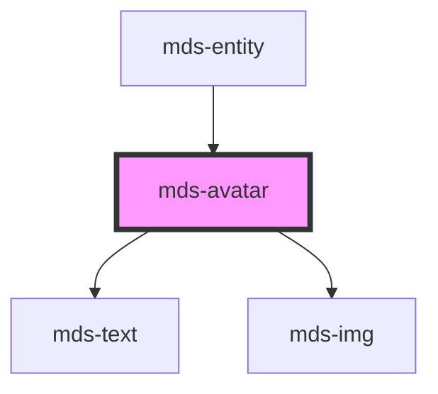

# mds-avatar

<!-- Start script-generated Magma Docs -->

# Install

Install the component via `npm` by running the following command

```bash
npm install @maggioli-design-system/mds-avatar
```

This package works also with yarn:

```bash
yarn add @maggioli-design-system/mds-avatar
```

### Import

Import the component in your project via `TypeScript` as follows:

```typescript
import { defineCustomElements as dceMdsAvatar } from '@maggioli-design-system/mds-avatar/loader'

dceMdsAvatar()
```

If you need to support older browsers (i.e. IE or early version of Edge), you can wrap the `defineCustomElements` in another utility awailable in the same package:

```typescript
import { applyPolyfills as apMdsAvatar, defineCustomElements as dceMdsAvatar } from '@maggioli-design-system/mds-avatar/loader'

apMdsAvatar().then(dceMdsAvatar())
```

Use alias for `defineCustomElements` method to initialize multiple web components in the same place:

```typescript
import { defineCustomElements as dceMdsComponentOne } from '@maggioli-design-system/mds-component-one/loader'
import { defineCustomElements as dceMdsComponentTwo } from '@maggioli-design-system/mds-component-two/loader'

dceMdsComponentOne()
dceMdsComponentTwo()
```

You can check how browser support works at [this page][stencil-browser-support].

# Integration

<!-- This section is useful to describe usages and configurations -->

#### How to use it in HTML

<!-- Add information about HTML usage here -->

`MdsAvatar` accepts a path to an image to be displayed via the `src` attribute, or if missing accepts the initials to be displayed via the `initials` attribute. Beware that the text passed via `initials` attribute will be trimmed and truncated up to the second character, so if `cya` is the value passed to the attribute, the final result displayed will be `CY` (the text will be transformed to uppercase via a css class).

An example follows:

```html
<mds-avatar src="https://placehold.co/80" initials="ap"></mds-avatar>
```

You can try it out on the component's [Storybook website][storybook]!

<!-- TODO set correct storybook link, `ui` may need to be changed into something else -->
[storybook]: https://magma.maggiolicloud.it/storybook/?path=/story/ui-avatar--default
[stencil-browser-support]: https://stenciljs.com/docs/browser-support

<!-- End script-generated Magma Docs -->

---

This is a web-component from Maggioli Design System [Magma](https://magma.maggiolicloud.it), built with StencilJS, TypeScript, Storybook. It's based on the web-component standard and it's designed to be agnostic from the JavaScirpt framework you are using.

<!-- Auto Generated Below -->


## Properties

| Property   | Attribute  | Description                                                 | Type                  | Default     |
| ---------- | ---------- | ----------------------------------------------------------- | --------------------- | ----------- |
| `initials` | `initials` | The user's inizials displayed if there's no image available | `string`              | `''`        |
| `src`      | `src`      | Specifies the path to the image                             | `string \| undefined` | `undefined` |


## CSS Custom Properties

| Name                                        | Description                                   |
| ------------------------------------------- | --------------------------------------------- |
| `--mds-avatar-background-color-pending`     | The background-color when an image is loading |
| `--mds-avatar-background-color-placeholder` | The background-color of the placeholder icon  |
| `--mds-avatar-color-placeholder`            | The color of the placeholder icon             |
| `--mds-avatar-radius`                       | The border-radius of the element              |


## Dependencies

### Used by

 - [mds-entity](../mds-entity)

### Depends on

- [mds-text](../mds-text)
- [mds-img](../mds-img)

### Graph


----------------------------------------------

Built with love @ [Gruppo Maggioli](https://www.maggioli.com) from [R&D Department](https://www.maggioli.com/it-it/chi-siamo/ricerca-sviluppo)
