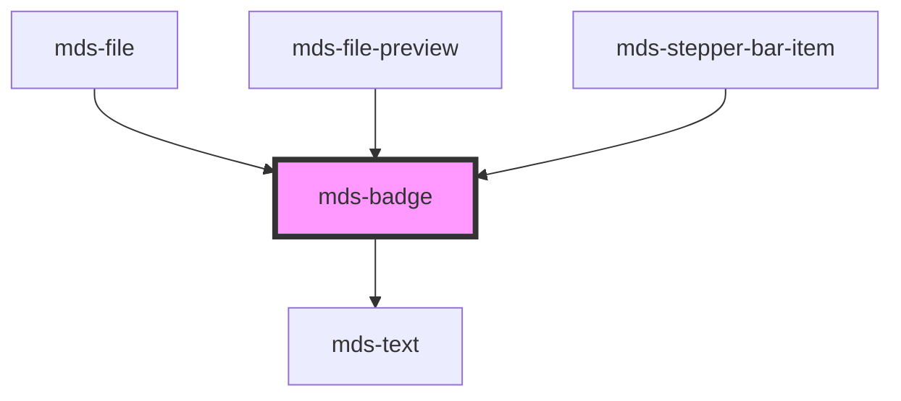

# mds-badge

This is a web-component from Maggioli Design System [Magma](https://magma.maggiolicloud.it), built with StencilJS, TypeScript, Storybook. It's based on the web-component standard and it's designed to be agnostic from the JavaScirpt framework you are using.

<!-- Auto Generated Below -->

## Properties

| Property            | Attribute            | Description                             | Type                                                                                                                                                                                            | Default     |
| ------------------- | -------------------- | --------------------------------------- | ----------------------------------------------------------------------------------------------------------------------------------------------------------------------------------------------- | ----------- |
| `tone`              | `tone`               | Sets the tone of the color variant      | `"ghost" \| "quiet" \| "strong" \| "weak" \| undefined`                                                                                                                                         | `'weak'`    |
| `typography`        | `typography`         | Specifies the typography of the element | `"caption" \| "detail" \| "label" \| "option" \| "paragraph" \| "tip"`                                                                                                                          | `'option'`  |
| `typographyVariant` | `typography-variant` | Specifies the variant for `typography`  | `"code" \| "info" \| "read" \| "title" \| undefined`                                                                                                                                            | `undefined` |
| `variant`           | `variant`            | Sets the theme variant colors           | `"amaranth" \| "aqua" \| "blue" \| "dark" \| "error" \| "green" \| "info" \| "light" \| "lime" \| "orange" \| "orchid" \| "sky" \| "success" \| "violet" \| "warning" \| "yellow" \| undefined` | `'green'`   |

## Slots

| Slot        | Description                                                                            |
| ----------- | -------------------------------------------------------------------------------------- |
| `"default"` | Add `text string` to this slot, **avoid** to add `HTML elements` or `components` here. |

## CSS Custom Properties

| Name                     | Description                                |
| ------------------------ | ------------------------------------------ |
| `--mds-badge-background` | Sets the background-color of the component |
| `--mds-badge-color`      | Sets the text color of the component       |
| `--mds-badge-radius`     | Sets the border-radius of the component    |

## Dependencies

### Used by

 - [mds-file](../mds-file)
 - [mds-file-preview](../mds-file-preview)
 - [mds-stepper-bar-item](../mds-stepper-bar-item)

### Depends on

- [mds-text](../mds-text)

### Graph

----------------------------------------------

Built with love @ [Gruppo Maggioli](https://www.maggioli.com) from [R&D Department](https://www.maggioli.com/it-it/chi-siamo/ricerca-sviluppo)
