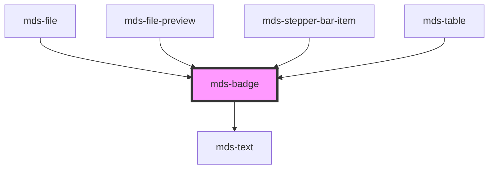

# mds-badge


This is a web-component from Maggioli Design System [Magma](https://magma.maggiolicloud.it), built with StencilJS, TypeScript, Storybook. It's based on the web-component standard and it's designed to be agnostic from the JavaScript framework you are using.

<!-- Auto Generated Below -->


## Usage

### 1. Description

The `<mds-badge>` web component is the Magma Design System's compact status and label indicator, used to attach a short categorical signal (count, state, tag) to other content. It is purely presentational and has no HTML primitive equivalent.

#### Semantic Behavior

- **Text-only content**: The badge is meant to carry a short text string, not markup; the `label` prop is the supported source of that text.
- **Deprecated default slot**: Slotted text is still read as a legacy fallback, but only when `label` is empty - once `label` is set it always wins. HTML elements or components in the slot are unsupported.
- **No interactivity**: The component emits no events, has no form association, no focus management, and no disabled/active state - it is a static visual marker.

#### Properties & Visual Configurations

The shared `variant` / `tone` ladders are defined in [`projects/stencil/SPEC.md`](../../../../SPEC.md#tone-and-variant-system); `<mds-badge>` consumes them directly and does not add any component-specific values. The default appearance is `variant="green"` with `tone="weak"`.

- **`tone`** selects the chrome treatment: `'weak'` for a subtle tinted fill (the default, best for dense lists and tables), `'strong'` for a saturated high-emphasis fill, and `'outline'` for a bordered, transparent-fill badge that reads as the lightest emphasis.

#### Other behavioral props

- **`typography`** chooses the internal text scale - `'option'` (default) or `'label'` - to align the badge's text size with the surrounding context (e.g. inside a denser table cell vs. a standalone label).


### 2. Pattern

Correct and idiomatic ways to use the `<mds-badge>` component, ordered from most common to most specialized. Patterns assume a working knowledge of the variant / tone ladders documented in [`docs/COMPONENTS.md`](../../../../../../docs/COMPONENTS.md) and the generic stencil rules in [`projects/stencil/SPEC.md`](../../../../SPEC.md).

#### Basic Badge via `label` Prop

The canonical form. Use the `label` prop for the badge's text content - it is the preferred source and the slot is deprecated.

```html
<mds-badge label="Attivo" variant="success" tone="weak"></mds-badge>
```

#### Variant and Tone for Emphasis

Pair the same `variant` with a different `tone` to control visual weight. `tone="weak"` (default) is the lightest fill; `tone="strong"` is a saturated solid; `tone="outline"` adds a visible border with a transparent background.

```html
<!-- Low emphasis: subtle tinted fill (default) -->
<mds-badge label="Bozza" variant="warning" tone="weak"></mds-badge>

<!-- High emphasis: solid saturated fill -->
<mds-badge label="Urgente" variant="error" tone="strong"></mds-badge>

<!-- Minimal emphasis: bordered, no fill -->
<mds-badge label="Archiviato" variant="dark" tone="outline"></mds-badge>
```

#### Status Variants

Use status variants (`info`, `success`, `warning`, `error`) to communicate state. Match the variant to the meaning, not to the colour you want.

```html
<mds-badge label="Completato" variant="success" tone="weak"></mds-badge>
<mds-badge label="In attesa" variant="info" tone="weak"></mds-badge>
<mds-badge label="Attenzione" variant="warning" tone="weak"></mds-badge>
<mds-badge label="Errore" variant="error" tone="weak"></mds-badge>
```

#### Decorative Label Variants

Use decorative label variants (`green`, `blue`, `violet`, `red`, `orange`, `yellow`, `lime`, `aqua`, `sky`, `orchid`, `purple`, `amaranth`) for categorical tags, topics, or visual grouping that carries no semantic state meaning. The default variant is `green`.

```html
<mds-badge label="Ambiente" variant="green"></mds-badge>
<mds-badge label="Tecnologia" variant="blue"></mds-badge>
<mds-badge label="Design" variant="violet"></mds-badge>
<mds-badge label="Marketing" variant="orange"></mds-badge>
```

#### Neutral Variants

Use `variant="dark"` for badges on light backgrounds and `variant="light"` for badges that must appear on dark surfaces.

```html
<!-- On a light surface -->
<mds-badge label="Categoria" variant="dark" tone="weak"></mds-badge>

<!-- On a dark or coloured surface -->
<mds-badge label="Categoria" variant="light" tone="strong"></mds-badge>
```

#### Typography Scale

Use `typography="label"` when the badge sits inside a denser context (such as a table cell) and the default `"option"` size is too large.

```html
<!-- Default scale - standalone labels, cards, sidebars -->
<mds-badge label="Nuovo" variant="primary" typography="option"></mds-badge>

<!-- Compact scale - inside tables or tight UI rows -->
<mds-badge label="Nuovo" variant="primary" typography="label"></mds-badge>
```

#### Badge Inside a Table Cell

`<mds-badge>` is commonly used as a status indicator inside [`mds-table`](../../mds-table) cells.

```html
<mds-table>
  <mds-table-body>
    <mds-table-row>
      <mds-table-cell>
        <mds-badge label="Approvato" variant="success" tone="weak" typography="label"></mds-badge>
      </mds-table-cell>
      <mds-table-cell>
        <mds-badge label="In revisione" variant="warning" tone="weak" typography="label"></mds-badge>
      </mds-table-cell>
    </mds-table-row>
  </mds-table-body>
</mds-table>
```

#### Badge Inside a File Listing

[`mds-file`](../../mds-file) and [`mds-file-preview`](../../mds-file-preview) render a badge internally to show the file type; you do not slot a badge into them. When adding a badge alongside file content elsewhere, compose it in the surrounding markup.

```html
<div class="file-meta">
  <mds-file name="relazione-2024.pdf"></mds-file>
  <mds-badge label="Firmato" variant="success" tone="weak" typography="label"></mds-badge>
</div>
```

#### Styling Customization

Style the badge only through its documented `--mds-badge-*` CSS custom properties. Use Magma color tokens via `rgb(var(--<token>))` so dark mode and high-contrast modes keep working.

```css
.custom-tag mds-badge {
  --mds-badge-background: rgb(var(--label-orchid-09));
  --mds-badge-color: rgb(var(--label-orchid-02));
  --mds-badge-radius: var(--radius-full);
}
```

For `tone="outline"`, also set the border properties:

```css
.custom-tag mds-badge[tone='outline'] {
  --mds-badge-border-color: rgb(var(--label-orchid-06));
  --mds-badge-border-width: 2px;
}
```


### 3. Antipattern

Common incorrect uses of `<mds-badge>`. Each entry pairs the wrong form with the right one and a one-line reason. System-wide rules (boolean-as-string, shadow piercing, Tailwind color utilities, raw native event listening) live in [`docs/COMPONENTS.md`](../../../../../../docs/COMPONENTS.md#system-level-anti-patterns) - they apply here too but are not repeated.

#### Do Not Put HTML in the Default Slot

The default slot is deprecated and accepts plain text only; nested elements are stripped or break layout. Use the `label` prop instead.

```html
<!-- 🚫 INCORRECT -->
<mds-badge>
  <strong>Urgente</strong>
</mds-badge>

<!-- ✅ CORRECT -->
<mds-badge label="Urgente" variant="error" tone="strong"></mds-badge>
```

#### Do Not Use the Slot When `label` Is Available

Slotted text still works as a legacy fallback but will be removed in a future release. The `label` prop is the documented API going forward.

```html
<!-- 🚫 INCORRECT -->
<mds-badge>Approvato</mds-badge>

<!-- ✅ CORRECT -->
<mds-badge label="Approvato" variant="success" tone="weak"></mds-badge>
```

#### Do Not Apply a `tone` Value Outside the Allowed Set

`<mds-badge>` uses `ToneSmartVariantType`, which allows only `strong`, `weak`, and `outline`. Values like `text` or `box` are not accepted and silently fall back to the default.

```html
<!-- 🚫 INCORRECT -->
<mds-badge label="Bozza" variant="warning" tone="text"></mds-badge>
<mds-badge label="Bozza" variant="warning" tone="box"></mds-badge>

<!-- ✅ CORRECT -->
<mds-badge label="Bozza" variant="warning" tone="outline"></mds-badge>
```

#### Do Not Use Legacy `ghost` or `quiet` Tone Values

`tone="ghost"` and `tone="quiet"` were renamed in Magma 2.0 to `outline` and `text`. Neither name is valid for `<mds-badge>` - use `outline` (the closest equivalent) or `weak`.

```html
<!-- 🚫 INCORRECT (Magma 1.x naming) -->
<mds-badge label="Archiviato" tone="ghost" variant="dark"></mds-badge>

<!-- ✅ CORRECT (Magma 2.x) -->
<mds-badge label="Archiviato" tone="outline" variant="dark"></mds-badge>
```

#### Do Not Pick a Variant for Its Color Alone

`variant` carries semantic meaning - status variants (`error`, `warning`, `success`, `info`) communicate state; label variants (`green`, `blue`, `violet`, etc.) communicate category. Do not choose a variant just because its color looks right.

```html
<!-- 🚫 INCORRECT: using "error" to get a red tag for a topic, not an error state -->
<mds-badge label="Ruby" variant="error" tone="weak"></mds-badge>

<!-- ✅ CORRECT: use a decorative label variant for non-state tags -->
<mds-badge label="Ruby" variant="red" tone="weak"></mds-badge>
```

#### Do Not Customize via Undocumented Selectors

The supported customization surface is `--mds-badge-*` CSS custom properties. Targeting shadow-DOM internals via `>>>`, `/deep/`, or undocumented `::part()` names couples your code to implementation details that can change on any release.

```css
/* 🚫 INCORRECT */
mds-badge >>> span {
  font-weight: bold;
  letter-spacing: 0.1em;
}

/* ✅ CORRECT */
mds-badge {
  --mds-badge-background: rgb(var(--label-violet-09));
  --mds-badge-color: rgb(var(--label-violet-02));
  --mds-badge-radius: var(--radius-full);
}
```

#### Do Not Use `<mds-badge>` for Interactive Controls

`<mds-badge>` is purely presentational - it emits no events and has no focus management. For a selectable or dismissible tag, use [`mds-chip`](../../mds-chip) instead.

```html
<!-- 🚫 INCORRECT: listening to a click on a non-interactive component -->
<mds-badge label="Rimuovi" variant="error" onclick="removeTag()"></mds-badge>

<!-- ✅ CORRECT: use mds-chip for interactive tag behavior -->
<mds-chip label="Rimuovi" variant="error" deletable></mds-chip>
```


## Properties

| Property     | Attribute    | Description                             | Type                                                                                                                                                                                                                 | Default     |
| ------------ | ------------ | --------------------------------------- | -------------------------------------------------------------------------------------------------------------------------------------------------------------------------------------------------------------------- | ----------- |
| `label`      | `label`      | The label of the badge                  | `string \| undefined`                                                                                                                                                                                                | `undefined` |
| `tone`       | `tone`       | Sets the tone of the color variant      | `"outline" \| "strong" \| "weak" \| undefined`                                                                                                                                                                       | `'weak'`    |
| `typography` | `typography` | Specifies the typography of the element | `"label" \| "option"`                                                                                                                                                                                                | `'option'`  |
| `variant`    | `variant`    | Sets the theme variant colors           | `"amaranth" \| "aqua" \| "blue" \| "dark" \| "error" \| "green" \| "info" \| "light" \| "lime" \| "orange" \| "orchid" \| "purple" \| "red" \| "sky" \| "success" \| "violet" \| "warning" \| "yellow" \| undefined` | `'green'`   |


## Slots

| Slot        | Description                                                                                                                              |
| ----------- | ---------------------------------------------------------------------------------------------------------------------------------------- |
| `"default"` | **Deprecated**, use the `label` property instead. Add `text string` to this slot, **avoid** to add `HTML elements` or `components` here. |


## CSS Custom Properties

| Name                       | Description                                                   |
| -------------------------- | ------------------------------------------------------------- |
| `--mds-badge-background`   | Sets the background-color of the component                    |
| `--mds-badge-border-color` | Sets the border color of the component when tone is "outline" |
| `--mds-badge-border-width` | Sets the border width of the component when tone is "outline" |
| `--mds-badge-color`        | Sets the text color of the component                          |
| `--mds-badge-radius`       | Sets the border-radius of the component                       |


## Dependencies

### Used by

 - [mds-file](../mds-file)
 - [mds-file-preview](../mds-file-preview)
 - [mds-stepper-bar-item](../mds-stepper-bar-item)
 - [mds-table](../mds-table)

### Depends on

- [mds-text](../mds-text)

### Graph


----------------------------------------------

Built with love @ [Gruppo Maggioli](https://www.maggioli.com) from [R&D Department](https://www.maggioli.com/it-it/chi-siamo/ricerca-sviluppo)
