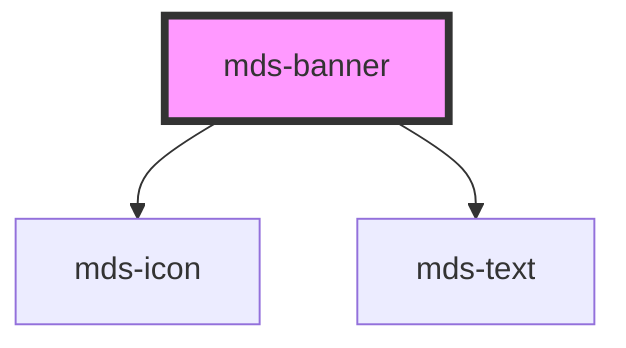

# mds-banner

<!-- Auto Generated Below -->

## Properties

| Property     | Attribute     | Description                                                                | Type                                                                                         | Default     |
| ------------ | ------------- | -------------------------------------------------------------------------- | -------------------------------------------------------------------------------------------- | ----------- |
| `closeLabel` | `close-label` | Sets the cross icon accessibility label to perform close action on element | `"Annulla" \| undefined`                                                                     | `'Annulla'` |
| `deletable`  | `deletable`   | Shows the cross icon to perform cancel/delete action on element            | `boolean \| undefined`                                                                       | `undefined` |
| `headline`   | `headline`    | The title on the top of the banner                                         | `string \| undefined`                                                                        | `undefined` |
| `icon`       | `icon`        | An icon displayed at the top left of the banner                            | `string \| undefined`                                                                        | `undefined` |
| `tone`       | `tone`        | Sets the tone of the color variant                                         | `"quiet" \| "strong" \| "weak" \| undefined`                                                 | `'weak'`    |
| `variant`    | `variant`     | Sets the theme variant colors                                              | `"dark" \| "error" \| "info" \| "light" \| "primary" \| "success" \| "warning" \| undefined` | `'light'`   |

## Events

| Event            | Description                       | Type                |
| ---------------- | --------------------------------- | ------------------- |
| `mdsBannerClose` | Emits when the url view is closed | `CustomEvent<void>` |

## Slots

| Slot        | Description                                                                             |
| ----------- | --------------------------------------------------------------------------------------- |
| `"action"`  | Add `HTML elements` or `components`, it is **recommended** to use `mds-button` element. |
| `"default"` | Add `text string`, `HTML elements` or `components` to this slot.                        |

## Dependencies

### Depends on

- [mds-icon](../mds-icon)
- [mds-text](../mds-text)

### Graph

----------------------------------------------

Built with love @ **Maggioli Informatica / R&D Department**
