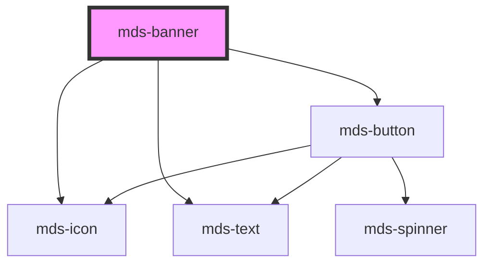

# mds-banner

This is a web-component from Maggioli Design System [Magma](https://magma.maggiolicloud.it), built with StencilJS, TypeScript, Storybook. It's based on the web-component standard and it's designed to be agnostic from the JavaScirpt framework you are using.

<!-- Auto Generated Below -->

## Properties

| Property    | Attribute   | Description                                                     | Type                                                                                         | Default     |
| ----------- | ----------- | --------------------------------------------------------------- | -------------------------------------------------------------------------------------------- | ----------- |
| `deletable` | `deletable` | Shows the cross icon to perform cancel/delete action on element | `boolean \| undefined`                                                                       | `undefined` |
| `headline`  | `headline`  | The title on the top of the banner                              | `string \| undefined`                                                                        | `undefined` |
| `icon`      | `icon`      | An icon displayed at the top left of the banner                 | `string \| undefined`                                                                        | `undefined` |
| `tone`      | `tone`      | Sets the tone of the color variant                              | `"quiet" \| "strong" \| "weak" \| undefined`                                                 | `'weak'`    |
| `variant`   | `variant`   | Sets the theme variant colors                                   | `"dark" \| "error" \| "info" \| "light" \| "primary" \| "success" \| "warning" \| undefined` | `'light'`   |

## Events

| Event            | Description                       | Type                |
| ---------------- | --------------------------------- | ------------------- |
| `mdsBannerClose` | Emits when the url view is closed | `CustomEvent<void>` |

## Slots

| Slot        | Description                                                                             |
| ----------- | --------------------------------------------------------------------------------------- |
| `"action"`  | Add `HTML elements` or `components`, it is **recommended** to use `mds-button` element. |
| `"default"` | Add `text string`, `HTML elements` or `components` to this slot.                        |

## CSS Custom Properties

| Name                                       | Description                                                           |
| ------------------------------------------ | --------------------------------------------------------------------- |
| `--mds-banner-background`                  | Sets the background-color of the component                            |
| `--mds-banner-close-icon-hover-background` | Sets the background color of the close icon when the mouse is over it |
| `--mds-banner-color`                       | Sets the text color of the component                                  |
| `--mds-banner-gap`                         | Sets gap between banner elements                                      |
| `--mds-banner-icon-color`                  | Sets the close icon fill color of the component                       |
| `--mds-banner-radius`                      | Sets the border-radius of the component                               |
| `--mds-banner-shadow`                      | Sets the box-shadow of the component                                  |

## Dependencies

### Depends on

- [mds-icon](../mds-icon)
- [mds-text](../mds-text)
- [mds-button](../mds-button)

### Graph

----------------------------------------------

Built with love @ [Gruppo Maggioli](https://www.maggioli.com) from [R&D Department](https://www.maggioli.com/it-it/chi-siamo/ricerca-sviluppo)
