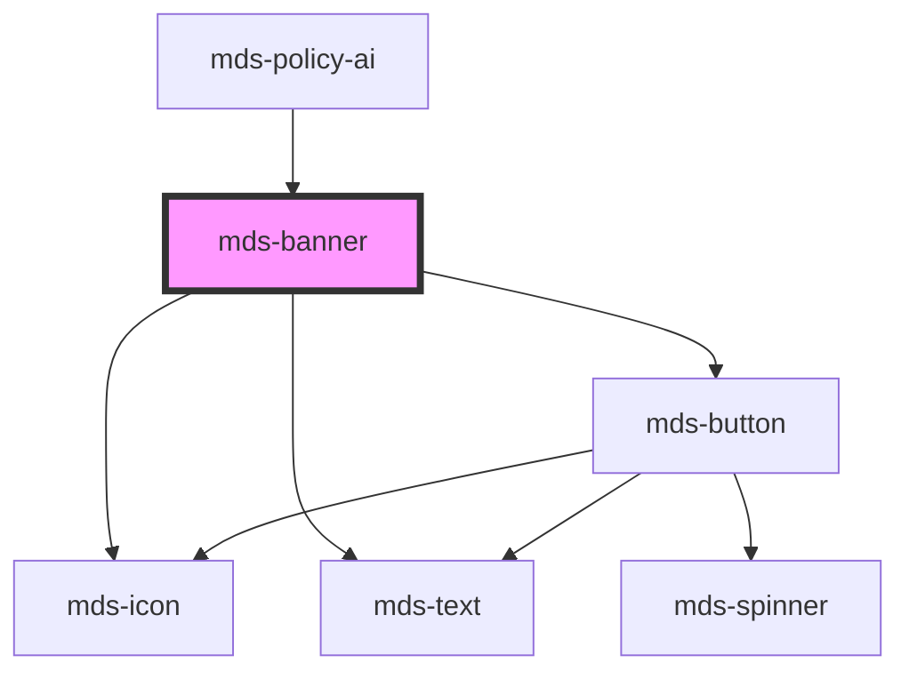

# mds-banner


This is a web-component from Maggioli Design System [Magma](https://magma.maggiolicloud.it), built with StencilJS, TypeScript, Storybook. It's based on the web-component standard and it's designed to be agnostic from the JavaScript framework you are using.

<!-- Auto Generated Below -->


## Usage

### 1. Description

The `<mds-banner>` web component is the Magma Design System surface for contextual, in-page messages - informational notices, status callouts, and alerts - pairing an optional icon, headline, body text, and inline actions inside a single themed box.

#### Semantic Behavior

- **Variant-driven ARIA**: The announcement role is derived from `variant`, not set manually. `error` and `warning` announce assertively (`role="alert"`); `ai`, `info`, `primary`, and `success` announce politely (`role="status"`); `light` and `dark` are decorative and silent.
- **Headline as label**: When `headline` is set it also becomes the banner's accessible label.
- **Dismissal**: When `deletable` is true a close button is rendered; activating it emits `mdsBannerClose` and, if the banner sits inside an `mds-modal`, closes that modal.
- **Localized close button**: The close button title is localized (el/en/es/it) from the host language.
- **Action slot**: The `action` region is rendered only when a direct `[slot="action"]` child is present, so banners without actions produce no empty container.

#### Properties & Visual Configurations

This component uses the shared `variant` / `tone` ladders defined in [`projects/stencil/SPEC.md`](../../../../SPEC.md#tone-and-variant-system); pick the `variant` according to the message's semantic weight, since it also governs the ARIA behavior described above. `tone` is limited to the minimal-box set (`'weak'`, `'strong'`, `'box'`), defaulting to `'weak'`.

#### Other behavioral props

- **`cockade`** (default `true`) wraps the leading `icon` in a colored decorative badge; disable it for a flatter icon presentation.
- **`icon`** is a Magma icon library slug shown at the top-left, surfaced as decorative.
- **`deletable`** opts the banner into being dismissible - choose it for transient or user-acknowledged messages rather than persistent context.
- The **default slot** carries the body text/markup; the **`action` slot** holds inline controls, with `mds-button` the recommended element.


### 2. Pattern

Correct and idiomatic ways to use the `<mds-banner>` component, ordered from most common to most specialized. Patterns assume a working knowledge of the variant / tone ladders documented in [`docs/COMPONENTS.md`](../../../../../../docs/COMPONENTS.md) and the generic stencil rules in [`projects/stencil/SPEC.md`](../../../../SPEC.md).

#### Informational Banner

The baseline usage. Provide `variant="info"` and place the body copy in the default slot. The component derives `role="status"` and `aria-live="polite"` automatically from the variant.

```html
<mds-banner variant="info">
  <mds-text typography="detail">
    Il sistema e in manutenzione programmata dalle 22:00 alle 23:00.
  </mds-text>
</mds-banner>
```

#### Status Variants

Pick the variant that matches the message's semantic weight. `error` and `warning` set `role="alert"` with assertive live region; the others use `role="status"` with polite announcement.

```html
<!-- Esito positivo -->
<mds-banner variant="success">
  <mds-text typography="detail">Dati salvati correttamente.</mds-text>
</mds-banner>

<!-- Avviso non bloccante -->
<mds-banner variant="warning">
  <mds-text typography="detail">La sessione scadra tra 5 minuti.</mds-text>
</mds-banner>

<!-- Errore bloccante -->
<mds-banner variant="error">
  <mds-text typography="detail">Impossibile completare l'operazione. Riprovare.</mds-text>
</mds-banner>
```

#### Banner with Headline

Use the `headline` prop to add a title above the body text. The headline is also used as the banner's accessible label (`aria-label`).

```html
<mds-banner variant="warning" headline="Licenza in scadenza">
  <mds-text typography="detail">
    La licenza del servizio scadra tra 7 giorni. Rinnova ora per non interrompere il servizio.
  </mds-text>
</mds-banner>
```

#### Banner with Icon

Set `icon` to a Magma icon slug. The icon is decorative (`aria-hidden="true"`). `cockade` is `true` by default, wrapping the icon in a colored badge; set `cockade="false"` for a flatter look.

```html
<!-- Con cockade (default) -->
<mds-banner variant="info" icon="mi/baseline/info" headline="Aggiornamento disponibile">
  <mds-text typography="detail">E disponibile una nuova versione dell'applicazione.</mds-text>
</mds-banner>

<!-- Senza cockade -->
<mds-banner variant="success" icon="mi/baseline/check-circle" cockade="false">
  <mds-text typography="detail">Operazione completata.</mds-text>
</mds-banner>
```

#### Dismissible Banner

Set `deletable` to show a close button. The button emits `mdsBannerClose` when activated. Listen for the event to remove the banner from the DOM or update application state.

```html
<mds-banner variant="info" deletable id="promo-banner">
  <mds-text typography="detail">
    Scopri le nuove funzioni premium disponibili nel tuo piano.
  </mds-text>
</mds-banner>

<script>
  document.querySelector('#promo-banner').addEventListener('mdsBannerClose', () => {
    document.querySelector('#promo-banner').remove();
  });
</script>
```

#### Banner with Action Buttons

Slot `<mds-button>` elements with `slot="action"` to add inline controls. The action region is rendered only when at least one `[slot="action"]` child is present. Match the button variant to the banner variant for visual consistency.

```html
<mds-banner variant="warning" headline="Abbonamento scaduto">
  <mds-text typography="detail">
    La licenza di questo servizio e scaduta. Il servizio continua a funzionare
    ma non puoi utilizzare le funzioni premium.
  </mds-text>
  <mds-button slot="action" variant="warning" tone="outline">Annulla</mds-button>
  <mds-button slot="action" variant="warning" tone="strong">Rinnova abbonamento</mds-button>
</mds-banner>
```

#### Tone for Visual Emphasis

`tone` controls emphasis without changing the semantic variant. Use `strong` for maximum contrast, `weak` (default) for subtle background tints, and `box` for high-contrast placements. `mds-banner` accepts only `weak`, `strong`, and `box` - not `outline` or `text`.

```html
<!-- Bassa enfasi (default) -->
<mds-banner variant="error" tone="weak">
  <mds-text typography="detail">Errore di validazione nei campi del modulo.</mds-text>
</mds-banner>

<!-- Alta enfasi -->
<mds-banner variant="error" tone="strong">
  <mds-text typography="detail">Account bloccato per attivita sospetta. Contatta il supporto.</mds-text>
</mds-banner>
```

#### Dark and Light Decorative Variants

`variant="dark"` and `variant="light"` are neutral, decorative banners without an ARIA live region (`role="presentation"`). Use them for non-critical UI chrome - announcements or promotional content that does not require immediate attention.

```html
<mds-banner variant="dark" tone="strong" headline="Novita del mese">
  <mds-text typography="detail">
    Tre nuovi moduli sono stati aggiunti alla piattaforma.
  </mds-text>
  <mds-button slot="action" variant="light" tone="text">Scopri</mds-button>
</mds-banner>
```

#### AI Variant

Use `variant="ai"` to mark banners that present AI-generated content or AI-powered suggestions. The variant emits a polite `role="status"` live announcement.

```html
<mds-banner variant="ai" icon="mi/baseline/auto-awesome" headline="Suggerimento IA">
  <mds-text typography="detail">
    L'analisi ha rilevato tre anomalie nel documento caricato.
  </mds-text>
  <mds-button slot="action" variant="ai" tone="outline">Visualizza dettagli</mds-button>
</mds-banner>
```

#### Dismissible Banner inside mds-modal

When `deletable` is set and the banner lives inside an `<mds-modal>`, activating the close button emits `mdsBannerClose` and also closes the modal automatically - no extra JavaScript needed.

```html
<mds-modal opened>
  <mds-banner variant="warning" deletable headline="Attenzione">
    <mds-text typography="detail">
      Stai per eliminare tutti i dati. L'azione non e reversibile.
    </mds-text>
    <mds-button slot="action" variant="warning" tone="outline">Annulla</mds-button>
    <mds-button slot="action" variant="warning" tone="strong">Elimina</mds-button>
  </mds-banner>
</mds-modal>
```

#### CSS Custom Property Customization

Override appearance only through the documented `--mds-banner-*` custom properties. Set them on the host or a parent selector; use Magma color tokens via `rgb(var(--<token>))` so dark mode and high-contrast modes keep working.

```css
.featured-notice mds-banner {
  --mds-banner-background: rgb(var(--variant-primary-03));
  --mds-banner-color: rgb(var(--tone-kaolin-10));
  --mds-banner-headline-color: rgb(var(--tone-kaolin-10));
  --mds-banner-radius: var(--radius-sm);
  --mds-banner-shadow: 0 4px 16px rgb(var(--tone-neutral-02) / 0.15);
}
```


### 3. Antipattern

Common incorrect uses of `<mds-banner>`. Each entry pairs the wrong form with the right one and a one-line reason. System-wide rules (boolean-as-string, shadow piercing, Tailwind color utilities, raw native event listening) live in [`docs/COMPONENTS.md`](../../../../../../docs/COMPONENTS.md#system-level-anti-patterns) - they apply here too but are not repeated.

#### Do Not Use an Invalid `tone` Value

`mds-banner.tone` is typed as `ToneMinimalBoxVariantType`, which allows only `weak`, `strong`, and `box`. Values like `outline` or `text` are not accepted and will silently fall back to the default.

```html
<!-- 🚫 INCORRECT -->
<mds-banner variant="info" tone="outline">
  <mds-text typography="detail">Informazione di sistema.</mds-text>
</mds-banner>

<!-- ✅ CORRECT -->
<mds-banner variant="info" tone="weak">
  <mds-text typography="detail">Informazione di sistema.</mds-text>
</mds-banner>
```

#### Do Not Override the ARIA Role Manually

The component derives `role` and `aria-live` from `variant` - overriding them breaks the intentional severity mapping (`error`/`warning` assertive, others polite).

```html
<!-- 🚫 INCORRECT -->
<mds-banner variant="info" role="alert" aria-live="assertive">
  <mds-text typography="detail">Aggiornamento disponibile.</mds-text>
</mds-banner>

<!-- ✅ CORRECT - let variant drive the ARIA behavior -->
<mds-banner variant="info">
  <mds-text typography="detail">Aggiornamento disponibile.</mds-text>
</mds-banner>
```

#### Do Not Slot an `mds-button` into the Default Slot to Add Actions

The `action` named slot is the correct place for inline controls. Placing buttons in the default slot renders them inside the text region, breaks layout, and loses the flex wrapping the action row provides.

```html
<!-- 🚫 INCORRECT -->
<mds-banner variant="warning">
  <mds-text typography="detail">La licenza sta per scadere.</mds-text>
  <mds-button variant="warning">Rinnova</mds-button>
</mds-banner>

<!-- ✅ CORRECT -->
<mds-banner variant="warning">
  <mds-text typography="detail">La licenza sta per scadere.</mds-text>
  <mds-button slot="action" variant="warning" tone="strong">Rinnova</mds-button>
</mds-banner>
```

#### Do Not Set `deletable="false"` to Hide the Close Button

`deletable` is a boolean prop. Setting it to the string `"false"` evaluates as truthy in HTML and shows the close button. Remove the attribute (or omit it) to hide the button.

```html
<!-- 🚫 INCORRECT -->
<mds-banner variant="error" deletable="false">
  <mds-text typography="detail">Errore permanente - non dismissibile.</mds-text>
</mds-banner>

<!-- ✅ CORRECT -->
<mds-banner variant="error">
  <mds-text typography="detail">Errore permanente - non dismissibile.</mds-text>
</mds-banner>
```

#### Do Not Use `dark` or `light` for Status Messages

`variant="dark"` and `variant="light"` produce `role="presentation"` with no live region - they are silent to assistive tech. Using them for error, warning, or informational content means screen reader users never receive the announcement.

```html
<!-- 🚫 INCORRECT - errore silenzioso per tecnologie assistive -->
<mds-banner variant="dark">
  <mds-text typography="detail">Errore: impossibile caricare il documento.</mds-text>
</mds-banner>

<!-- ✅ CORRECT -->
<mds-banner variant="error">
  <mds-text typography="detail">Errore: impossibile caricare il documento.</mds-text>
</mds-banner>
```

#### Do Not Pierce Shadow DOM to Style Internals

The only supported customization surface is the `--mds-banner-*` CSS custom properties plus the `::part(text)` shadow part. Targeting internal class names with `>>>` or undocumented `::part()` names couples your code to the implementation and breaks on minor releases.

```css
/* 🚫 INCORRECT */
mds-banner >>> .headline {
  font-size: 1.5rem;
}
mds-banner::part(content) {
  padding: 0;
}

/* ✅ CORRECT */
mds-banner {
  --mds-banner-headline-color: rgb(var(--variant-primary-03));
  --mds-banner-radius: var(--radius-sm);
}
mds-banner::part(text) {
  line-height: 1.6;
}
```

#### Do Not Listen to the Native `click` Event for Dismissal

The component fires `mdsBannerClose` when the close button is activated (both pointer and keyboard). Listening to the native `click` event may miss keyboard activations and does not bubble out of Shadow DOM reliably.

```html
<!-- 🚫 INCORRECT -->
<mds-banner variant="info" deletable id="notice">
  <mds-text typography="detail">Avviso temporaneo.</mds-text>
</mds-banner>
<script>
  document.querySelector('#notice').addEventListener('click', () => {
    document.querySelector('#notice').remove();
  });
</script>

<!-- ✅ CORRECT -->
<mds-banner variant="info" deletable id="notice">
  <mds-text typography="detail">Avviso temporaneo.</mds-text>
</mds-banner>
<script>
  document.querySelector('#notice').addEventListener('mdsBannerClose', () => {
    document.querySelector('#notice').remove();
  });
</script>
```


## Properties

| Property    | Attribute   | Description                                                     | Type                                                                                                 | Default     |
| ----------- | ----------- | --------------------------------------------------------------- | ---------------------------------------------------------------------------------------------------- | ----------- |
| `cockade`   | `cockade`   | Shows a decoration around the banner icon                       | `boolean \| undefined`                                                                               | `true`      |
| `deletable` | `deletable` | Shows the cross icon to perform cancel/delete action on element | `boolean \| undefined`                                                                               | `undefined` |
| `headline`  | `headline`  | The title on the top of the banner                              | `string \| undefined`                                                                                | `undefined` |
| `icon`      | `icon`      | An icon displayed at the top left of the banner                 | `string \| undefined`                                                                                | `undefined` |
| `tone`      | `tone`      | Sets the tone of the color variant                              | `"box" \| "strong" \| "weak" \| undefined`                                                           | `'weak'`    |
| `variant`   | `variant`   | Sets the theme variant colors                                   | `"ai" \| "dark" \| "error" \| "info" \| "light" \| "primary" \| "success" \| "warning" \| undefined` | `'primary'` |


## Events

| Event            | Description                       | Type                |
| ---------------- | --------------------------------- | ------------------- |
| `mdsBannerClose` | Emits when the url view is closed | `CustomEvent<void>` |


## Methods

### `updateLang() => Promise<void>`

Updates the component's texts to the locale currently set on the host element.

#### Returns

Type: `Promise<void>`


## Slots

| Slot       | Description                                                                             |
| ---------- | --------------------------------------------------------------------------------------- |
|            | Add `text string`, `HTML elements` or `components` to this slot.                        |
| `"action"` | Add `HTML elements` or `components`, it is **recommended** to use `mds-button` element. |


## Shadow Parts

| Part     | Description                                           |
| -------- | ----------------------------------------------------- |
| `"text"` | The text wrapper of the `default` and `content` slots |


## CSS Custom Properties

| Name                                       | Description                                                                                          |
| ------------------------------------------ | ---------------------------------------------------------------------------------------------------- |
| `--mds-banner-background`                  | Sets the background-color of the component                                                           |
| `--mds-banner-close-icon-hover-background` | Sets the background color of the close icon when the mouse is over it                                |
| `--mds-banner-cockade-background`          | When cockade attribute is set, the icon will be wrapper with a colored area, this is it's background |
| `--mds-banner-cockade-distance`            | When cockade attribute is set, the icon will be wrapper with a colored area, this is it's icon color |
| `--mds-banner-color`                       | Sets the text color of the component                                                                 |
| `--mds-banner-content-gap`                 | Sets gap between banner elements                                                                     |
| `--mds-banner-headline-color`              | The text color of the headline                                                                       |
| `--mds-banner-icon-color`                  | Sets the close icon fill color of the component                                                      |
| `--mds-banner-radius`                      | Sets the border-radius of the component                                                              |
| `--mds-banner-shadow`                      | Sets the box-shadow of the component                                                                 |
| `--mds-banner-transition-duration`         | Sets the transition duration                                                                         |
| `--mds-banner-transition-timing-function`  | Sets the transition timing function                                                                  |


## Dependencies

### Used by

 - [mds-policy-ai](../mds-policy-ai)

### Depends on

- [mds-icon](../mds-icon)
- [mds-text](../mds-text)
- [mds-button](../mds-button)

### Graph


----------------------------------------------

Built with love @ [Gruppo Maggioli](https://www.maggioli.com) from [R&D Department](https://www.maggioli.com/it-it/chi-siamo/ricerca-sviluppo)
