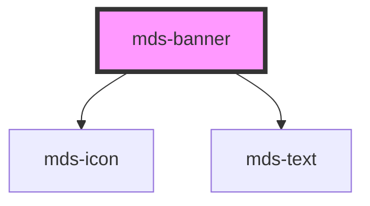

# mds-banner

<!-- Auto Generated Below -->

## Properties

| Property    | Attribute   | Description                                                     | Type                                                                            | Default     |
| ----------- | ----------- | --------------------------------------------------------------- | ------------------------------------------------------------------------------- | ----------- |
| `deletable` | `deletable` | Shows the cross icon to perform cancel/delete action on element | `boolean`                                                                       | `undefined` |
| `headline`  | `headline`  | The title on the top of the banner                              | `string`                                                                        | `undefined` |
| `icon`      | `icon`      | An icon displayed at the top left of the banner                 | `string`                                                                        | `undefined` |
| `tone`      | `tone`      | Sets the tone of the color variant                              | `"quiet" \| "strong" \| "weak"`                                                 | `'weak'`    |
| `variant`   | `variant`   | Sets the theme variant colors                                   | `"dark" \| "error" \| "info" \| "light" \| "primary" \| "success" \| "warning"` | `'light'`   |

## Events

| Event   | Description                       | Type                |
| ------- | --------------------------------- | ------------------- |
| `close` | Emits when the url view is closed | `CustomEvent<void>` |

## CSS Custom Properties

| Name           | Description                                     |
| -------------- | ----------------------------------------------- |
| `--background` | Sets the background-color of the component      |
| `--color`      | Sets the text color of the component            |
| `--icon-color` | Sets the close icon fill color of the component |
| `--radius`     | Sets the border-radius of the component         |
| `--shadow`     | Sets the box-shadow of the component            |

## Dependencies

### Depends on

- [mds-icon](../mds-icon)
- [mds-text](../mds-text)

### Graph

----------------------------------------------

Built with love @ **Maggioli Informatica / R&D Department**
