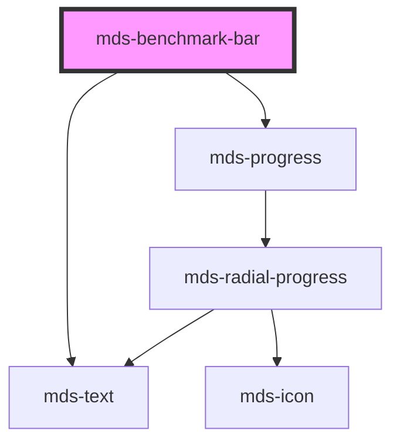

# mds-benchmark-bar


This is a web-component from Maggioli Design System [Magma](https://magma.maggiolicloud.it), built with StencilJS, TypeScript, Storybook. It's based on the web-component standard and it's designed to be agnostic from the JavaScript framework you are using.

<!-- Auto Generated Below -->


## Usage

### 1. Description

The `<mds-benchmark-bar>` web component is a read-only data-visualization element of the Magma Design System that pairs a labelled caption with a horizontal progress bar to express a single benchmark value on a 0-100 scale. It is a presentational compound that composes `<mds-text>` and `<mds-progress>`; it has no native HTML primitive equivalent.

#### Semantic Behavior

- **Display-only**: The component is non-interactive - it emits no events, has no form association, and is not part of the tab sequence.
- **Text-only label**: The label caption is meant to carry a plain text string, not markup; the `label` prop is the supported source of that text.
- **Deprecated default slot**: Slotted text is still read as a legacy fallback, but only when `label` is empty - once `label` is set it always wins. HTML elements or components in the slot are unsupported.
- **Shadow part**: The inner progress bar is exposed as the `progress-bar` part for external styling.

#### Properties & Visual Configurations

- **`value`** drives both the rendered value text and the fill of the progress bar; supply it on a 0-100 scale.
- **`alias`** overrides how the value is displayed: when present it replaces the numeric `value` in the caption (and in the announced value), letting you show formatted or qualitative text (e.g. a graded label) instead of the raw number.
- **`typography`** selects the text scale applied to both the label and value captions, choosing between `'label'` (the default, heavier caption styling) and `'option'` (lighter, denser styling for compact contexts).

The shared `variant` and `size` ladders are defined in [`projects/stencil/SPEC.md`](../../../../SPEC.md#tone-and-variant-system); `variant` sets the progress bar theme colors (defaulting to `'dark'`), and `size` controls the progress bar height (defaulting to `'md'`). This component does not add values beyond the shared sets.


### 2. Pattern

Correct and idiomatic ways to use the `<mds-benchmark-bar>` component, ordered from most common to most specialized. Patterns assume a working knowledge of the variant / tone ladders documented in [`docs/COMPONENTS.md`](../../../../../../docs/COMPONENTS.md) and the generic stencil rules in [`projects/stencil/SPEC.md`](../../../../SPEC.md).

#### Basic Benchmark via `label` and `value`

The canonical form. Set `label` for the caption text and `value` (0-100) for the fill. Both are reflected as attributes, so CSS attribute selectors work.

```html
<mds-benchmark-bar label="Soddisfazione clienti" value="72"></mds-benchmark-bar>
```

#### Multiple Bars in a List

Render several bars together to compare metrics. Each bar stands on its own; no parent wrapper is required.

```html
<mds-benchmark-bar label="Qualita del servizio" value="85"></mds-benchmark-bar>
<mds-benchmark-bar label="Tempi di risposta" value="61"></mds-benchmark-bar>
<mds-benchmark-bar label="Risoluzione al primo contatto" value="44"></mds-benchmark-bar>
```

#### Alias to Replace the Numeric Value

Use `alias` when you need to display a formatted or qualitative string instead of the raw number. The alias also becomes the accessible `aria-valuetext` announced to screen readers.

```html
<!-- Show a grade label instead of the raw score -->
<mds-benchmark-bar
  label="Punteggio complessivo"
  value="68"
  alias="Buono"
></mds-benchmark-bar>

<!-- Show a ratio string -->
<mds-benchmark-bar
  label="Attivita completate"
  value="33"
  alias="1 di 3"
></mds-benchmark-bar>
```

#### Variant for Semantic Color

`variant` controls the color theme of the progress bar. Pick the value that matches the meaning of the metric, not the color you want.

```html
<!-- Neutral / default -->
<mds-benchmark-bar label="Utilizzo CPU" value="55" variant="dark"></mds-benchmark-bar>

<!-- Primary brand emphasis -->
<mds-benchmark-bar label="Avanzamento progetto" value="70" variant="primary"></mds-benchmark-bar>

<!-- Status: healthy -->
<mds-benchmark-bar label="Uptime mensile" value="99" variant="success"></mds-benchmark-bar>

<!-- Status: under threshold -->
<mds-benchmark-bar label="Scorte disponibili" value="18" variant="warning"></mds-benchmark-bar>

<!-- Status: critical -->
<mds-benchmark-bar label="Errori rilevati" value="82" variant="error"></mds-benchmark-bar>
```

#### Size

`size` controls the height of the progress bar. Use `sm` for dense lists, `lg` / `xl` for hero metrics.

```html
<mds-benchmark-bar label="Piccolo" value="40" size="sm"></mds-benchmark-bar>
<mds-benchmark-bar label="Medio (default)" value="40" size="md"></mds-benchmark-bar>
<mds-benchmark-bar label="Grande" value="40" size="lg"></mds-benchmark-bar>
<mds-benchmark-bar label="Extra grande" value="40" size="xl"></mds-benchmark-bar>
```

#### Typography Scale

`typography` applies to both the label caption and the value text. Use `option` for compact contexts where the default `label` scale is too heavy.

```html
<!-- Default scale -->
<mds-benchmark-bar label="Punteggio" value="76" typography="label"></mds-benchmark-bar>

<!-- Compact / denser scale -->
<mds-benchmark-bar label="Punteggio" value="76" typography="option"></mds-benchmark-bar>
```

#### Styling Customization via `::part(progress-bar)`

The inner progress bar is exposed as the `progress-bar` shadow part. Use it to apply targeted overrides when the documented variant colors are insufficient - for example, to enforce a brand-specific fill in a narrow context.

```css
.hero-metric mds-benchmark-bar::part(progress-bar) {
  --mds-progress-color: rgb(var(--variant-ai-04));
}
```


### 3. Antipattern

Common incorrect uses of `<mds-benchmark-bar>`. Each entry pairs the wrong form with the right one and a one-line reason. System-wide rules (boolean-as-string, shadow piercing, Tailwind color utilities, raw native event listening) live in [`docs/COMPONENTS.md`](../../../../../../docs/COMPONENTS.md#system-level-anti-patterns) - they apply here too but are not repeated.

#### Do Not Put HTML in the Default Slot

The default slot is deprecated and accepts plain text only; HTML elements are unsupported and will not render correctly. Use the `label` prop for the caption.

```html
<!-- 🚫 INCORRECT -->
<mds-benchmark-bar value="60">
  <strong>Completamento attivita</strong>
</mds-benchmark-bar>

<!-- ✅ CORRECT -->
<mds-benchmark-bar label="Completamento attivita" value="60"></mds-benchmark-bar>
```

#### Do Not Set `value` Outside the 0-100 Range

The component passes `value / 100` directly to the inner `<mds-progress>` fill. Values above 100 overflow the bar; negative values produce no fill and no error. Clamp the value in your data layer before binding.

```html
<!-- 🚫 INCORRECT -->
<mds-benchmark-bar label="Richieste elaborate" value="1540"></mds-benchmark-bar>

<!-- ✅ CORRECT -->
<!-- normalize to 0-100 in your controller before binding -->
<mds-benchmark-bar label="Richieste elaborate" value="100"></mds-benchmark-bar>
```

#### Do Not Use `alias` for Structurally Different Content

`alias` replaces the numeric value with a plain string in both the visual caption and the accessible `aria-valuetext`. It is not a slot - do not attempt to bind rich HTML or icon markup to it.

```html
<!-- 🚫 INCORRECT -->
<mds-benchmark-bar label="Stato" value="80" alias="<mds-badge variant='success'>OK</mds-badge>"></mds-benchmark-bar>

<!-- ✅ CORRECT -->
<mds-benchmark-bar label="Stato" value="80" alias="Ottimo"></mds-benchmark-bar>
```

#### Do Not Override `variant` to Express Visual Weight Alone

`variant` is a semantic role (`primary`, `error`, `success`, `warning`, etc.). Do not choose it purely for the color it produces - choose it for what the metric means. Mixing semantic values for aesthetic reasons makes the chart misleading.

```html
<!-- 🚫 INCORRECT: error red chosen because it "looks bold", not because it signals a problem -->
<mds-benchmark-bar label="Popolarita del prodotto" value="88" variant="error"></mds-benchmark-bar>

<!-- ✅ CORRECT -->
<mds-benchmark-bar label="Popolarita del prodotto" value="88" variant="success"></mds-benchmark-bar>
```

#### Do Not Pierce the Shadow DOM to Style the Progress Bar

Use the documented `::part(progress-bar)` surface to style the inner bar. Reaching into the shadow DOM via `>>>` or undocumented class selectors couples your code to the implementation and will break on minor releases.

```css
/* 🚫 INCORRECT */
mds-benchmark-bar >>> mds-progress {
  background-color: hotpink;
}

/* ✅ CORRECT */
.my-context mds-benchmark-bar::part(progress-bar) {
  --mds-progress-color: rgb(var(--variant-primary-04));
}
```


## Properties

| Property     | Attribute    | Description                                             | Type                                                                                                 | Default     |
| ------------ | ------------ | ------------------------------------------------------- | ---------------------------------------------------------------------------------------------------- | ----------- |
| `alias`      | `alias`      | An alias to custom how value is represented             | `string \| undefined`                                                                                | `undefined` |
| `label`      | `label`      | The label of the benchmark bar                          | `string \| undefined`                                                                                | `undefined` |
| `size`       | `size`       | Sets the size of the component                          | `"lg" \| "md" \| "sm" \| "xl" \| undefined`                                                          | `'md'`      |
| `typography` | `typography` | The typography of the component                         | `"label" \| "option" \| undefined`                                                                   | `'label'`   |
| `value`      | `value`      | A value between 0 and 100 that rapresents the benchmark | `number`                                                                                             | `0`         |
| `variant`    | `variant`    | Sets the theme variant colors                           | `"ai" \| "dark" \| "error" \| "info" \| "light" \| "primary" \| "success" \| "warning" \| undefined` | `'dark'`    |


## Slots

| Slot | Description                                                                                                                              |
| ---- | ---------------------------------------------------------------------------------------------------------------------------------------- |
|      | **Deprecated**, use the `label` property instead. Add `text string` to this slot, **avoid** to add `HTML elements` or `components` here. |


## Shadow Parts

| Part             | Description              |
| ---------------- | ------------------------ |
| `"progress-bar"` | The progress bar element |


## Dependencies

### Depends on

- [mds-text](../mds-text)
- [mds-progress](../mds-progress)

### Graph


----------------------------------------------

Built with love @ [Gruppo Maggioli](https://www.maggioli.com) from [R&D Department](https://www.maggioli.com/it-it/chi-siamo/ricerca-sviluppo)
