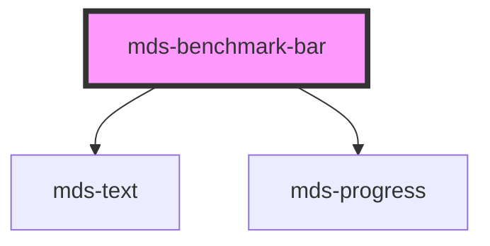

# mds-benchmark-bar

<!-- Auto Generated Below -->

## Properties

| Property     | Attribute    | Description                                             | Type                                                                            | Default     |
| ------------ | ------------ | ------------------------------------------------------- | ------------------------------------------------------------------------------- | ----------- |
| `alias`      | `alias`      | An alias to custom how value is represented             | `string`                                                                        | `undefined` |
| `typography` | `typography` | The typography of the component                         | `"label" \| "option"`                                                           | `'label'`   |
| `value`      | `value`      | A value between 0 and 100 that rapresents the benchmark | `number`                                                                        | `0`         |
| `variant`    | `variant`    | Sets the theme variant colors                           | `"dark" \| "error" \| "info" \| "light" \| "primary" \| "success" \| "warning"` | `'dark'`    |

## Dependencies

### Depends on

- [mds-text](../mds-text)
- [mds-progress](../mds-progress)

### Graph

----------------------------------------------

Built with love @ **Maggioli Informatica / R&D Department**
