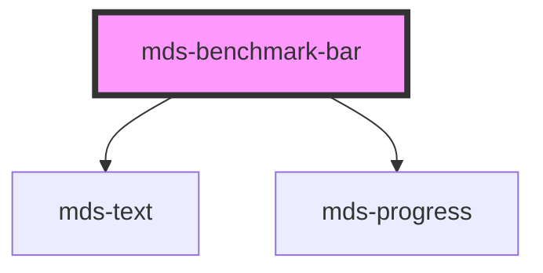

# mds-benchmark-bar

This is a web-component from Maggioli Design System [Magma](https://magma.maggiolicloud.it), built with StencilJS, TypeScript, Storybook. It's based on the web-component standard and it's designed to be agnostic from the JavaScirpt framework you are using.

<!-- Auto Generated Below -->

## Properties

| Property     | Attribute    | Description                                             | Type                                                                                         | Default     |
| ------------ | ------------ | ------------------------------------------------------- | -------------------------------------------------------------------------------------------- | ----------- |
| `alias`      | `alias`      | An alias to custom how value is represented             | `string \| undefined`                                                                        | `undefined` |
| `typography` | `typography` | The typography of the component                         | `"label" \| "option" \| undefined`                                                           | `'label'`   |
| `value`      | `value`      | A value between 0 and 100 that rapresents the benchmark | `number`                                                                                     | `0`         |
| `variant`    | `variant`    | Sets the theme variant colors                           | `"dark" \| "error" \| "info" \| "light" \| "primary" \| "success" \| "warning" \| undefined` | `'dark'`    |

## Slots

| Slot        | Description                                                                            |
| ----------- | -------------------------------------------------------------------------------------- |
| `"default"` | Add `text string` to this slot, **avoid** to add `HTML elements` or `components` here. |

## Dependencies

### Depends on

- [mds-text](../mds-text)
- [mds-progress](../mds-progress)

### Graph

----------------------------------------------

Built with love @ [Gruppo Maggioli](https://www.maggioli.com) from [R&D Department](https://www.maggioli.com/it-it/chi-siamo/ricerca-sviluppo)
