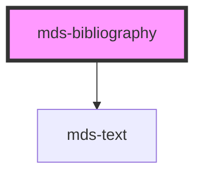

# mds-bibliography


<!-- Start script-generated Magma Docs -->

# Install

Install the component via `npm` by running the following command

```bash
npm install @maggioli-design-system/mds-bibliography
```

This package works also with yarn:

```bash
yarn add @maggioli-design-system/mds-bibliography
```

#### Import

Import the component in your project via `TypeScript` as follows:

```typescript
import { defineCustomElements as dceMdsBibliography } from '@maggioli-design-system/mds-bibliography/loader'

dceMdsBibliography()
```

`MdsBibliography` depends on `MdsText`, so you will have to import it as well:

```typescript
import { defineCustomElements as dceMdsText } from '@maggioli-design-system/mds-text/loader'

dceMdsText()
```

If you need to support older browsers (i.e. IE or early version of Edge), you can wrap the `defineCustomElements` in another utility awailable in the same package:

```typescript
import { applyPolyfills as apMdsBibliography, defineCustomElements as dceMdsBibliography } from '@maggioli-design-system/mds-bibliography/loader'

apMdsBibliography().then(dceMdsBibliography())
```

Use alias for `defineCustomElements` method to initialize multiple web components in the same place:

```typescript
import { defineCustomElements as dceMdsComponentOne } from '@maggioli-design-system/mds-component-one/loader'
import { defineCustomElements as dceMdsComponentTwo } from '@maggioli-design-system/mds-component-two/loader'

dceMdsComponentOne()
dceMdsComponentTwo()
```

You can check how browser support works at [this page][stencil-browser-support].

# Integration

<!-- This section is useful to describe usages and configurations -->

#### How to use it in HTML

<!-- Add information about HTML usage here -->
`MdsBibliography` accepts the following attributes:
- `author`: specifies a single or multiple authors, accepts a string or an array of strings
- `date`: specifies the date of the bibliography
- `format`: specifies the bibliography format
- `location`: specifies the location of the bibliography
- `name`: specifies the name of the bibliography
- `publisher`: specifies the publisher of the bibliography
- `rel`: specifies relationship between the current document and the URL
- `typography`: specifies the font typography of the element
- `url`: specifies the URL of the bibliography
- `variant`: specifies the variant for `typography`

```html
<mds-bibliography
  author="John Doe"
  date="2022-10-04"
  location="London"
  name="Meet John Doe"
  publisher="Maggioli Editore"
  url="https://www.maggioli.com"
  variant="read"
></mds-bibliography>
```

Wrap first name or last name to crop them correctly:

```
author="'Jhon Arthur' Doe"
author="'Jhon Arthur' 'Doe Jhonson'"
```

For multiple authors, you can separate the names using comma, and can still wrap first/last name to crop them:

```
author="'Jhon Arthur' 'Doe Jhonson', Mike Collins, Erik 'Ross Anderson'"
```

You can use single or double quotation marks for composite names.

If needed, you can customize the color of the text, the `url` text and the color of the `url` text when overed overriding the value of the [`CSS custom properties`](#css-custom-properties) listed below

You can try it out on the component's [Storybook website][storybook]!

<!-- TODO set correct storybook link, `ui` may need to be changed into something else -->
[storybook]: https://magma.maggiolicloud.it/storybook/?path=/story/ui-bibliography--default
[stencil-browser-support]: https://stenciljs.com/docs/browser-support

<!-- End script-generated Magma Docs -->

This is a web-component from Maggioli Design System [Magma](https://magma.maggiolicloud.it), built with StencilJS, TypeScript, Storybook. It's based on the web-component standard and it's designed to be agnostic from the JavaScirpt framework you are using.

<!-- Auto Generated Below -->


## Properties

| Property     | Attribute    | Description                                                                                                                                                                                                                                                                                                                                                                                                       | Type                                                                   | Default      |
| ------------ | ------------ | ----------------------------------------------------------------------------------------------------------------------------------------------------------------------------------------------------------------------------------------------------------------------------------------------------------------------------------------------------------------------------------------------------------------- | ---------------------------------------------------------------------- | ------------ |
| `author`     | `author`     | Specifies a single or mupltiple authors, this field expect a string or an array of strings. First name and Last name: "Jhon Doe", you can wrap first name or last name to crop them correctly: "'Jhon Arthur' Doe", "'Jhon Arthur' 'Doe Jhonson'", and for multiple authors "'Jhon Arthur' 'Doe Jhonson', 'Mike Collins', Erik 'Ross Anderson'", you can use single or double quotation marks for composite names | `string \| undefined`                                                  | `undefined`  |
| `date`       | `date`       | Specifies the date of the bibliography                                                                                                                                                                                                                                                                                                                                                                            | `string \| undefined`                                                  | `undefined`  |
| `format`     | `format`     | Specifies the bibliography format to rapresent the bibliography content                                                                                                                                                                                                                                                                                                                                           | `"apa" \| "mla" \| "turabian"`                                         | `'apa'`      |
| `location`   | `location`   | Specifies the location of the bibliography                                                                                                                                                                                                                                                                                                                                                                        | `string \| undefined`                                                  | `undefined`  |
| `name`       | `name`       | Specifies the name of the bibliography                                                                                                                                                                                                                                                                                                                                                                            | `string \| undefined`                                                  | `undefined`  |
| `publisher`  | `publisher`  | Specifies the publisher of the bibliography                                                                                                                                                                                                                                                                                                                                                                       | `string \| undefined`                                                  | `undefined`  |
| `rel`        | `rel`        | Specifies relationship between the current document and the URL                                                                                                                                                                                                                                                                                                                                                   | `"author" \| "external"`                                               | `'external'` |
| `typography` | `typography` | Specifies the font typography of the element                                                                                                                                                                                                                                                                                                                                                                      | `"caption" \| "detail" \| "label" \| "option" \| "paragraph" \| "tip"` | `'detail'`   |
| `url`        | `url`        | Specifies the URL of the bibliography                                                                                                                                                                                                                                                                                                                                                                             | `string \| undefined`                                                  | `undefined`  |
| `variant`    | `variant`    | Specifies the variant for `typography`                                                                                                                                                                                                                                                                                                                                                                            | `"code" \| "info" \| "read" \| "title" \| undefined`                   | `undefined`  |


## CSS Custom Properties

| Name                                       | Description                                                          |
| ------------------------------------------ | -------------------------------------------------------------------- |
| `--mds-bibliography-color`                 | Sets the text color of the component                                 |
| `--mds-bibliography-text-decoration`       | Sets the text decoration color of the link                           |
| `--mds-bibliography-text-decoration-hover` | Sets the text decoration color of the link when the mouse is over it |


## Dependencies

### Depends on

- [mds-text](../mds-text)

### Graph


----------------------------------------------

Built with love @ **Maggioli Informatica / R&D Department**
