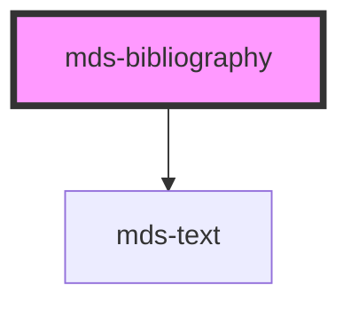

# mds-bibliography

<!-- Start script-generated Magma Docs -->

# Install

Install the component via `npm` by running the following command

```bash
npm install @maggioli-design-system/mds-bibliography
```

This package works also with yarn:

```bash
yarn add @maggioli-design-system/mds-bibliography
```

#### Import

Import the component in your project via `TypeScript` as follows:

```typescript
import { defineCustomElements as dceMdsBibliography } from '@maggioli-design-system/mds-bibliography/loader'

dceMdsBibliography()
```

`MdsBibliography` depends on `MdsText`, so you will have to import it as well:

```typescript
import { defineCustomElements as dceMdsText } from '@maggioli-design-system/mds-text/loader'

dceMdsText()
```

If you need to support older browsers (i.e. IE or early version of Edge), you can wrap the `defineCustomElements` in another utility awailable in the same package:

```typescript
import { applyPolyfills as apMdsBibliography, defineCustomElements as dceMdsBibliography } from '@maggioli-design-system/mds-bibliography/loader'

apMdsBibliography().then(dceMdsBibliography())
```

Use alias for `defineCustomElements` method to initialize multiple web components in the same place:

```typescript
import { defineCustomElements as dceMdsComponentOne } from '@maggioli-design-system/mds-component-one/loader'
import { defineCustomElements as dceMdsComponentTwo } from '@maggioli-design-system/mds-component-two/loader'

dceMdsComponentOne()
dceMdsComponentTwo()
```

You can check how browser support works at [this page][stencil-browser-support].

# Integration

<!-- This section is useful to describe usages and configurations -->

#### How to use it in HTML

<!-- Add information about HTML usage here -->
`MdsBibliography` accepts the following attributes:
- `author`: specifies a single or multiple authors, accepts a string or an array of strings
- `date`: specifies the date of the bibliography
- `format`: specifies the bibliography format
- `location`: specifies the location of the bibliography
- `name`: specifies the name of the bibliography
- `publisher`: specifies the publisher of the bibliography
- `rel`: specifies relationship between the current document and the URL
- `typography`: specifies the font typography of the element
- `url`: specifies the URL of the bibliography
- `variant`: specifies the variant for `typography`

```html
<mds-bibliography
  author="John Doe"
  date="2022-10-04"
  location="London"
  name="Meet John Doe"
  publisher="Maggioli Editore"
  url="https://www.maggioli.com"
  variant="read"
></mds-bibliography>
```

Wrap first name or last name to crop them correctly:

```
author="'Jhon Arthur' Doe"
author="'Jhon Arthur' 'Doe Jhonson'"
```

For multiple authors, you can separate the names using comma, and can still wrap first/last name to crop them:

```
author="'Jhon Arthur' 'Doe Jhonson', Mike Collins, Erik 'Ross Anderson'"
```

You can use single or double quotation marks for composite names.

If needed, you can customize the color of the text, the `url` text and the color of the `url` text when overed overriding the value of the [`CSS custom properties`](#css-custom-properties) listed below

You can try it out on the component's [Storybook website][storybook]!

<!-- TODO set correct storybook link, `ui` may need to be changed into something else -->
[storybook]: https://magma.maggiolicloud.it/storybook/?path=/story/ui-bibliography--default
[stencil-browser-support]: https://stenciljs.com/docs/browser-support

<!-- End script-generated Magma Docs -->

This is a web-component from Maggioli Design System [Magma](https://magma.maggiolicloud.it), built with StencilJS, TypeScript, Storybook. It's based on the web-component standard and it's designed to be agnostic from the JavaScript framework you are using.

<!-- Auto Generated Below -->


## Usage

### 1. Description

The `<mds-bibliography>` web component renders a single citation entry formatted according to a recognized academic style. It is a presentational component that takes structured metadata (author, title, publisher, date, location, URL) and composes it into a styled, correctly-punctuated reference line, replacing the manual assembly of a bibliography string.

#### Semantic Behavior

- **Citation formatting**: The `format` prop drives the entire output - field ordering, punctuation, separators, author-name abbreviation, and date layout. Switching formats re-composes the same metadata rather than just restyling it.
- **Author parsing**: `author` is parsed, not displayed verbatim. Names are split on commas into multiple authors, first/last names are detected by position, and composite first or last names can be grouped with single or double quotation marks (e.g. `'Jhon Arthur' Doe`). Each author is then abbreviated per the active format (APA initials, MLA full first name).
- **Date handling**: `date` accepts an ISO string or a numeric timestamp and renders inside a semantic `<time>` element; invalid dates collapse to empty output, and month names are localized in Italian.
- **Link vs. plain title**: When both `name` and `url` are set, the title renders as a link (`target="_blank"`) carrying the `rel` value; otherwise it renders as plain emphasized text.
- **No slots**: Content is built entirely from props; the component does not project slotted children.

#### Properties & Visual Configurations

- **`format`** selects the citation standard (`'apa'`, `'mla'`, `'turabian'`) and is the primary behavioral switch; pick it to match the referencing convention required by the document. APA leads with the date in parentheses, MLA/Turabian place the date at the end, and each applies its own punctuation between location, publisher, and date.
- **`rel`** sets the relationship attribute applied to the generated title link (`'external'` or `'author'`); it only takes effect when the title is rendered as a hyperlink.

#### Other behavioral props

- **`typography`** and **`variant`** set the text role and styling of the rendered citation; they affect appearance only, not the citation structure.


### 2. Pattern

Correct and idiomatic ways to use the `<mds-bibliography>` component, ordered from most common to most specialized. Patterns assume a working knowledge of the variant / tone ladders documented in [`docs/COMPONENTS.md`](../../../../../../docs/COMPONENTS.md) and the generic stencil rules in [`projects/stencil/SPEC.md`](../../../../SPEC.md).

#### Basic APA Citation (Default Format)

The default `format` is `'apa'`. Supply author, date, name, location, and publisher to produce a correctly punctuated APA reference line. APA places the date in parentheses immediately after the author list.

```html
<mds-bibliography
  author="Rossi Mario"
  date="2021-03-15"
  name="Fondamenti di diritto amministrativo"
  location="Milano"
  publisher="Maggioli Editore"
></mds-bibliography>
```

#### APA Citation With a Linked Title

When both `name` and `url` are provided the title renders as a hyperlink opening in a new tab. The `rel` prop defaults to `'external'`; change it to `'author'` only when the URL points to an author profile.

```html
<mds-bibliography
  author="Rossi Mario"
  date="2021-03-15"
  name="Fondamenti di diritto amministrativo"
  location="Milano"
  publisher="Maggioli Editore"
  url="https://www.maggioli.com/catalogo/fondamenti"
></mds-bibliography>
```

#### MLA Format

Set `format="mla"` for Modern Language Association style. The title moves before location and publisher, the date appears at the end, and author names are formatted with the full first name rather than initials.

```html
<mds-bibliography
  format="mla"
  author="Rossi Mario"
  date="2021-03-15"
  name="Fondamenti di diritto amministrativo"
  location="Milano"
  publisher="Maggioli Editore"
></mds-bibliography>
```

#### Turabian Format

`format="turabian"` follows the Kate Turabian style - same field order as MLA but with different punctuation between location and publisher (a comma instead of a colon).

```html
<mds-bibliography
  format="turabian"
  author="Rossi Mario"
  date="2021-03-15"
  name="Fondamenti di diritto amministrativo"
  location="Milano"
  publisher="Maggioli Editore"
></mds-bibliography>
```

#### Multiple Authors

Separate multiple authors with a comma. Composite first or last names that contain spaces must be wrapped in single or double quotation marks so the parser groups them correctly. The component joins authors with the format-appropriate separator (APA: `&`, MLA/Turabian: `e`).

```html
<!-- Two authors, both single-word first and last names -->
<mds-bibliography
  author="Rossi Mario, Verdi Luigi"
  date="2019-06-01"
  name="Gestione del territorio"
  publisher="Giuffre Editore"
></mds-bibliography>

<!-- Composite first name and composite last name -->
<mds-bibliography
  author="'Maria Grazia' Bianchi, Enrico 'De Luca'"
  date="2020-11-20"
  name="Appalti pubblici"
  publisher="Il Sole 24 Ore"
></mds-bibliography>
```

#### Date From a Numeric Timestamp

`date` accepts either an ISO date string or a numeric Unix timestamp (milliseconds as a string). The component parses both forms identically and renders the result inside a semantic `<time>` element.

```html
<!-- ISO string -->
<mds-bibliography
  author="Ferrari Luca"
  date="2018-09-10"
  name="Intelligenza artificiale e diritto"
  publisher="Giuffre Editore"
></mds-bibliography>

<!-- Numeric timestamp (milliseconds) -->
<mds-bibliography
  author="Ferrari Luca"
  date="1536537600000"
  name="Intelligenza artificiale e diritto"
  publisher="Giuffre Editore"
></mds-bibliography>
```

#### Adjusting Typography

The `typography` prop controls the text role (`'caption'`, `'detail'` [default], `'label'`, `'option'`, `'paragraph'`, `'tip'`). Use `variant` to apply a style variant inside that role. Change these when the citation must match its surrounding body copy.

```html
<!-- Use paragraph size inside a long-form article -->
<mds-bibliography
  format="apa"
  author="Conti Francesca"
  date="2022-05-18"
  name="Sociologia del lavoro pubblico"
  publisher="Laterza"
  typography="paragraph"
  variant="read"
></mds-bibliography>
```

#### Styling Customization

Style the link color and underline through the documented `--mds-bibliography-*` CSS custom properties. Use Magma color tokens via `rgb(var(--<token>))` so dark mode and high-contrast modes keep working.

```css
.riferimenti mds-bibliography {
  --mds-bibliography-color: rgb(var(--variant-primary-03));
  --mds-bibliography-text-decoration: rgb(var(--variant-primary-06));
  --mds-bibliography-text-decoration-hover: rgb(var(--variant-primary-02));
}
```


### 3. Antipattern

Common incorrect uses of `<mds-bibliography>`. Each entry pairs the wrong form with the right one and a one-line reason. System-wide rules (boolean-as-string, shadow piercing, Tailwind color utilities, raw native event listening) live in [`docs/COMPONENTS.md`](../../../../../../docs/COMPONENTS.md#system-level-anti-patterns) - they apply here too but are not repeated.

#### Do Not Slot Content - The Component Has No Slots

`<mds-bibliography>` builds its output entirely from props; it has no default slot and no named slots. Any children placed inside the tag are ignored.

```html
<!-- 🚫 INCORRECT -->
<mds-bibliography>
  Rossi, M. (2021). <em>Fondamenti di diritto amministrativo</em>. Maggioli Editore.
</mds-bibliography>

<!-- ✅ CORRECT -->
<mds-bibliography
  author="Rossi Mario"
  date="2021-03-15"
  name="Fondamenti di diritto amministrativo"
  publisher="Maggioli Editore"
></mds-bibliography>
```

#### Do Not Use `url` Without `name`

When `name` is absent the component renders no title element, so `url` has nowhere to attach and the hyperlink is never created. Always supply `name` together with `url`.

```html
<!-- 🚫 INCORRECT -->
<mds-bibliography
  author="Bianchi Giulia"
  date="2020-06-01"
  url="https://www.maggioli.com/catalogo/appalti"
></mds-bibliography>

<!-- ✅ CORRECT -->
<mds-bibliography
  author="Bianchi Giulia"
  date="2020-06-01"
  name="Appalti pubblici: guida pratica"
  url="https://www.maggioli.com/catalogo/appalti"
></mds-bibliography>
```

#### Do Not Pass an Author Array as a JavaScript Array Literal in HTML

The `author` prop expects a plain comma-separated string. Passing a JavaScript array literal (with square brackets or JSON syntax) is not parsed by Stencil as an array - it is treated as a single malformed name.

```html
<!-- 🚫 INCORRECT -->
<mds-bibliography
  author="['Rossi Mario', 'Verdi Luigi']"
  name="Gestione del territorio"
></mds-bibliography>

<!-- ✅ CORRECT -->
<mds-bibliography
  author="Rossi Mario, Verdi Luigi"
  name="Gestione del territorio"
></mds-bibliography>
```

#### Do Not Use `rel` Without a URL

The `rel` attribute only takes effect when the title is rendered as a hyperlink (i.e. when both `name` and `url` are set). Setting `rel="author"` alone has no semantic effect and may confuse automated link checkers that scan for `rel` on anchors.

```html
<!-- 🚫 INCORRECT -->
<mds-bibliography
  author="De Luca Enrico"
  name="Sociologia delle organizzazioni"
  rel="author"
></mds-bibliography>

<!-- ✅ CORRECT -->
<mds-bibliography
  author="De Luca Enrico"
  name="Sociologia delle organizzazioni"
  url="https://www.maggioli.com/catalogo/sociologia"
  rel="author"
></mds-bibliography>
```

#### Do Not Invent a `format` Value Outside the Three Accepted Styles

Only `'apa'`, `'mla'`, and `'turabian'` are valid. Passing an unrecognised string leaves the format branch unmatched and renders only the author portion (no date, title, location, or publisher).

```html
<!-- 🚫 INCORRECT -->
<mds-bibliography
  format="chicago"
  author="Conti Francesca"
  name="Sociologia del lavoro pubblico"
></mds-bibliography>

<!-- ✅ CORRECT -->
<mds-bibliography
  format="turabian"
  author="Conti Francesca"
  name="Sociologia del lavoro pubblico"
></mds-bibliography>
```

#### Customize via Documented CSS Vars, Not Internal Selectors

The supported customization surface is the three `--mds-bibliography-*` CSS custom properties. Targeting the `.link` class or other internals via shadow-piercing selectors or undocumented `::part()` names couples your code to the implementation and will break on minor releases.

```css
/* 🚫 INCORRECT */
mds-bibliography >>> .link {
  color: blue;
}
mds-bibliography::part(link) {
  text-decoration: none;
}

/* ✅ CORRECT */
.sezione-riferimenti mds-bibliography {
  --mds-bibliography-color: rgb(var(--variant-primary-03));
  --mds-bibliography-text-decoration: rgb(var(--variant-primary-06));
  --mds-bibliography-text-decoration-hover: rgb(var(--variant-primary-02));
}
```


## Properties

| Property     | Attribute    | Description                                                                                                                                                                                                                                                                                                                                                                                                       | Type                                                                   | Default      |
| ------------ | ------------ | ----------------------------------------------------------------------------------------------------------------------------------------------------------------------------------------------------------------------------------------------------------------------------------------------------------------------------------------------------------------------------------------------------------------- | ---------------------------------------------------------------------- | ------------ |
| `author`     | `author`     | Specifies a single or mupltiple authors, this field expect a string or an array of strings. First name and Last name: "Jhon Doe", you can wrap first name or last name to crop them correctly: "'Jhon Arthur' Doe", "'Jhon Arthur' 'Doe Jhonson'", and for multiple authors "'Jhon Arthur' 'Doe Jhonson', 'Mike Collins', Erik 'Ross Anderson'", you can use single or double quotation marks for composite names | `string \| undefined`                                                  | `undefined`  |
| `date`       | `date`       | Specifies the date of the bibliography                                                                                                                                                                                                                                                                                                                                                                            | `string \| undefined`                                                  | `undefined`  |
| `format`     | `format`     | Specifies the bibliography format to rapresent the bibliography content                                                                                                                                                                                                                                                                                                                                           | `"apa" \| "mla" \| "turabian"`                                         | `'apa'`      |
| `location`   | `location`   | Specifies the location of the bibliography                                                                                                                                                                                                                                                                                                                                                                        | `string \| undefined`                                                  | `undefined`  |
| `name`       | `name`       | Specifies the name of the bibliography                                                                                                                                                                                                                                                                                                                                                                            | `string \| undefined`                                                  | `undefined`  |
| `publisher`  | `publisher`  | Specifies the publisher of the bibliography                                                                                                                                                                                                                                                                                                                                                                       | `string \| undefined`                                                  | `undefined`  |
| `rel`        | `rel`        | Specifies relationship between the current document and the URL                                                                                                                                                                                                                                                                                                                                                   | `"author" \| "external"`                                               | `'external'` |
| `typography` | `typography` | Specifies the font typography of the element                                                                                                                                                                                                                                                                                                                                                                      | `"caption" \| "detail" \| "label" \| "option" \| "paragraph" \| "tip"` | `'detail'`   |
| `url`        | `url`        | Specifies the URL of the bibliography                                                                                                                                                                                                                                                                                                                                                                             | `string \| undefined`                                                  | `undefined`  |
| `variant`    | `variant`    | Specifies the variant for `typography`                                                                                                                                                                                                                                                                                                                                                                            | `"code" \| "info" \| "read" \| "title" \| undefined`                   | `undefined`  |


## CSS Custom Properties

| Name                                       | Description                                                          |
| ------------------------------------------ | -------------------------------------------------------------------- |
| `--mds-bibliography-color`                 | Sets the text color of the component                                 |
| `--mds-bibliography-text-decoration`       | Sets the text decoration color of the link                           |
| `--mds-bibliography-text-decoration-hover` | Sets the text decoration color of the link when the mouse is over it |


## Dependencies

### Depends on

- [mds-text](../mds-text)

### Graph


----------------------------------------------

Built with love @ [Gruppo Maggioli](https://www.maggioli.com) from [R&D Department](https://www.maggioli.com/it-it/chi-siamo/ricerca-sviluppo)
