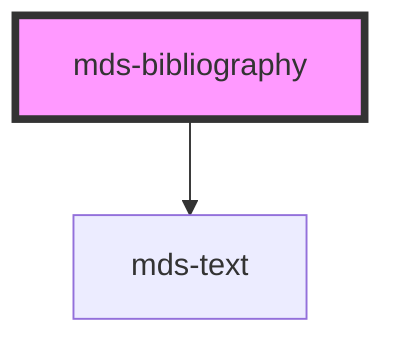

# mds-bibliography

<!-- Auto Generated Below -->

## Properties

| Property     | Attribute    | Description                                                                                                                                                                                                                                                                                                                                                                                                           | Type                                                                   | Default      |
| ------------ | ------------ | --------------------------------------------------------------------------------------------------------------------------------------------------------------------------------------------------------------------------------------------------------------------------------------------------------------------------------------------------------------------------------------------------------------------- | ---------------------------------------------------------------------- | ------------ |
| `author`     | `author`     | Specifies a single or mupltiple authors, this field expect a string or an array of strings. First name and Last name: "Jhon Doe", you can wrap first name or last name to crop them correctly: "'Jhon Arthur' Doe", "'Jhon Arthur' 'Doe Jhonson'", and for multiple authors ["'Jhon Arthur' 'Doe Jhonson'", "Mike Collins", "Erik 'Ross Anderson'"], you can use single or double quotation marks for composite names | `string`                                                               | `undefined`  |
| `date`       | `date`       | Specifies the date of the bibliography                                                                                                                                                                                                                                                                                                                                                                                | `string`                                                               | `undefined`  |
| `format`     | `format`     | Specifies the bibliography format to rapresent the bibliography content                                                                                                                                                                                                                                                                                                                                               | `"apa" \| "mla" \| "turabian"`                                         | `'apa'`      |
| `location`   | `location`   | Specifies the location of the bibliography                                                                                                                                                                                                                                                                                                                                                                            | `string`                                                               | `undefined`  |
| `name`       | `name`       | Specifies the name of the bibliography                                                                                                                                                                                                                                                                                                                                                                                | `string`                                                               | `undefined`  |
| `publisher`  | `publisher`  | Specifies the publisher of the bibliography                                                                                                                                                                                                                                                                                                                                                                           | `string`                                                               | `undefined`  |
| `rel`        | `rel`        | Specifies relationship between the current document and the URL                                                                                                                                                                                                                                                                                                                                                       | `"author" \| "external"`                                               | `'external'` |
| `typography` | `typography` | Specifies the font typography of the element                                                                                                                                                                                                                                                                                                                                                                          | `"caption" \| "detail" \| "label" \| "option" \| "paragraph" \| "tip"` | `'detail'`   |
| `url`        | `url`        | Specifies the URL of the bibliography                                                                                                                                                                                                                                                                                                                                                                                 | `string`                                                               | `undefined`  |
| `variant`    | `variant`    | Specifies the variant for `typography`                                                                                                                                                                                                                                                                                                                                                                                | `"info" \| "mono" \| "read" \| "title"`                                | `undefined`  |

## CSS Custom Properties

| Name                      | Description                                                          |
| ------------------------- | -------------------------------------------------------------------- |
| `--color`                 | Sets the text color of the component                                 |
| `--text-decoration`       | Sets the text decoration color of the link                           |
| `--text-decoration-hover` | Sets the text decoration color of the link when the mouse is over it |

## Dependencies

### Depends on

- [mds-text](../mds-text)

### Graph

----------------------------------------------

Built with love @ **Maggioli Informatica / R&D Department**
