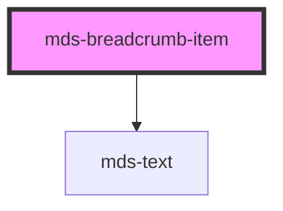

# mds-breadcrumb-item

This is a web-component from Maggioli Design System [Magma](https://magma.maggiolicloud.it), built with StencilJS, TypeScript, Storybook. It's based on the web-component standard and it's designed to be agnostic from the JavaScirpt framework you are using.

<!-- Auto Generated Below -->

## Properties

| Property   | Attribute  | Description                                | Type                   | Default     |
| ---------- | ---------- | ------------------------------------------ | ---------------------- | ----------- |
| `selected` | `selected` | Choose if the component is selected or not | `boolean \| undefined` | `undefined` |

## Events

| Event                     | Description                         | Type                                        |
| ------------------------- | ----------------------------------- | ------------------------------------------- |
| `mdsBreadcrumbItemSelect` | Emits when the breadcrumb is active | `CustomEvent<MdsBreadcrumbItemEventDetail>` |

## Slots

| Slot        | Description                                                                            |
| ----------- | -------------------------------------------------------------------------------------- |
| `"default"` | Add `text string` to this slot, **avoid** to add `HTML elements` or `components` here. |

## Dependencies

### Depends on

- [mds-text](../mds-text)

### Graph

----------------------------------------------

Built with love @ [Gruppo Maggioli](https://www.maggioli.com) from [R&D Department](https://www.maggioli.com/it-it/chi-siamo/ricerca-sviluppo)
