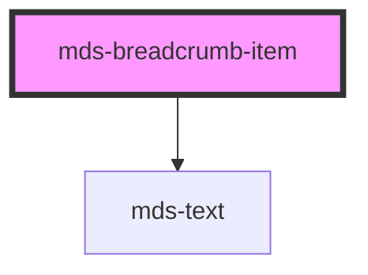

# mds-breadcrumb-item

This is a web-component from Maggioli Design System [Magma](https://magma.maggiolicloud.it), built with StencilJS, TypeScript, Storybook. It's based on the web-component standard and it's designed to be agnostic from the JavaScirpt framework you are using.

<!-- Auto Generated Below -->

## Properties

| Property   | Attribute  | Description                                | Type                   | Default     |
| ---------- | ---------- | ------------------------------------------ | ---------------------- | ----------- |
| `selected` | `selected` | Choose if the component is selected or not | `boolean \| undefined` | `undefined` |

## Events

| Event                     | Description                         | Type                                        |
| ------------------------- | ----------------------------------- | ------------------------------------------- |
| `mdsBreadcrumbItemSelect` | Emits when the breadcrumb is active | `CustomEvent<MdsBreadcrumbItemEventDetail>` |

## Slots

| Slot        | Description                                                                            |
| ----------- | -------------------------------------------------------------------------------------- |
| `"default"` | Add `text string` to this slot, **avoid** to add `HTML elements` or `components` here. |

## CSS Custom Properties

| Name                                               | Description                                                         |
| -------------------------------------------------- | ------------------------------------------------------------------- |
| `--mds-breadcrumb-item-arrow-depth-color`          | Sets the color of the arrow icon that separates buttons             |
| `--mds-breadcrumb-item-button-background`          | Sets the background color of the button                             |
| `--mds-breadcrumb-item-button-background-hover`    | Sets the background color of the button when the mouse is over it   |
| `--mds-breadcrumb-item-button-background-selected` | Sets the background color of the button when it's active            |
| `--mds-breadcrumb-item-button-color`               | Sets the text color of the button                                   |
| `--mds-breadcrumb-item-button-color-hover`         | Sets the text color of the button when the mouse is over it         |
| `--mds-breadcrumb-item-button-color-selected`      | Sets the text color of the button when it's active                  |
| `--mds-breadcrumb-item-outline-blur`               | Sets the blur color when the button is blurred via keyboard         |
| `--mds-breadcrumb-item-outline-blur-offset`        | Sets the blur offset color when the button is blurred via keyboard  |
| `--mds-breadcrumb-item-outline-focus`              | Sets the focus color when the button is focused via keyboard        |
| `--mds-breadcrumb-item-outline-focus-offset`       | Sets the focus offset color when the button is focused via keyboard |

## Dependencies

### Depends on

- [mds-text](../mds-text)

### Graph

----------------------------------------------

Built with love @ **Maggioli Informatica / R&D Department**
