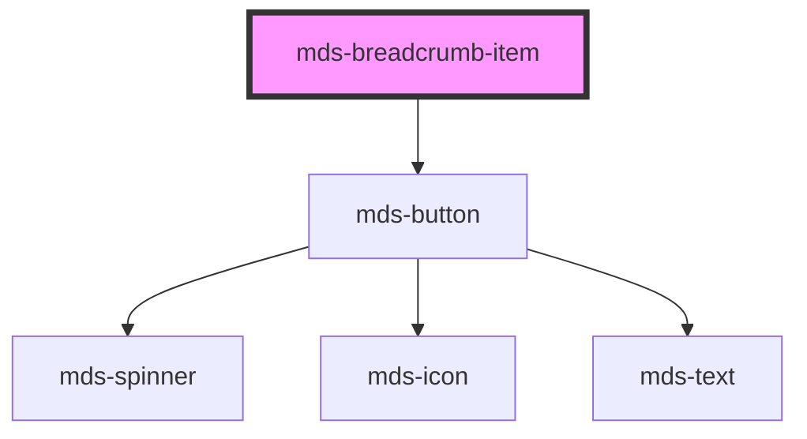

# mds-breadcrumb-item


This is a web-component from Maggioli Design System [Magma](https://magma.maggiolicloud.it), built with StencilJS, TypeScript, Storybook. It's based on the web-component standard and it's designed to be agnostic from the JavaScript framework you are using.

<!-- Auto Generated Below -->


## Usage

### 1. Description

The `<mds-breadcrumb-item>` web component represents a single navigable depth in a breadcrumb trail. It is a compound child of [`<mds-breadcrumb>`](../../mds-breadcrumb) and renders a clickable label followed by a separator arrow.

#### Semantic Behavior

- **Compound child only**: Must be placed as a direct default-slot child of `<mds-breadcrumb>`; it is not used standalone and the parent's slot should contain only `mds-breadcrumb-item` elements, not mixed child types.
- **Selection is parent-orchestrated**: Clicking the item emits `mdsBreadcrumbItemSelect` with `{ id, selected }`; the parent then marks the matching item selected and clears the others, so only one item is selected at a time.
- **Selected item is inert**: While `selected` is true the item cannot be re-activated; non-selected items remain clickable.
- **Keyboard activation**: The item responds to keyboard activation in addition to pointer clicks.
- **Decorative separator**: The trailing arrow is decorative and carries no semantic meaning.

#### Properties & Visual Configurations

This child exposes essentially no visual configuration of its own - appearance is inherited from `<mds-breadcrumb>` and the shared button system, and styling overrides are done through the `--mds-breadcrumb-item-*` CSS custom properties listed in the readme.

- **`selected`**: Marks this item as the current depth. In normal use you set it on at most one item as the initial state; thereafter the parent manages it in response to navigation. Use it only to seed which depth is active on first render.

The `label` provides the visible text. Per the slot contract, the default slot should receive a plain text string only - do not place HTML elements or other components inside it, as that breaks the breadcrumb layout.


### 2. Pattern

Correct and idiomatic ways to use the `<mds-breadcrumb-item>` component, ordered from most common to most specialized. Patterns assume a working knowledge of the variant / tone ladders documented in [`docs/COMPONENTS.md`](../../../../../../docs/COMPONENTS.md) and the generic stencil rules in [`projects/stencil/SPEC.md`](../../../../SPEC.md).

#### Basic Breadcrumb Trail

The canonical form. Place `<mds-breadcrumb-item>` elements as direct children of [`<mds-breadcrumb>`](../../mds-breadcrumb). Use the `label` prop for each step's text.

```html
<mds-breadcrumb>
  <mds-breadcrumb-item label="Home"></mds-breadcrumb-item>
  <mds-breadcrumb-item label="Archivio"></mds-breadcrumb-item>
  <mds-breadcrumb-item label="Dettaglio documento"></mds-breadcrumb-item>
</mds-breadcrumb>
```

#### Seeding the Active Depth with `selected`

Set `selected` on the item that represents the user's current location on first render. The parent [`<mds-breadcrumb>`](../../mds-breadcrumb) takes over selection management after that; do not set `selected` on more than one item at a time.

```html
<mds-breadcrumb>
  <mds-breadcrumb-item label="Home"></mds-breadcrumb-item>
  <mds-breadcrumb-item label="Archivio"></mds-breadcrumb-item>
  <mds-breadcrumb-item label="Documenti" selected></mds-breadcrumb-item>
</mds-breadcrumb>
```

#### Listening for Navigation Changes

Listen to `mdsBreadcrumbItemSelect` on the item (or on its parent [`<mds-breadcrumb>`](../../mds-breadcrumb) via event bubbling as `mdsBreadcrumbChange`) to react when the user navigates to a different depth.

```html
<mds-breadcrumb id="nav">
  <mds-breadcrumb-item label="Home"></mds-breadcrumb-item>
  <mds-breadcrumb-item label="Pratiche"></mds-breadcrumb-item>
  <mds-breadcrumb-item label="Dettaglio" selected></mds-breadcrumb-item>
</mds-breadcrumb>

<script>
  document.querySelector('#nav').addEventListener('mdsBreadcrumbChange', (e) => {
    console.log('profondita selezionata:', e.detail.id);
  });
</script>
```

#### Styling the Arrow Separator

Override `--mds-breadcrumb-item-arrow-depth-color` on the host or a parent selector to recolour the separator icon without touching the button label color. Use Magma color tokens wrapped in `rgb(var(...))` so dark mode keeps working.

```css
.header-nav mds-breadcrumb-item {
  --mds-breadcrumb-item-arrow-depth-color: rgb(var(--variant-primary-03));
}
```

#### Styling Button States

Override the button color and background tokens to match a custom surface. All three state variants - default, hover, and selected - have dedicated custom properties.

```css
.sidebar-nav mds-breadcrumb-item {
  --mds-breadcrumb-item-button-color: rgb(var(--tone-neutral-03));
  --mds-breadcrumb-item-button-color-hover: rgb(var(--tone-neutral-01));
  --mds-breadcrumb-item-button-color-selected: rgb(var(--variant-primary-05));
  --mds-breadcrumb-item-button-background-selected: rgb(var(--variant-primary-10));
}
```

#### Styling the Internal Button via `::part(button)`

The internal `<mds-button>` is exposed as `::part(button)`. Use it only when the documented CSS custom properties are insufficient - for example to adjust padding or border radius for a product-specific surface.

```css
.compact-nav mds-breadcrumb-item::part(button) {
  --mds-button-radius: var(--radius-sm);
}
```

#### Styling Focus Rings

Override the outline tokens to match a custom focus style for keyboard users. Provide both focus and blur variants so the focus ring animates consistently.

```css
.custom-nav mds-breadcrumb-item {
  --mds-breadcrumb-item-outline-focus: rgb(var(--variant-primary-03));
  --mds-breadcrumb-item-outline-focus-offset: 2px;
  --mds-breadcrumb-item-outline-blur: rgb(var(--tone-neutral-06));
  --mds-breadcrumb-item-outline-blur-offset: 0px;
}
```


### 3. Antipattern

Common incorrect uses of `<mds-breadcrumb-item>`. Each entry pairs the wrong form with the right one and a one-line reason. System-wide rules (boolean-as-string, shadow piercing, Tailwind color utilities, raw native event listening) live in [`docs/COMPONENTS.md`](../../../../../../docs/COMPONENTS.md#system-level-anti-patterns) - they apply here too but are not repeated.

#### Do Not Use Outside `<mds-breadcrumb>`

`<mds-breadcrumb-item>` is a compound child; it communicates with its parent through internal events and relies on the parent to assign IDs, manage selection, and control the back button. Outside the parent it renders an isolated button with no selection management.

```html
<!-- 🚫 INCORRECT -->
<nav>
  <mds-breadcrumb-item label="Home"></mds-breadcrumb-item>
  <mds-breadcrumb-item label="Archivio"></mds-breadcrumb-item>
</nav>

<!-- ✅ CORRECT -->
<mds-breadcrumb>
  <mds-breadcrumb-item label="Home"></mds-breadcrumb-item>
  <mds-breadcrumb-item label="Archivio"></mds-breadcrumb-item>
</mds-breadcrumb>
```

#### Do Not Put HTML in the Default Slot

The default slot accepts plain text strings only; nested elements break the button layout. Use the `label` prop for the step text.

```html
<!-- 🚫 INCORRECT -->
<mds-breadcrumb-item>
  <strong>Dettaglio</strong>
</mds-breadcrumb-item>

<!-- ✅ CORRECT -->
<mds-breadcrumb-item label="Dettaglio"></mds-breadcrumb-item>
```

#### Do Not Select More Than One Item at Initialisation

`selected` should be set on at most one item as the initial active depth. Marking multiple items selected puts the breadcrumb in an inconsistent state that the parent cannot resolve until the next click.

```html
<!-- 🚫 INCORRECT -->
<mds-breadcrumb>
  <mds-breadcrumb-item label="Home" selected></mds-breadcrumb-item>
  <mds-breadcrumb-item label="Archivio" selected></mds-breadcrumb-item>
  <mds-breadcrumb-item label="Dettaglio"></mds-breadcrumb-item>
</mds-breadcrumb>

<!-- ✅ CORRECT -->
<mds-breadcrumb>
  <mds-breadcrumb-item label="Home"></mds-breadcrumb-item>
  <mds-breadcrumb-item label="Archivio"></mds-breadcrumb-item>
  <mds-breadcrumb-item label="Dettaglio" selected></mds-breadcrumb-item>
</mds-breadcrumb>
```

#### Do Not Set `selected="false"` to Deselect

`selected` is a boolean attribute. Any non-empty string value - including `"false"` - is truthy in HTML and keeps the item selected. Remove the attribute entirely to deselect.

```html
<!-- 🚫 INCORRECT -->
<mds-breadcrumb-item label="Home" selected="false"></mds-breadcrumb-item>

<!-- ✅ CORRECT -->
<mds-breadcrumb-item label="Home"></mds-breadcrumb-item>
```

#### Do Not Listen for Native `click` to Track Navigation

The component emits `mdsBreadcrumbItemSelect` when a step is activated and the parent emits `mdsBreadcrumbChange`. Native `click` events may not bubble out of shadow DOM reliably, and they fire even on the already-selected (inert) item.

```html
<!-- 🚫 INCORRECT -->
<script>
  document.querySelector('mds-breadcrumb-item').addEventListener('click', (e) => {
    // may not fire; fires even on the selected/inert item
  });
</script>

<!-- ✅ CORRECT -->
<script>
  document.querySelector('mds-breadcrumb').addEventListener('mdsBreadcrumbChange', (e) => {
    console.log('nuovo passo attivo:', e.detail.id);
  });
</script>
```

#### Do Not Pierce Shadow DOM to Style Internals

The supported customization surface is the documented `--mds-breadcrumb-item-*` CSS custom properties and the `::part(button)` export. Targeting internal classes directly couples your code to the shadow DOM implementation and will break on minor releases.

```css
/* 🚫 INCORRECT */
mds-breadcrumb-item >>> .icon {
  fill: red;
}

/* ✅ CORRECT */
mds-breadcrumb-item {
  --mds-breadcrumb-item-arrow-depth-color: rgb(var(--variant-primary-03));
}
```


## Properties

| Property   | Attribute  | Description                                | Type                   | Default     |
| ---------- | ---------- | ------------------------------------------ | ---------------------- | ----------- |
| `label`    | `label`    | Sets the label of the breadcrumb item      | `string \| undefined`  | `undefined` |
| `selected` | `selected` | Choose if the component is selected or not | `boolean \| undefined` | `undefined` |


## Events

| Event                     | Description                         | Type                                        |
| ------------------------- | ----------------------------------- | ------------------------------------------- |
| `mdsBreadcrumbItemSelect` | Emits when the breadcrumb is active | `CustomEvent<MdsBreadcrumbItemEventDetail>` |


## Slots

| Slot        | Description                                                                            |
| ----------- | -------------------------------------------------------------------------------------- |
| `"default"` | Add `text string` to this slot, **avoid** to add `HTML elements` or `components` here. |


## Shadow Parts

| Part       | Description |
| ---------- | ----------- |
| `"button"` |             |


## CSS Custom Properties

| Name                                               | Description                                                         |
| -------------------------------------------------- | ------------------------------------------------------------------- |
| `--mds-breadcrumb-item-arrow-depth-color`          | Sets the color of the arrow icon that separates buttons             |
| `--mds-breadcrumb-item-button-background`          | Sets the background color of the button                             |
| `--mds-breadcrumb-item-button-background-hover`    | Sets the background color of the button when the mouse is over it   |
| `--mds-breadcrumb-item-button-background-selected` | Sets the background color of the button when it's active            |
| `--mds-breadcrumb-item-button-color`               | Sets the text color of the button                                   |
| `--mds-breadcrumb-item-button-color-hover`         | Sets the text color of the button when the mouse is over it         |
| `--mds-breadcrumb-item-button-color-selected`      | Sets the text color of the button when it's active                  |
| `--mds-breadcrumb-item-outline-blur`               | Sets the blur color when the button is blurred via keyboard         |
| `--mds-breadcrumb-item-outline-blur-offset`        | Sets the blur offset color when the button is blurred via keyboard  |
| `--mds-breadcrumb-item-outline-focus`              | Sets the focus color when the button is focused via keyboard        |
| `--mds-breadcrumb-item-outline-focus-offset`       | Sets the focus offset color when the button is focused via keyboard |


## Dependencies

### Depends on

- [mds-button](../mds-button)

### Graph


----------------------------------------------

Built with love @ [Gruppo Maggioli](https://www.maggioli.com) from [R&D Department](https://www.maggioli.com/it-it/chi-siamo/ricerca-sviluppo)
