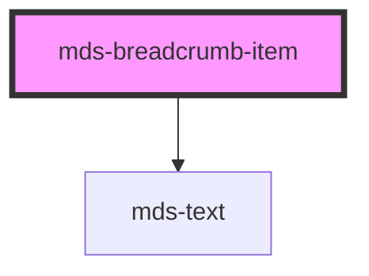

# mds-breadcrumb-item

<!-- Auto Generated Below -->

## Properties

| Property | Attribute | Description                                    | Type      | Default     |
| -------- | --------- | ---------------------------------------------- | --------- | ----------- |
| `active` | `active`  | Choose to display or not the back arrow button | `boolean` | `undefined` |

## Events

| Event          | Description                         | Type                                  |
| -------------- | ----------------------------------- | ------------------------------------- |
| `activedEvent` | Emits when the breadcrumb is active | `CustomEvent<BreadcrumbClickedEvent>` |

## Dependencies

### Depends on

- [mds-text](../mds-text)

### Graph

----------------------------------------------

Built with love @ **Maggioli Informatica / R&D Department**
