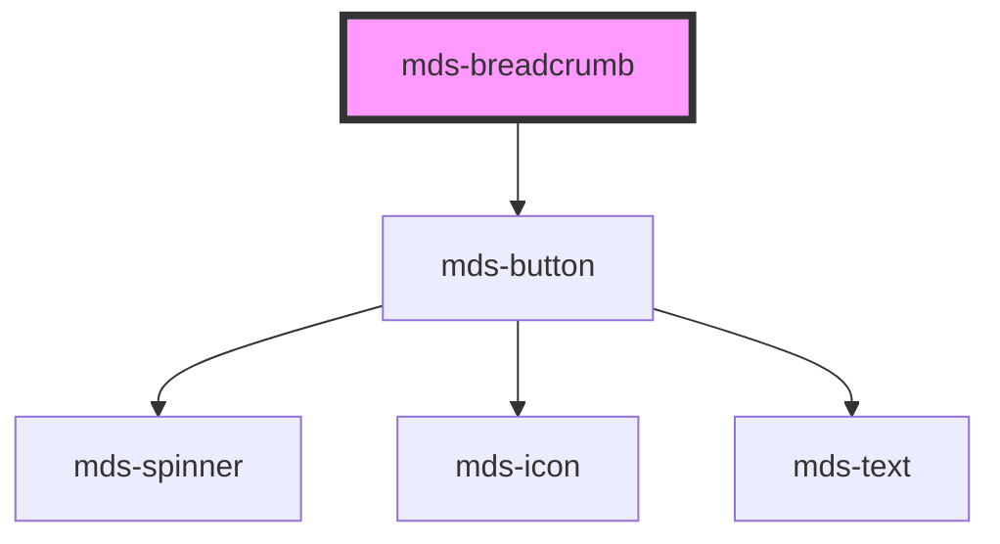

# mds-breadcrumb

This is a web-component from Maggioli Design System [Magma](https://magma.maggiolicloud.it), built with StencilJS, TypeScript, Storybook. It's based on the web-component standard and it's designed to be agnostic from the JavaScirpt framework you are using.

<!-- Auto Generated Below -->

## Properties

| Property | Attribute | Description                                    | Type                   | Default |
| -------- | --------- | ---------------------------------------------- | ---------------------- | ------- |
| `back`   | `back`    | Choose to display or not the back arrow button | `boolean \| undefined` | `true`  |

## Events

| Event                 | Description                          | Type                                    |
| --------------------- | ------------------------------------ | --------------------------------------- |
| `mdsBreadcrumbChange` | Emits when the breadcrumb is changed | `CustomEvent<MdsBreadcrumbEventDetail>` |

## Slots

| Slot        | Description                          |
| ----------- | ------------------------------------ |
| `"default"` | Add `mds-breadcrumb-item` element/s. |

## Dependencies

### Depends on

- [mds-button](../mds-button)

### Graph

----------------------------------------------

Built with love @ [Gruppo Maggioli](https://www.maggioli.com) from [R&D Department](https://www.maggioli.com/it-it/chi-siamo/ricerca-sviluppo)
