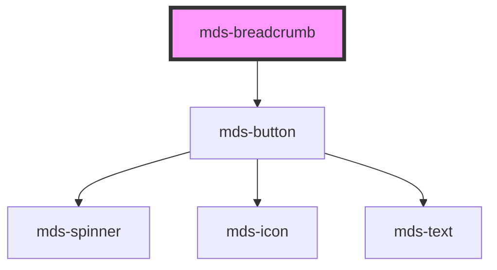

# mds-breadcrumb


This is a web-component from Maggioli Design System [Magma](https://magma.maggiolicloud.it), built with StencilJS, TypeScript, Storybook. It's based on the web-component standard and it's designed to be agnostic from the JavaScript framework you are using.

<!-- Auto Generated Below -->


## Usage

### 1. Description

The `<mds-breadcrumb>` web component is the navigation-trail container of the Magma Design System. It is a compound parent that arranges a sequence of slotted `<mds-breadcrumb-item>` children into a hierarchical path and adds an optional back-navigation control.

#### Semantic Behavior

- **Compound parent/child**: The default slot accepts only `<mds-breadcrumb-item>` children.
- **Selection tracking**: When a child is selected it becomes the single current depth and the others are cleared.
- **Back button**: When `back` is enabled the host renders a leading arrow that steps selection to the previous item; it auto-disables whenever the first item is current.
- **Change event**: `mdsBreadcrumbChange` fires after any selection change - via a child click or the back arrow - carrying the new index `id` and the originating `caller` item.
- **Localized back button**: The back button's `title` is resolved per document language (el/en/es/it).

#### Properties & Visual Configurations

This component exposes a single behavioral prop:

- **`back`** toggles the leading arrow control. Leave it enabled (the default) for multi-level trails where users benefit from a one-tap step backwards; disable it for shallow or display-only breadcrumbs where reverse navigation adds no value.

Visual styling (button colors, current-depth color, separator arrow color) is driven by the CSS custom properties documented in [`readme.md`](../readme.md), not by props. The shared `variant` / `tone` / `size` ladders defined in [`projects/stencil/SPEC.md`](../../../../SPEC.md#tone-and-variant-system) do not apply here; per-item labels and selection state live on the `<mds-breadcrumb-item>` children.


### 2. Pattern

Correct and idiomatic ways to use the `<mds-breadcrumb>` component, ordered from most common to most specialized. Patterns assume a working knowledge of the compound-component rules documented in [`docs/COMPONENTS.md`](../../../../../../docs/COMPONENTS.md) and the generic stencil rules in [`projects/stencil/SPEC.md`](../../../../SPEC.md).

#### Basic Navigation Trail

The canonical form. Slot one `<mds-breadcrumb-item>` per level and mark the current depth with `selected`. The back arrow is shown by default.

```html
<mds-breadcrumb>
  <mds-breadcrumb-item label="Home"></mds-breadcrumb-item>
  <mds-breadcrumb-item label="Archivio pratiche"></mds-breadcrumb-item>
  <mds-breadcrumb-item label="Pratica 2024/001" selected></mds-breadcrumb-item>
</mds-breadcrumb>
```

#### Without the Back Arrow

Set `back="false"` - or remove the attribute - for display-only or shallow breadcrumbs where reverse navigation adds no value. Note: `back` defaults to `true`, so you must explicitly opt out.

```html
<!-- back is boolean; to disable it, pass the prop as false in frameworks
     or omit / bind it. In plain HTML use :back="false" (framework) or
     control it programmatically. -->
<mds-breadcrumb>
  <mds-breadcrumb-item label="Impostazioni"></mds-breadcrumb-item>
  <mds-breadcrumb-item label="Profilo utente" selected></mds-breadcrumb-item>
</mds-breadcrumb>
```

In a JavaScript context:

```js
document.querySelector('mds-breadcrumb').back = false;
```

#### Listening for Navigation Changes

`mdsBreadcrumbChange` fires whenever a child item is clicked or the back arrow is activated. The detail carries the zero-based `id` string of the newly selected item and the originating `caller` element.

```html
<mds-breadcrumb id="nav">
  <mds-breadcrumb-item label="Dashboard"></mds-breadcrumb-item>
  <mds-breadcrumb-item label="Documenti"></mds-breadcrumb-item>
  <mds-breadcrumb-item label="Fatture" selected></mds-breadcrumb-item>
</mds-breadcrumb>

<script>
  document.getElementById('nav').addEventListener('mdsBreadcrumbChange', (e) => {
    console.log('Livello selezionato:', e.detail.id);
    console.log('Elemento:', e.detail.caller);
  });
</script>
```

#### Programmatic Selection

Set `selected` on the item you want active - the component will deselect the others and update the back button state automatically.

```html
<mds-breadcrumb>
  <mds-breadcrumb-item label="Progetto Alpha" selected></mds-breadcrumb-item>
  <mds-breadcrumb-item label="Sprint 3"></mds-breadcrumb-item>
  <mds-breadcrumb-item label="Attivita"></mds-breadcrumb-item>
</mds-breadcrumb>
```

#### Item Label via `label` Prop

Always prefer the `label` prop on `<mds-breadcrumb-item>` over the default text slot. The prop is reflected as an HTML attribute, enabling CSS attribute selectors and framework bindings.

```html
<mds-breadcrumb>
  <mds-breadcrumb-item label="Area riservata"></mds-breadcrumb-item>
  <mds-breadcrumb-item label="Gestione utenti"></mds-breadcrumb-item>
  <mds-breadcrumb-item label="Nuovo utente" selected></mds-breadcrumb-item>
</mds-breadcrumb>
```

#### Styling Customization via CSS Custom Properties

Apply `--mds-breadcrumb-*` vars on the host to retheme the whole trail at once. Use Magma color tokens wrapped in `rgb(var(--<token>))` so dark mode and high-contrast modes keep working. Changes on the parent propagate into the child items because the item vars inherit from the parent vars.

```css
.sidebar-nav mds-breadcrumb {
  --mds-breadcrumb-button-color: rgb(var(--variant-secondary-03));
  --mds-breadcrumb-button-color-hover: rgb(var(--variant-secondary-01));
  --mds-breadcrumb-button-background-current: rgb(var(--variant-secondary-09));
  --mds-breadcrumb-button-color-current: rgb(var(--variant-secondary-01));
  --mds-breadcrumb-arrow-depth-color: rgb(var(--variant-secondary-05));
}
```

#### Per-Item Styling via `::part(button)`

When you need to restyle a single item's inner button beyond what the CSS vars allow, target the documented `::part(button)` on `<mds-breadcrumb-item>`. This is the only supported shadow-part surface on the child component.

```css
mds-breadcrumb-item[selected]::part(button) {
  font-weight: bold;
  letter-spacing: 0.02em;
}
```


### 3. Antipattern

Common incorrect uses of `<mds-breadcrumb>`. Each entry pairs the wrong form with the right one and a one-line reason. System-wide rules (boolean-as-string, shadow piercing, raw native event listening) live in [`docs/COMPONENTS.md`](../../../../../../docs/COMPONENTS.md#system-level-anti-patterns) - they apply here too but are not repeated.

#### Do Not Slot Raw HTML Inside `<mds-breadcrumb>`

The default slot accepts only `<mds-breadcrumb-item>` elements; slotting arbitrary HTML breaks the internal selection-tracking and back-button logic.

```html
<!-- 🚫 INCORRECT -->
<mds-breadcrumb>
  <a href="/home">Home</a>
  <span>Archivio</span>
  <strong>Documento corrente</strong>
</mds-breadcrumb>

<!-- ✅ CORRECT -->
<mds-breadcrumb>
  <mds-breadcrumb-item label="Home"></mds-breadcrumb-item>
  <mds-breadcrumb-item label="Archivio"></mds-breadcrumb-item>
  <mds-breadcrumb-item label="Documento corrente" selected></mds-breadcrumb-item>
</mds-breadcrumb>
```

#### Do Not Disable the Back Button with `back="false"`

`back` is a boolean prop. In HTML, any non-empty string attribute value is truthy - `back="false"` keeps the button visible. Set the prop to `false` via JavaScript, or omit the attribute entirely.

```html
<!-- 🚫 INCORRECT -->
<mds-breadcrumb back="false">
  <mds-breadcrumb-item label="Home"></mds-breadcrumb-item>
  <mds-breadcrumb-item label="Sezione" selected></mds-breadcrumb-item>
</mds-breadcrumb>

<!-- ✅ CORRECT (set via JS) -->
<mds-breadcrumb id="bc">
  <mds-breadcrumb-item label="Home"></mds-breadcrumb-item>
  <mds-breadcrumb-item label="Sezione" selected></mds-breadcrumb-item>
</mds-breadcrumb>
<script>document.getElementById('bc').back = false;</script>
```

#### Do Not Use `<mds-breadcrumb-item>` Outside `<mds-breadcrumb>`

Child items rely on the parent for ID assignment and selection-state management. Rendering them standalone breaks both keyboard navigation and the change event.

```html
<!-- 🚫 INCORRECT -->
<div class="my-nav">
  <mds-breadcrumb-item label="Home"></mds-breadcrumb-item>
  <mds-breadcrumb-item label="Sezione" selected></mds-breadcrumb-item>
</div>

<!-- ✅ CORRECT -->
<mds-breadcrumb>
  <mds-breadcrumb-item label="Home"></mds-breadcrumb-item>
  <mds-breadcrumb-item label="Sezione" selected></mds-breadcrumb-item>
</mds-breadcrumb>
```

#### Do Not Pass Text or HTML as `<mds-breadcrumb-item>` Children

`<mds-breadcrumb-item>` has no default slot; the `label` prop is the only way to set the visible text. Text or HTML placed between the tags is ignored and never rendered.

```html
<!-- 🚫 INCORRECT -->
<mds-breadcrumb>
  <mds-breadcrumb-item>
    <strong>Categoria</strong>
  </mds-breadcrumb-item>
  <mds-breadcrumb-item selected>
    <span class="active">Sottocategoria</span>
  </mds-breadcrumb-item>
</mds-breadcrumb>

<!-- ✅ CORRECT -->
<mds-breadcrumb>
  <mds-breadcrumb-item label="Categoria"></mds-breadcrumb-item>
  <mds-breadcrumb-item label="Sottocategoria" selected></mds-breadcrumb-item>
</mds-breadcrumb>
```

#### Do Not Manage Selection State Manually by Toggling Classes

The parent tracks which item is selected internally; toggling CSS classes or `aria-current` on the host bypasses that logic and leaves the back button in an inconsistent state. Use the `selected` prop instead.

```html
<!-- 🚫 INCORRECT -->
<mds-breadcrumb>
  <mds-breadcrumb-item label="Home" class="is-active" aria-current="page"></mds-breadcrumb-item>
  <mds-breadcrumb-item label="Archivio"></mds-breadcrumb-item>
</mds-breadcrumb>

<!-- ✅ CORRECT -->
<mds-breadcrumb>
  <mds-breadcrumb-item label="Home" selected></mds-breadcrumb-item>
  <mds-breadcrumb-item label="Archivio"></mds-breadcrumb-item>
</mds-breadcrumb>
```

#### Do Not Pierce the Shadow DOM to Style the Internal Back Button

The back button rendered inside `<mds-breadcrumb>` is a private implementation detail. Use the documented `--mds-breadcrumb-*` CSS custom properties to control its appearance.

```css
/* 🚫 INCORRECT */
mds-breadcrumb >>> .back {
  background: red;
}
mds-breadcrumb::part(back) {
  display: none;
}

/* ✅ CORRECT */
mds-breadcrumb {
  --mds-breadcrumb-button-background-disabled: transparent;
  --mds-breadcrumb-button-color-disabled: rgb(var(--tone-neutral-08));
}
```


## Properties

| Property | Attribute | Description                                    | Type                   | Default |
| -------- | --------- | ---------------------------------------------- | ---------------------- | ------- |
| `back`   | `back`    | Choose to display or not the back arrow button | `boolean \| undefined` | `true`  |


## Events

| Event                 | Description                          | Type                                    |
| --------------------- | ------------------------------------ | --------------------------------------- |
| `mdsBreadcrumbChange` | Emits when the breadcrumb is changed | `CustomEvent<MdsBreadcrumbEventDetail>` |


## Methods

### `updateLang() => Promise<void>`

Updates the component's texts to the locale currently set on the host element.

#### Returns

Type: `Promise<void>`


## Slots

| Slot | Description                          |
| ---- | ------------------------------------ |
|      | Add `mds-breadcrumb-item` element/s. |


## CSS Custom Properties

| Name                                          | Description                                                                          |
| --------------------------------------------- | ------------------------------------------------------------------------------------ |
| `--mds-breadcrumb-arrow-depth-color`          | Sets the color of the arrow icon that separates buttons                              |
| `--mds-breadcrumb-button-background`          | Sets the background color of the button                                              |
| `--mds-breadcrumb-button-background-current`  | Sets the background color of the button when it's active                             |
| `--mds-breadcrumb-button-background-disabled` | Sets the background color of the button when it's disabled, is used for arrow button |
| `--mds-breadcrumb-button-background-hover`    | Sets the background color of the button when the mouse is over it                    |
| `--mds-breadcrumb-button-color`               | Sets the text color of the button                                                    |
| `--mds-breadcrumb-button-color-current`       | Sets the text color of the button when it's active                                   |
| `--mds-breadcrumb-button-color-disabled`      | Sets the text color of the button when it's disabled, is used for arrow button       |
| `--mds-breadcrumb-button-color-hover`         | Sets the text color of the button when the mouse is over it                          |
| `--mds-breadcrumb-current-button-color`       | Sets the text color of the current depth button                                      |


## Dependencies

### Depends on

- [mds-button](../mds-button)

### Graph


----------------------------------------------

Built with love @ [Gruppo Maggioli](https://www.maggioli.com) from [R&D Department](https://www.maggioli.com/it-it/chi-siamo/ricerca-sviluppo)
