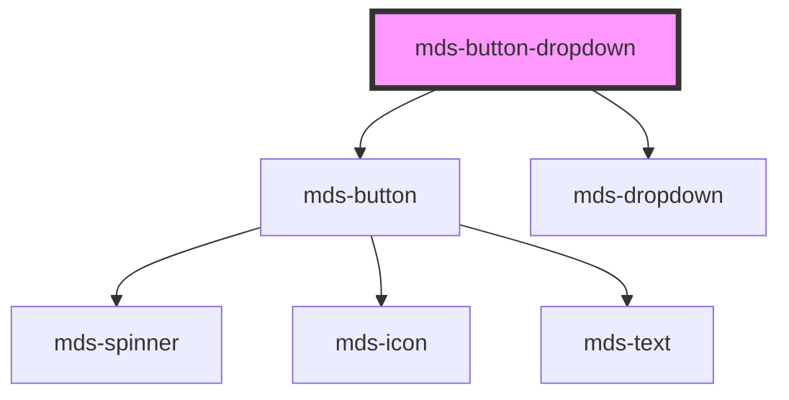

# mds-button-dropdown

<!-- Auto Generated Below -->

## Properties

| Property    | Attribute    | Description                                                                | Type                                                                                                                | Default     |
| ----------- | ------------ | -------------------------------------------------------------------------- | ------------------------------------------------------------------------------------------------------------------- | ----------- |
| `active`    | `active`     | Specifies if the button is active or not                                   | `boolean`                                                                                                           | `undefined` |
| `autoFocus` | `auto-focus` | Specifies if the component is focused when is loaded on the viewport       | `boolean`                                                                                                           | `undefined` |
| `await`     | `await`      | Specifies if the button is awaiting for a response                         | `boolean \| undefined`                                                                                              | `undefined` |
| `disabled`  | `disabled`   | Specifies if the component is disabled or not                              | `boolean \| undefined`                                                                                              | `undefined` |
| `href`      | `href`       | Specifies the URL target of the button                                     | `string \| undefined`                                                                                               | `undefined` |
| `icon`      | `icon`       | The icon displayed in the button                                           | `string \| undefined`                                                                                               | `undefined` |
| `label`     | `label`      | Specifies le text label of the component                                   | `string`                                                                                                            | `undefined` |
| `size`      | `size`       | Specifies the size for the button                                          | `"lg" \| "md" \| "sm" \| "xl"`                                                                                      | `'md'`      |
| `target`    | `target`     | Specifies the target of the URL, if self or blank                          | `"blank" \| "self"`                                                                                                 | `'self'`    |
| `tone`      | `tone`       | Specifies the tone variant for the button                                  | `"strong" \| "weak" \| undefined`                                                                                   | `'strong'`  |
| `truncate`  | `truncate`   | Specifies if the text shoud be truncated or should behave as a normal text | `"all" \| "none" \| "word" \| undefined`                                                                            | `'word'`    |
| `type`      | `type`       | The type of the button element                                             | `"a" \| "button" \| "reset" \| "submit" \| undefined`                                                               | `'submit'`  |
| `variant`   | `variant`    | Specifies the color variant for the button                                 | `"ai" \| "dark" \| "error" \| "info" \| "light" \| "primary" \| "secondary" \| "success" \| "warning" \| undefined` | `'primary'` |

## Shadow Parts

| Part         | Description |
| ------------ | ----------- |
| `"dropdown"` |             |

## Dependencies

### Depends on

- [mds-button](../mds-button)
- [mds-dropdown](../mds-dropdown)

### Graph

----------------------------------------------

Built with love @ [Gruppo Maggioli](https://www.maggioli.com) from [R&D Department](https://www.maggioli.com/it-it/chi-siamo/ricerca-sviluppo)
