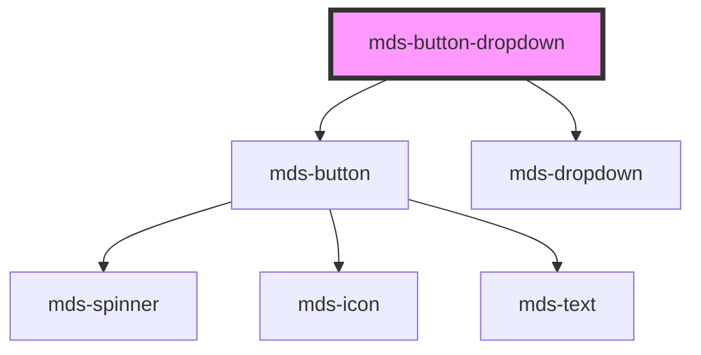

# mds-button-dropdown


<!-- Auto Generated Below -->


## Usage

### 1. Description

The `<mds-button-dropdown>` web component is a split-button control of the Magma Design System: it pairs a primary `<mds-button>` action with a secondary chevron button that opens an attached `<mds-dropdown>`, giving users a default action plus a menu of related choices in a single, visually unified control.

#### Semantic Behavior

- **Default slot is the menu**: Whatever you place in the default slot becomes the dropdown panel content; it is not treated as the button label (the visible label comes from the `label` prop).
- **Chevron trigger**: The second button is icon-only (chevron) and toggles the dropdown.
- **Shared configuration**: `active`, `autoFocus`, `await`, `disabled`, `href`, `target`, `size`, `tone`, `type` and `variant` are forwarded identically to both internal buttons, so the two halves always stay visually and behaviorally in sync.
- **Disabled / await states**: Because these flags pass through to both buttons, disabling or putting the control in an awaiting state affects the action and the trigger together.
- **Dropdown part**: The internal dropdown is exposed as the `dropdown` shadow part for external styling of the menu surface.

#### Properties & Visual Configurations

The shared `variant` / `tone` / `size` ladders are defined in [`projects/stencil/SPEC.md`](../../../../SPEC.md#tone-and-variant-system); they apply here exactly as in `<mds-button>` and are forwarded to both internal buttons. `variant` defaults to `'primary'`, `tone` defaults to `'strong'`, and `size` defaults to `'md'`.

- **`label`** sets the text of the primary action button only; the chevron trigger is icon-only.
- **`type`** defaults to `'submit'`, so inside a `<form>` the primary button submits unless set to `'button'`; switching to `'a'` (or supplying `href`) turns the buttons into links, with `target` choosing `'self'` vs `'blank'`.

#### Other behavioral props

- **`icon`** is an SVG filename slug from the Magma icon library, applied to the primary action button (the chevron icon on the trigger is fixed and not configurable).
- **`truncate`** controls how an overflowing primary label is clipped, defaulting to `'word'`.


### 2. Pattern

Correct and idiomatic ways to use the `<mds-button-dropdown>` component, ordered from most common to most specialized. Patterns assume a working knowledge of the variant / tone ladders documented in [`docs/COMPONENTS.md`](../../../../../../docs/COMPONENTS.md) and the generic stencil rules in [`projects/stencil/SPEC.md`](../../../../SPEC.md).

#### Basic Split Button with Menu Items

The canonical form: a `label` prop for the primary action and one or more [`mds-button`](../../mds-button) elements in the default slot as menu choices. Slot items receive `variant="dark" tone="text"` to stay visually neutral inside the dropdown panel.

```html
<mds-button-dropdown label="Salva come bozza" variant="success" tone="weak">
  <mds-button icon="mi/baseline/send" variant="dark" tone="text" label="Invia subito"></mds-button>
  <mds-button icon="mi/baseline/delete" variant="dark" tone="text" label="Elimina"></mds-button>
</mds-button-dropdown>
```

#### Variant and Tone for Emphasis

Use `variant` to express meaning and `tone` to express weight - the same pair applies to both internal buttons automatically.

```html
<!-- High emphasis: primary action -->
<mds-button-dropdown label="Pubblica" variant="primary" tone="strong">
  <mds-button variant="dark" tone="text" label="Pubblica come bozza"></mds-button>
  <mds-button variant="dark" tone="text" label="Pianifica pubblicazione"></mds-button>
</mds-button-dropdown>

<!-- Status emphasis: destructive action group -->
<mds-button-dropdown label="Elimina voce" variant="error" tone="weak">
  <mds-button variant="dark" tone="text" label="Elimina e archivia"></mds-button>
  <mds-button variant="dark" tone="text" label="Annulla eliminazione"></mds-button>
</mds-button-dropdown>
```

#### Sizing

Use the `size` prop. Both internal buttons track it automatically.

```html
<mds-button-dropdown label="Azione" size="sm" variant="primary" tone="strong">
  <mds-button variant="dark" tone="text" label="Opzione A"></mds-button>
</mds-button-dropdown>

<mds-button-dropdown label="Azione" size="md" variant="primary" tone="strong">
  <mds-button variant="dark" tone="text" label="Opzione A"></mds-button>
</mds-button-dropdown>

<mds-button-dropdown label="Azione" size="lg" variant="primary" tone="strong">
  <mds-button variant="dark" tone="text" label="Opzione A"></mds-button>
</mds-button-dropdown>

<mds-button-dropdown label="Azione" size="xl" variant="primary" tone="strong">
  <mds-button variant="dark" tone="text" label="Opzione A"></mds-button>
</mds-button-dropdown>
```

#### Primary Action with an Icon

Supply the `icon` prop to add an icon to the primary action button. The chevron trigger icon is fixed and not configurable.

```html
<mds-button-dropdown
  label="Carica documento"
  icon="mi/baseline/upload"
  variant="secondary"
  tone="weak"
>
  <mds-button variant="dark" tone="text" label="Carica da URL"></mds-button>
  <mds-button variant="dark" tone="text" label="Carica da Drive"></mds-button>
</mds-button-dropdown>
```

#### Async Loading via `await`

Set the `await` boolean attribute while a request is in flight. Both the action button and the chevron trigger become unavailable simultaneously. Remove the attribute when done - do not set `await="false"`.

```html
<mds-button-dropdown label="Salvataggio in corso..." await variant="primary" tone="strong">
  <mds-button variant="dark" tone="text" label="Salva e chiudi"></mds-button>
  <mds-button variant="dark" tone="text" label="Salva come copia"></mds-button>
</mds-button-dropdown>
```

#### Disabled State

The `disabled` attribute blocks both halves of the control together.

```html
<mds-button-dropdown label="Invia richiesta" disabled variant="primary" tone="strong">
  <mds-button variant="dark" tone="text" label="Invia in bozza"></mds-button>
</mds-button-dropdown>
```

#### Hyperlink Split Button via `href`

Setting `href` switches both internal buttons to anchor semantics. Use `target="blank"` to open in a new tab.

```html
<mds-button-dropdown
  label="Apri documento"
  href="https://example.com/doc"
  target="blank"
  variant="secondary"
  tone="outline"
>
  <mds-button href="https://example.com/doc/edit" target="blank" variant="dark" tone="text" label="Modifica"></mds-button>
  <mds-button href="https://example.com/doc/history" target="blank" variant="dark" tone="text" label="Cronologia"></mds-button>
</mds-button-dropdown>
```

#### Styling Customization

Style the component through its documented `--mds-button-dropdown-*` CSS custom properties or the `dropdown` shadow part. Use Magma color tokens via `rgb(var(--<token>))` so dark mode keeps working.

```css
.custom-toolbar mds-button-dropdown {
  --mds-button-dropdown-radius: var(--radius-md);
  --mds-button-dropdown-window-radius: var(--radius-lg);
}

/* Style the dropdown panel surface through the documented shadow part */
.custom-toolbar mds-button-dropdown::part(dropdown) {
  box-shadow: var(--shadow-lg);
}
```


### 3. Antipattern

Common incorrect uses of `<mds-button-dropdown>`. Each entry pairs the wrong form with the right one and a one-line reason. System-wide rules (boolean-as-string, shadow piercing, Tailwind color utilities, raw native event listening) live in [`docs/COMPONENTS.md`](../../../../../../docs/COMPONENTS.md#system-level-anti-patterns) - they apply here too but are not repeated.

#### Do Not Put the Label in the Default Slot

The default slot feeds the `<mds-dropdown>` panel, not the button label. Text placed in the slot ends up as menu content, not as the button's visible text. Use the `label` prop.

```html
<!-- 🚫 INCORRECT -->
<mds-button-dropdown variant="primary" tone="strong">
  Salva
</mds-button-dropdown>

<!-- ✅ CORRECT -->
<mds-button-dropdown label="Salva" variant="primary" tone="strong">
  <mds-button variant="dark" tone="text" label="Salva come bozza"></mds-button>
</mds-button-dropdown>
```

#### Do Not Slot Non-Button Content as Menu Items

The dropdown panel is designed for [`mds-button`](../../mds-button) elements. Slotting raw `<button>`, `<a>`, or arbitrary HTML bypasses theming, keyboard navigation, and the shared `variant` / `tone` forwarding.

```html
<!-- 🚫 INCORRECT -->
<mds-button-dropdown label="Esporta" variant="secondary" tone="weak">
  <button onclick="exportPDF()">PDF</button>
  <a href="/export/csv">CSV</a>
</mds-button-dropdown>

<!-- ✅ CORRECT -->
<mds-button-dropdown label="Esporta" variant="secondary" tone="weak">
  <mds-button variant="dark" tone="text" label="Esporta PDF" icon="mi/baseline/picture-as-pdf"></mds-button>
  <mds-button variant="dark" tone="text" label="Esporta CSV" icon="mi/baseline/table-chart"></mds-button>
</mds-button-dropdown>
```

#### Do Not Use Unsupported `tone` Values

`<mds-button-dropdown>` accepts `ToneMinimalVariantType`, which is `strong` and `weak` only. Passing `outline`, `text`, or `box` is not valid for this component and will silently fall back to the default.

```html
<!-- 🚫 INCORRECT -->
<mds-button-dropdown label="Azione" variant="primary" tone="outline"></mds-button-dropdown>
<mds-button-dropdown label="Azione" variant="primary" tone="text"></mds-button-dropdown>

<!-- ✅ CORRECT -->
<mds-button-dropdown label="Azione" variant="primary" tone="strong">
  <mds-button variant="dark" tone="text" label="Opzione"></mds-button>
</mds-button-dropdown>
<mds-button-dropdown label="Azione" variant="primary" tone="weak">
  <mds-button variant="dark" tone="text" label="Opzione"></mds-button>
</mds-button-dropdown>
```

#### Do Not Try to Customize the Chevron Icon

The chevron trigger icon is internal and fixed. There is no prop to change it. Do not attempt to override it with CSS property hacks or shadow-DOM selectors.

```css
/* 🚫 INCORRECT */
mds-button-dropdown .dropdown-action mds-icon {
  content: url('custom-arrow.svg');
}

/* ✅ CORRECT - style only through documented custom properties and the dropdown part */
mds-button-dropdown {
  --mds-button-dropdown-radius: var(--radius-md);
}
mds-button-dropdown::part(dropdown) {
  box-shadow: var(--shadow-lg);
}
```

#### Do Not Set Boolean Attributes to `"false"`

`await`, `disabled`, and `active` are boolean attributes. Setting them to the string `"false"` keeps them active because any non-empty string is truthy in HTML. Remove the attribute to turn it off.

```html
<!-- 🚫 INCORRECT -->
<mds-button-dropdown label="Invia" await="false" disabled="false" variant="primary"></mds-button-dropdown>

<!-- ✅ CORRECT -->
<mds-button-dropdown label="Invia" variant="primary" tone="strong">
  <mds-button variant="dark" tone="text" label="Invia come bozza"></mds-button>
</mds-button-dropdown>
```

#### Do Not Use `type="button"` to Prevent Menu Submission Without Reviewing Both Actions

Inside a `<form>`, both internal buttons share the same `type`. If you set `type="submit"` (the default) and only want the chevron to be inert, that is not possible - `type` is shared. Use `type="button"` on the whole component when neither half should submit the form.

```html
<!-- 🚫 INCORRECT: intent is only the chevron to not submit, but type is shared -->
<form>
  <mds-button-dropdown label="Invia" variant="primary" tone="strong">
    <mds-button type="button" variant="dark" tone="text" label="Salva bozza"></mds-button>
  </mds-button-dropdown>
</form>

<!-- ✅ CORRECT: set type on the host to opt the whole control in or out of form submission -->
<form>
  <!-- submits the form when the primary button is clicked -->
  <mds-button-dropdown type="submit" label="Invia" variant="primary" tone="strong">
    <mds-button variant="dark" tone="text" label="Salva bozza"></mds-button>
  </mds-button-dropdown>

  <!-- never submits: use when the action is handled via JavaScript -->
  <mds-button-dropdown type="button" label="Invia" variant="primary" tone="strong">
    <mds-button variant="dark" tone="text" label="Salva bozza"></mds-button>
  </mds-button-dropdown>
</form>
```


## Properties

| Property    | Attribute    | Description                                                                | Type                                                                                                                | Default     |
| ----------- | ------------ | -------------------------------------------------------------------------- | ------------------------------------------------------------------------------------------------------------------- | ----------- |
| `active`    | `active`     | Specifies if the button is active or not                                   | `boolean`                                                                                                           | `undefined` |
| `autoFocus` | `auto-focus` | Specifies if the component is focused when is loaded on the viewport       | `boolean`                                                                                                           | `undefined` |
| `await`     | `await`      | Specifies if the button is awaiting for a response                         | `boolean \| undefined`                                                                                              | `undefined` |
| `disabled`  | `disabled`   | Specifies if the component is disabled or not                              | `boolean \| undefined`                                                                                              | `undefined` |
| `href`      | `href`       | Specifies the URL target of the button                                     | `string \| undefined`                                                                                               | `undefined` |
| `icon`      | `icon`       | The icon displayed in the button                                           | `string \| undefined`                                                                                               | `undefined` |
| `label`     | `label`      | Specifies le text label of the component                                   | `string`                                                                                                            | `undefined` |
| `size`      | `size`       | Specifies the size for the button                                          | `"lg" \| "md" \| "sm" \| "xl"`                                                                                      | `'md'`      |
| `target`    | `target`     | Specifies the target of the URL, if self or blank                          | `"blank" \| "self"`                                                                                                 | `'self'`    |
| `tone`      | `tone`       | Specifies the tone variant for the button                                  | `"strong" \| "weak" \| undefined`                                                                                   | `'strong'`  |
| `truncate`  | `truncate`   | Specifies if the text shoud be truncated or should behave as a normal text | `"all" \| "none" \| "word" \| undefined`                                                                            | `'word'`    |
| `type`      | `type`       | The type of the button element                                             | `"a" \| "button" \| "reset" \| "submit" \| undefined`                                                               | `'submit'`  |
| `variant`   | `variant`    | Specifies the color variant for the button                                 | `"ai" \| "dark" \| "error" \| "info" \| "light" \| "primary" \| "secondary" \| "success" \| "warning" \| undefined` | `'primary'` |


## Slots

| Slot | Description                                                      |
| ---- | ---------------------------------------------------------------- |
|      | Add `text string`, `HTML elements` or `components` to this slot. |


## Shadow Parts

| Part         | Description |
| ------------ | ----------- |
| `"dropdown"` |             |


## CSS Custom Properties

| Name                           | Description                             |
| ------------------------------ | --------------------------------------- |
| `--mds-button-dropdown-radius` | Sets the border-radius of the component |


## Dependencies

### Depends on

- [mds-button](../mds-button)
- [mds-dropdown](../mds-dropdown)

### Graph


----------------------------------------------

Built with love @ [Gruppo Maggioli](https://www.maggioli.com) from [R&D Department](https://www.maggioli.com/it-it/chi-siamo/ricerca-sviluppo)
