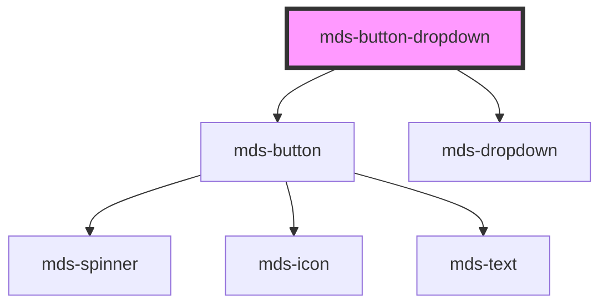

# mds-button-dropdown


<!-- Auto Generated Below -->


## Usage

### 1. Description

The `<mds-button-dropdown>` web component is a split-button control of the Magma Design System: it pairs a primary `<mds-button>` action with a secondary chevron button that opens an attached `<mds-dropdown>`, giving users a default action plus a menu of related choices in a single, visually unified control.

#### Semantic Behavior

- **Default slot is the menu**: Whatever you place in the default slot becomes the dropdown panel content; it is not treated as the button label (the visible label comes from the `label` prop).
- **Chevron trigger**: The second button is icon-only (chevron) and toggles the dropdown.
- **Shared configuration**: `active`, `autoFocus`, `await`, `disabled`, `href`, `target`, `size`, `tone` and `variant` are forwarded identically to both internal buttons, so the two halves always stay visually and behaviorally in sync.
- **Form association**: The host is form-associated. With `type="submit"` the primary action submits the enclosing `<form>` (or the one its `form` attribute names) and sends `name=value`, like a native submit button; with `type="reset"` it resets it. The chevron never submits. Unlike `<mds-button>`, `type` defaults to `'button'`: a dropdown in a form submits it only when asked. The menu items are slotted `<mds-button>`, so they follow their own `type` (default `'submit'`), `name` and `value`, and the receiver tells all the actions apart by `name`.
- **Disabled / await states**: Because these flags pass through to both buttons, disabling or putting the control in an awaiting state affects the action and the trigger together. A disabled `<fieldset>` around the component disables both halves the same way, without setting `disabled`.
- **Primary action event**: `mdsButtonDropdownClick` fires when the primary action is clicked or activated from the keyboard, and not while the component is `disabled` or awaiting. The chevron and the menu items do not fire it. A native `click` listener on the component also runs for the menu items, whose clicks bubble to it, so listen for `mdsButtonDropdownClick` to run the primary action in JavaScript.
- **Dropdown part**: The internal dropdown is exposed as the `dropdown` shadow part for external styling of the menu surface.

#### Properties & Visual Configurations

The shared `variant` / `tone` / `size` ladders are defined in [`docs/agents/variants.md`](../../../../../../docs/agents/variants.md); they apply here as in `<mds-button>`, narrowed to `tone` `strong` / `weak` and without the `google` / `apple` variants, and are forwarded to both internal buttons. `variant` defaults to `'primary'`, `tone` defaults to `'strong'`, and `size` defaults to `'md'`.

- **`label`** sets the text of the primary action button only; the chevron trigger is icon-only.
- **`type`** (default `'button'`), **`name`** and **`value`** apply to the primary action only, as described under Form association. The menu items follow their own `type`: inside a `<form>`, give `type="button"` to the ones that must not submit it.
- **`href`** makes a click navigate instead of submitting, with `target` choosing `'self'` vs `'blank'`; it is forwarded to the chevron too, which then navigates as well as opening the menu.

#### Other behavioral props

- **`icon`** is an SVG filename slug from the Magma icon library, applied to the primary action button (the chevron icon on the trigger is fixed and not configurable).
- **`truncate`** is declared (default `'word'`) but not forwarded to the internal buttons: the primary label always truncates as `'word'`.


### 2. Pattern

Correct and idiomatic ways to use the `<mds-button-dropdown>` component, ordered from most common to most specialized. Patterns assume a working knowledge of the variant / tone ladders documented in [`docs/agents/variants.md`](../../../../../../docs/agents/variants.md) and the shared component rules in [`docs/agents/conventions.md`](../../../../../../docs/agents/conventions.md).

#### Basic Split Button with Menu Items

The canonical form: a `label` prop for the primary action and one or more [`mds-button`](../../mds-button) elements in the default slot as menu choices. Give the slot items `variant="dark" tone="text"` to keep them visually neutral inside the dropdown panel.

```html
<mds-button-dropdown label="Salva come bozza" variant="success" tone="weak">
  <mds-button icon="mi/baseline/send" variant="dark" tone="text" label="Invia subito"></mds-button>
  <mds-button icon="mi/baseline/delete" variant="dark" tone="text" label="Elimina"></mds-button>
</mds-button-dropdown>
```

#### Variant and Tone for Emphasis

Use `variant` to express meaning and `tone` to express weight - the same pair applies to both internal buttons automatically.

```html
<!-- High emphasis: primary action -->
<mds-button-dropdown label="Pubblica" variant="primary" tone="strong">
  <mds-button variant="dark" tone="text" label="Pubblica come bozza"></mds-button>
  <mds-button variant="dark" tone="text" label="Pianifica pubblicazione"></mds-button>
</mds-button-dropdown>

<!-- Status emphasis: destructive action group -->
<mds-button-dropdown label="Elimina voce" variant="error" tone="weak">
  <mds-button variant="dark" tone="text" label="Elimina e archivia"></mds-button>
  <mds-button variant="dark" tone="text" label="Annulla eliminazione"></mds-button>
</mds-button-dropdown>
```

#### Sizing

Use the `size` prop. Both internal buttons track it automatically.

```html
<mds-button-dropdown label="Azione" size="sm" variant="primary" tone="strong">
  <mds-button variant="dark" tone="text" label="Opzione A"></mds-button>
</mds-button-dropdown>

<mds-button-dropdown label="Azione" size="md" variant="primary" tone="strong">
  <mds-button variant="dark" tone="text" label="Opzione A"></mds-button>
</mds-button-dropdown>

<mds-button-dropdown label="Azione" size="lg" variant="primary" tone="strong">
  <mds-button variant="dark" tone="text" label="Opzione A"></mds-button>
</mds-button-dropdown>

<mds-button-dropdown label="Azione" size="xl" variant="primary" tone="strong">
  <mds-button variant="dark" tone="text" label="Opzione A"></mds-button>
</mds-button-dropdown>
```

#### Primary Action with an Icon

Supply the `icon` prop to add an icon to the primary action button. The chevron trigger icon is fixed and not configurable.

```html
<mds-button-dropdown
  label="Carica documento"
  icon="mi/baseline/upload"
  variant="primary"
  tone="weak"
>
  <mds-button variant="dark" tone="text" label="Carica da URL"></mds-button>
  <mds-button variant="dark" tone="text" label="Carica da Drive"></mds-button>
</mds-button-dropdown>
```

#### Async Loading via `await`

Set the `await` boolean attribute while a request is in flight. Both the action button and the chevron trigger become unavailable simultaneously. Remove the attribute when done - do not set `await="false"`.

```html
<mds-button-dropdown label="Salvataggio in corso..." await variant="primary" tone="strong">
  <mds-button variant="dark" tone="text" label="Salva e chiudi"></mds-button>
  <mds-button variant="dark" tone="text" label="Salva come copia"></mds-button>
</mds-button-dropdown>
```

#### Disabled State

The `disabled` attribute blocks both halves of the control together.

```html
<mds-button-dropdown label="Invia richiesta" disabled variant="primary" tone="strong">
  <mds-button variant="dark" tone="text" label="Invia in bozza"></mds-button>
</mds-button-dropdown>
```

#### Primary Action Handled in JavaScript

Listen for `mdsButtonDropdownClick` to run the primary action: it comes from the primary action only, from a click or the keyboard, and not while the component is `disabled` or awaiting. Handle each menu item with its own `click`.

```html
<mds-button-dropdown id="save" label="Salva" variant="primary">
  <mds-button id="save-copy" variant="dark" tone="text" label="Salva come copia"></mds-button>
</mds-button-dropdown>

<script>
  document.getElementById('save').addEventListener('mdsButtonDropdownClick', () => save());
  document.getElementById('save-copy').addEventListener('click', () => saveCopy());
</script>
```

#### Several Actions That Submit One Form

Set `type="submit"` on the component and give the primary action and the menu items the same `name` with a different `value`: each action submits the form, and the receiver reads which one was chosen from `name`, as with native submit buttons. Give `type="button"` to the menu items that must not submit.

```html
<form action="/mail" method="post">
  <mds-input-field label="Oggetto">
    <mds-input name="subject"></mds-input>
  </mds-input-field>

  <!-- the receiver gets action=send, action=draft or action=schedule -->
  <mds-button-dropdown type="submit" name="action" value="send" label="Invia" variant="primary">
    <mds-button name="action" value="draft" variant="dark" tone="text" label="Salva come bozza"></mds-button>
    <mds-button name="action" value="schedule" variant="dark" tone="text" label="Invio programmato"></mds-button>
    <mds-button type="button" variant="dark" tone="text" label="Anteprima"></mds-button>
  </mds-button-dropdown>
</form>
```

When your code handles the submit, build the form data with `event.submitter`, as for [`mds-button`](../../mds-button): `new FormData(form, event.submitter)`.

#### Hyperlink Split Button via `href`

`href` and `target` on the component are forwarded to both internal buttons, the chevron included: a click on the chevron navigates as well as opening the menu. Keep `href` off the component, handle the primary action with `mdsButtonDropdownClick`, and put the links on the menu items (`target="blank"` opens them in a new tab).

```html
<mds-button-dropdown
  label="Apri documento"
  variant="primary"
  tone="weak"
>
  <mds-button href="https://example.com/doc/edit" target="blank" variant="dark" tone="text" label="Modifica"></mds-button>
  <mds-button href="https://example.com/doc/history" target="blank" variant="dark" tone="text" label="Cronologia"></mds-button>
</mds-button-dropdown>
```

#### Styling Customization

Style the component through its documented `--mds-button-dropdown-*` CSS custom properties or the `dropdown` shadow part. Use the semantic color roles via `rgb(var(--magma-<role>))` so dark mode and named themes keep working.

```css
.custom-toolbar mds-button-dropdown {
  --mds-button-dropdown-radius: var(--magma-radius-md);
}

/* Style the dropdown panel surface through the documented shadow part */
.custom-toolbar mds-button-dropdown::part(dropdown) {
  box-shadow: var(--shadow-lg);
}
```


### 3. Antipattern

Common incorrect uses of `<mds-button-dropdown>`. Each entry pairs the wrong form with the right one and a one-line reason. System-wide rules (boolean-as-string, shadow piercing, Tailwind color utilities, raw native event listening) live in [`docs/agents/anti-patterns.md`](../../../../../../docs/agents/anti-patterns.md) - they apply here too but are not repeated.

#### Do Not Put the Label in the Default Slot

The default slot feeds the `<mds-dropdown>` panel, not the button label. Text placed in the slot ends up as menu content, not as the button's visible text. Use the `label` prop.

```html
<!-- INCORRECT -->
<mds-button-dropdown variant="primary" tone="strong">
  Salva
</mds-button-dropdown>

<!-- CORRECT -->
<mds-button-dropdown label="Salva" variant="primary" tone="strong">
  <mds-button variant="dark" tone="text" label="Salva come bozza"></mds-button>
</mds-button-dropdown>
```

#### Do Not Slot Non-Button Content as Menu Items

The dropdown panel is designed for [`mds-button`](../../mds-button) elements. Slotting raw `<button>`, `<a>`, or arbitrary HTML bypasses the Magma theming, focus styles and button API (`icon`, `await`, `disabled`) of the menu entries.

```html
<!-- INCORRECT -->
<mds-button-dropdown label="Esporta" variant="primary" tone="weak">
  <button onclick="exportPDF()">PDF</button>
  <a href="/export/csv">CSV</a>
</mds-button-dropdown>

<!-- CORRECT -->
<mds-button-dropdown label="Esporta" variant="primary" tone="weak">
  <mds-button variant="dark" tone="text" label="Esporta PDF" icon="mi/baseline/picture-as-pdf"></mds-button>
  <mds-button variant="dark" tone="text" label="Esporta CSV" icon="mi/baseline/table-chart"></mds-button>
</mds-button-dropdown>
```

#### Do Not Count on the Default `type` to Submit a Form

Unlike `<mds-button>`, the component defaults to `type="button"`: inside a form, the primary action submits nothing until you set `type="submit"`.

```html
<!-- INCORRECT: the primary action does not submit -->
<form action="/mail" method="post">
  <mds-button-dropdown name="action" value="send" label="Invia">
    <mds-button name="action" value="draft" variant="dark" tone="text" label="Salva come bozza"></mds-button>
  </mds-button-dropdown>
</form>

<!-- CORRECT -->
<form action="/mail" method="post">
  <mds-button-dropdown type="submit" name="action" value="send" label="Invia">
    <mds-button name="action" value="draft" variant="dark" tone="text" label="Salva come bozza"></mds-button>
  </mds-button-dropdown>
</form>
```

#### Do Not Submit the Form from a `click` Listener

A `click` listener on the component also runs for the menu items, whose clicks bubble to it: picking a menu item that submits ("Salva come bozza") submits the form twice, once with its `name` / `value` and once without, and the receiver cannot tell which action was chosen. Use `type="submit"` with `name` / `value`.

```html
<!-- INCORRECT -->
<mds-button-dropdown id="send" label="Invia"></mds-button-dropdown>
<script>
  document.getElementById('send').addEventListener('click', () => form.requestSubmit());
</script>

<!-- CORRECT -->
<mds-button-dropdown type="submit" name="action" value="send" label="Invia"></mds-button-dropdown>
```

#### Do Not Listen to `click` for the Primary Action

A `click` on the component also comes from the menu items, whose clicks bubble to it: the primary action would run whenever the user picks an entry of the menu. Listen for `mdsButtonDropdownClick`, which only the primary action emits.

```js
// INCORRECT: also runs for "Salva come copia"
dropdown.addEventListener('click', () => save());

// CORRECT
dropdown.addEventListener('mdsButtonDropdownClick', () => save());
```

#### Do Not Leave a Menu Item That Must Not Submit on the Default `type`

The menu items are slotted `<mds-button>`, whose `type` defaults to `'submit'`: inside a form, an item that runs your own code (a preview, a copy) submits the form too. Give it `type="button"`.

```html
<!-- INCORRECT: "Anteprima" submits the form -->
<mds-button-dropdown type="submit" name="action" value="send" label="Invia">
  <mds-button variant="dark" tone="text" label="Anteprima"></mds-button>
</mds-button-dropdown>

<!-- CORRECT -->
<mds-button-dropdown type="submit" name="action" value="send" label="Invia">
  <mds-button type="button" variant="dark" tone="text" label="Anteprima"></mds-button>
</mds-button-dropdown>
```

#### Do Not Use Unsupported `tone` Values

`<mds-button-dropdown>` accepts `ToneMinimalVariantType`, which is `strong` and `weak` only. Passing `outline`, `text`, or `box` is not valid for this component: the value reaches the internal buttons unchecked, without the split-button styling that only `strong` and `weak` have.

```html
<!-- INCORRECT -->
<mds-button-dropdown label="Azione" variant="primary" tone="outline"></mds-button-dropdown>
<mds-button-dropdown label="Azione" variant="primary" tone="text"></mds-button-dropdown>

<!-- CORRECT -->
<mds-button-dropdown label="Azione" variant="primary" tone="strong">
  <mds-button variant="dark" tone="text" label="Opzione"></mds-button>
</mds-button-dropdown>
<mds-button-dropdown label="Azione" variant="primary" tone="weak">
  <mds-button variant="dark" tone="text" label="Opzione"></mds-button>
</mds-button-dropdown>
```

#### Do Not Try to Customize the Chevron Icon

The chevron trigger icon is internal and fixed. There is no prop to change it. Do not attempt to override it with CSS property hacks or shadow-DOM selectors.

```css
/* INCORRECT */
mds-button-dropdown .dropdown-action mds-icon {
  content: url('custom-arrow.svg');
}

/* CORRECT - style only through documented custom properties and the dropdown part */
mds-button-dropdown {
  --mds-button-dropdown-radius: var(--magma-radius-md);
}
mds-button-dropdown::part(dropdown) {
  box-shadow: var(--shadow-lg);
}
```

#### Do Not Set Boolean Attributes to `"false"`

`await`, `disabled`, and `active` are boolean attributes. The component reads the string `"false"` as `false` and drops the attribute when it renders, but until then the attribute is in the DOM and attribute selectors (`mds-button-dropdown[disabled]`) match it. Remove the attribute to turn it off.

```html
<!-- INCORRECT -->
<mds-button-dropdown label="Invia" await="false" disabled="false" variant="primary"></mds-button-dropdown>

<!-- CORRECT -->
<mds-button-dropdown label="Invia" variant="primary" tone="strong">
  <mds-button variant="dark" tone="text" label="Invia come bozza"></mds-button>
</mds-button-dropdown>
```


## Properties

| Property    | Attribute    | Description                                                                                                                                                                           | Type                                                                                                                | Default     |
| ----------- | ------------ | ------------------------------------------------------------------------------------------------------------------------------------------------------------------------------------- | ------------------------------------------------------------------------------------------------------------------- | ----------- |
| `active`    | `active`     | Specifies if the button is active or not                                                                                                                                              | `boolean`                                                                                                           | `undefined` |
| `autoFocus` | `auto-focus` | Specifies if the component is focused when is loaded on the viewport                                                                                                                  | `boolean`                                                                                                           | `undefined` |
| `await`     | `await`      | Specifies if the button is awaiting for a response                                                                                                                                    | `boolean \| undefined`                                                                                              | `undefined` |
| `disabled`  | `disabled`   | Specifies if the component is disabled or not                                                                                                                                         | `boolean \| undefined`                                                                                              | `undefined` |
| `href`      | `href`       | Specifies the URL target of the button                                                                                                                                                | `string \| undefined`                                                                                               | `undefined` |
| `icon`      | `icon`       | The icon displayed in the button                                                                                                                                                      | `string \| undefined`                                                                                               | `undefined` |
| `label`     | `label`      | Specifies le text label of the component                                                                                                                                              | `string`                                                                                                            | `undefined` |
| `name`      | `name`       | The name sent with `value` to the form the primary action submits, as a native submit button does                                                                                     | `string \| undefined`                                                                                               | `undefined` |
| `size`      | `size`       | Specifies the size for the button                                                                                                                                                     | `"lg" \| "md" \| "sm" \| "xl"`                                                                                      | `'md'`      |
| `target`    | `target`     | Specifies the target of the URL, if self or blank                                                                                                                                     | `"blank" \| "self"`                                                                                                 | `'self'`    |
| `tone`      | `tone`       | Specifies the tone variant for the button                                                                                                                                             | `"strong" \| "weak" \| undefined`                                                                                   | `'strong'`  |
| `truncate`  | `truncate`   | Specifies if the text shoud be truncated or should behave as a normal text                                                                                                            | `"all" \| "none" \| "word" \| undefined`                                                                            | `'word'`    |
| `type`      | `type`       | The type of the primary action: with `'submit'` or `'reset'` it submits or resets the form the component is in, the chevron never does. Unlike `mds-button` it defaults to `'button'` | `"a" \| "button" \| "reset" \| "submit" \| undefined`                                                               | `'button'`  |
| `value`     | `value`      | The value sent under `name` to the form the primary action submits                                                                                                                    | `string \| undefined`                                                                                               | `undefined` |
| `variant`   | `variant`    | Specifies the color variant for the button                                                                                                                                            | `"ai" \| "dark" \| "error" \| "info" \| "light" \| "primary" \| "secondary" \| "success" \| "warning" \| undefined` | `'primary'` |


## Events

| Event                    | Description                                                                                                                                                                                                                                  | Type                |
| ------------------------ | -------------------------------------------------------------------------------------------------------------------------------------------------------------------------------------------------------------------------------------------- | ------------------- |
| `mdsButtonDropdownClick` | Emits when the primary action is clicked or activated from the keyboard, unless the component is disabled or awaiting. The chevron and the menu items do not emit it, while a native `click` on the component also comes from the menu items | `CustomEvent<void>` |


## Slots

| Slot | Description                                                      |
| ---- | ---------------------------------------------------------------- |
|      | Add `text string`, `HTML elements` or `components` to this slot. |


## Shadow Parts

| Part         | Description |
| ------------ | ----------- |
| `"dropdown"` |             |


## CSS Custom Properties

| Name                           | Description                             |
| ------------------------------ | --------------------------------------- |
| `--mds-button-dropdown-radius` | Sets the border-radius of the component |


## Dependencies

### Depends on

- [mds-button](../mds-button)
- [mds-dropdown](../mds-dropdown)

### Graph

```mermaid
graph TD;
  mds-button-dropdown --> mds-button
  mds-button-dropdown --> mds-dropdown
  mds-button --> mds-spinner
  mds-button --> mds-icon
  mds-button --> mds-text
  style mds-button-dropdown fill:#f9f,stroke:#333,stroke-width:4px
```

----------------------------------------------

Built with love @ [Gruppo Maggioli](https://www.maggioli.com) from [R&D Department](https://www.maggioli.com/it-it/chi-siamo/ricerca-sviluppo)
