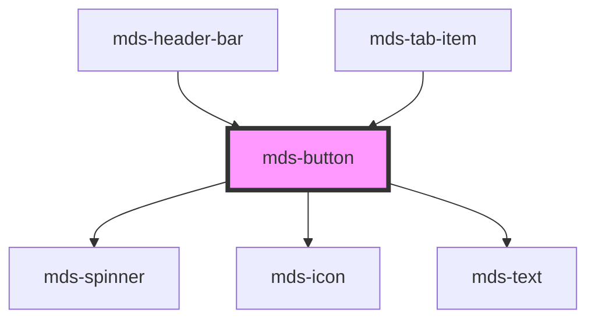

# mds-button

This is a web-component from Maggioli Design System [Magma](https://magma.maggiolicloud.it), built with StencilJS, TypeScript, Storybook. It's based on the web-component standard and it's designed to be agnostic from the JavaScirpt framework you are using.

<!-- Auto Generated Below -->

## Properties

| Property       | Attribute       | Description                                                           | Type                                                                                         | Default     |
| -------------- | --------------- | --------------------------------------------------------------------- | -------------------------------------------------------------------------------------------- | ----------- |
| `active`       | `active`        | Specifies if the button is active or not                              | `boolean`                                                                                    | `undefined` |
| `await`        | `await`         | Specifies if the button is awaiting for a response                    | `boolean`                                                                                    | `undefined` |
| `disabled`     | `disabled`      | Specifies if the component is disabled or not                         | `boolean`                                                                                    | `undefined` |
| `href`         | `href`          | Specifies the URL target of the button                                | `string \| undefined`                                                                        | `undefined` |
| `icon`         | `icon`          | The icon displayed in the button                                      | `string \| undefined`                                                                        | `undefined` |
| `iconPosition` | `icon-position` | Specifies the horizontal position of the icon displayed in the button | `"left" \| "right" \| undefined`                                                             | `'left'`    |
| `size`         | `size`          | Specifies the size for the button                                     | `"lg" \| "md" \| "sm" \| "xl"`                                                               | `'md'`      |
| `target`       | `target`        | Specifies the target of the URL, if self or blank                     | `"blank" \| "self"`                                                                          | `'self'`    |
| `tone`         | `tone`          | Specifies the tone variant for the button                             | `"ghost" \| "quiet" \| "strong" \| "weak" \| undefined`                                      | `'strong'`  |
| `type`         | `type`          | The type of the button element                                        | `"a" \| "button" \| "reset" \| "submit" \| undefined`                                        | `'submit'`  |
| `variant`      | `variant`       | Specifies the color variant for the button                            | `"dark" \| "error" \| "info" \| "light" \| "primary" \| "success" \| "warning" \| undefined` | `'primary'` |

## Slots

| Slot             | Description                                                                                   |
| ---------------- | --------------------------------------------------------------------------------------------- |
| `"default"`      | Add `text string` to this slot, **avoid** to add `HTML elements` or `components` here.        |
| `"notification"` | Add `HTML elements` or `components`, it is **recommended** to use `mds-notification` element. |

## Shadow Parts

| Part      | Description |
| --------- | ----------- |
| `"label"` |             |

## CSS Custom Properties

| Name                          | Description                                                                                              |
| ----------------------------- | -------------------------------------------------------------------------------------------------------- |
| `--mds-button-await-duration` | Sets the duration of the rotation of the spinner await component                                         |
| `--mds-button-background`     | Sets the background-color of the component                                                               |
| `--mds-button-border-color`   | Sets the border-color of the component                                                                   |
| `--mds-button-color`          | Sets the text color of the component                                                                     |
| `--mds-button-gap`            | Sets the distance betwen element inside the components, use it instead of setting gap property directly. |
| `--mds-button-icon-color`     | Sets the icon color of the component                                                                     |
| `--mds-button-radius`         | Sets the border-radius of the component                                                                  |

## Dependencies

### Used by

 - [mds-header-bar](../mds-header-bar)
 - [mds-tab-item](../mds-tab-item)

### Depends on

- [mds-spinner](../mds-spinner)
- [mds-icon](../mds-icon)
- [mds-text](../mds-text)

### Graph

----------------------------------------------

Built with love @ **Maggioli Informatica / R&D Department**
