# mds-button

This is a web-component from Maggioli Design System [Magma](https://magma.maggiolicloud.it), built with StencilJS, TypeScript, Storybook. It's based on the web-component standard and it's designed to be agnostic from the JavaScript framework you are using.

## Magma 2.0 migration guide

- Button labels can be set via the `label` property or the `default` slot for convenience.

<!-- Auto Generated Below -->


## Usage

### Antipattern

Below are incorrect uses, anti-patterns, and bad practices for the `<mds-button>` component.

## 1. Do not slot elements

```html
<!-- WRONG: this will strip tags -->
<mds-button>
  <div>Click here</div>
</mds-button>

<!-- Right: this will render text correctly -->
<mds-button>
  Click here
</mds-button>
```


## 1. Do Not Pass Boolean Attributes as Strings
Never set `disabled="false"` or `await="false"`. In HTML/Stencil, a non-empty string is truthy, meaning the button will remain disabled/loading. Instead, completely remove the attribute.
```html
<!-- INCORRECT -->
<mds-button disabled="false" label="Clicca qui"></mds-button>
<mds-button await="false" label="Invia"></mds-button>

<!-- CORRECT -->
<mds-button label="Clicca qui"></mds-button>
```

## 2. Avoid Rich HTML Markup in the Default Slot
The default slot is reserved strictly for text content. Do not nest icons, spans, or complex layout divs inside it. Use properties for icons/labels or dedicated slots instead.
```html
<!-- INCORRECT -->
<mds-button>
  
  <span>Download</span>
</mds-button>

<!-- CORRECT -->
<mds-button label="Download" icon="action-download"></mds-button>
```

## 3. Do Not Nest Button Inside an Anchor Link
If you need a button that acts as a hyperlink, use the `href` attribute directly on the component. Wrapping `<mds-button>` in `<a>` creates nested interactive controls which violate HTML accessibility specifications.
```html
<!-- INCORRECT -->
<a href="/login">
  <mds-button label="Accedi"></mds-button>
</a>

<!-- CORRECT -->
<mds-button label="Accedi" href="/login"></mds-button>
```

## 4. Avoid Custom CSS Overrides and Shadow Piercing
Do not attempt to style internal elements by targeting tags, classes, or shadow selectors like `::part()`. Use the documented CSS custom variables.
```css
/* INCORRECT */
mds-button >>> .text {
  font-weight: bold;
}
mds-button::part(label) {
  color: red;
}

/* CORRECT */
mds-button {
  --mds-button-color: red;
}
```

## 5. Never Use Icon-Only Buttons without Accessible Description
Screen readers will not know what an icon-only button does if there is no text. Always include `aria-label` or `title` when `label` is empty.
```html
<!-- INCORRECT -->
<mds-button icon="action-delete"></mds-button>

<!-- CORRECT -->
<mds-button icon="action-delete" aria-label="Elimina elemento"></mds-button>
```

## 6. Do Not Mix Multiple Icon Methods
Do not use standard HTML child elements for icons. Use the component's `icon` attribute.
```html
<!-- INCORRECT -->
<mds-button>
  <mds-icon name="action-add"></mds-icon>
  Aggiungi
</mds-button>

<!-- CORRECT -->
<mds-button label="Aggiungi" icon="action-add"></mds-button>
```


### Description

The `<mds-button>` web component represents an interactive button or hyperlink within the Magma Design System. It encapsulates states, styling, accessibility behavior, and icons inside a Shadow DOM, exposing styling hooks via CSS Custom Properties.

## Semantic Behavior

- **Button vs. Link**: By default, `<mds-button>` renders as an interactive button (`role="button"`). If the `href` property is provided, it acts as a link redirecting the browser window, utilizing the `target` property (`self` or `blank`) to determine target window context.
- **Form Association**: Fully form-associated (`formAssociated: true`), allowing it to natively trigger form submission (`type="submit"`) or resets (`type="reset"`) when enclosed inside a `<form>` element.
- **Active State**: Tracks visual pressed state natively via the `active` attribute.
- **Disabled State**: Setting the `disabled` property disables interactions, prevents click events, and removes it from the tab sequence.
- **Await State**: Triggers a loading spinner (`<mds-spinner>`) and intercepts mouse/keyboard click events while preserving accessibility (automatically maps to `aria-busy="true"`).

## Properties & Visual Configurations

- **`variant`**: Defines the color role. Supports brand colors (`primary`, `secondary`, `ai`), luminance states (`dark`, `light`), status indicators (`success`, `warning`, `error`, `info`), and preset login identities (`google`, `apple`).
- **`tone`**: Controls the visual weight and styling archetype:
  - `strong`: Solid filled background (highest emphasis).
  - `weak`: Subtle background tint (medium emphasis).
  - `outline`: Bordered outline with no solid background (medium-low emphasis).
  - `text`: Borderless and background-less (lowest emphasis).
  - `box`: High-contrast, boxed container style.
- **`size`**: Controls overall sizing. Values: `sm`, `md`, `lg`, `xl` (default: `md`).
- **`icon`**: An SVG filename slug from the icon library.
- **`iconPosition`**: Positions the icon relative to the label: `left` (default) or `right`.
- **`truncate`**: Handles long label text overflow truncation. Values: `all`, `none`, `word` (default: `word`).
- **`animation`**: Text entry/rendering animation. Values: `none` (default), `yugop`.


### Pattern

Here are correct and recommended usage patterns for the `<mds-button>` component.

## 1. Text Button (Preferred Approach)

Use the `label` property to set the text content, rather than nesting text inside the slot.

```html
<mds-button label="Save preferences" variant="primary" tone="strong"></mds-button>
```

## 2. Text Button using Slot (Fallback)

If using the default slot, supply **only** a plain text string. Do not embed nested HTML elements.

```html
<mds-button variant="primary">Invia modulo</mds-buttonu>
```

## 3. Button with Icon
Reference icons by their filename slug (without the `.svg` suffix). Set position using `iconPosition`.
```html
<!-- Left icon (default) -->
<mds-button label="Aggiungi" icon="action-plus" variant="secondary" tone="weak"></mds-button>

<!-- Right icon -->
<mds-button label="Avanti" icon="arrow-right" icon-position="right" variant="primary" tone="strong"></mds-button>
```

## 4. Icon-Only Button (Accessible)
When using only an icon without label text, you must supply `aria-label` or `title` for screen readers.
```html
<mds-button icon="action-delete" aria-label="Elimina elemento" variant="error" tone="text"></mds-button>
```

## 5. Navigation Link Style
Provide an `href` prop to convert the button behavior to a hyperlink. Use `target="blank"` to open in a new tab.
```html
<mds-button label="Visita il sito" href="https://example.com" target="blank" variant="secondary" tone="outline"></mds-button>
```

## 6. Await (Loading) State
To show a loading state during asynchronous operations, set the `await` attribute. Remove the attribute when complete (do not set `await="false"`).
```html
<mds-button label="Caricamento..." await variant="primary"></mds-button>
```

## 7. Button with Notification Badge
Use the named `notification` slot to attach a notification indicator, such as `<mds-notification>`.
```html
<mds-button label="Messaggi" icon="communication-email" variant="secondary" tone="weak">
  <mds-notification slot="notification" count="5" variant="error"></mds-notification>
</mds-button>
```

## 8. Form Submission and Reset
Since `<mds-button>` is form-associated, nesting it in a form will naturally submit or reset form data.
```html
<form>
  <!-- Native submit button -->
  <mds-button type="submit" label="Invia modulo" variant="success"></mds-button>
  <!-- Native reset button -->
  <mds-button type="reset" label="Annulla" variant="light" tone="outline"></mds-button>
</form>
```

## 9. Visual Variations
Select appropriate tone and variant combinations according to importance.
```html
<!-- High importance action -->
<mds-button label="Salva" variant="primary" tone="strong"></mds-button>

<!-- Medium importance action -->
<mds-button label="Modifica" variant="secondary" tone="outline"></mds-button>

<!-- Low importance action -->
<mds-button label="Cancella" variant="error" tone="text"></mds-button>
```

## 10. Styling Customization
Always use CSS Custom Properties when customizing the button from outside.
```css
/* Customizing button aesthetics in your application stylesheet */
.custom-action-button {
  --mds-button-background: var(--mds-color-primary-600);
  --mds-button-color: var(--mds-color-white);
  --mds-button-radius: 8px;
}
```


## Properties

| Property       | Attribute       | Description                                                                | Type                                                                                                                                       | Default     |
| -------------- | --------------- | -------------------------------------------------------------------------- | ------------------------------------------------------------------------------------------------------------------------------------------ | ----------- |
| `active`       | `active`        | Specifies if the button is active or not                                   | `boolean`                                                                                                                                  | `undefined` |
| `animation`    | `animation`     | Specifies if the text is animated when it is rendered                      | `"none" \| "yugop" \| undefined`                                                                                                           | `'none'`    |
| `autoFocus`    | `auto-focus`    | Specifies if the component is focused when is loaded on the viewport       | `boolean`                                                                                                                                  | `undefined` |
| `await`        | `await`         | Specifies if the button is awaiting for a response                         | `boolean \| undefined`                                                                                                                     | `undefined` |
| `disabled`     | `disabled`      | Specifies if the component is disabled or not                              | `boolean \| undefined`                                                                                                                     | `undefined` |
| `href`         | `href`          | Specifies the URL target of the button                                     | `string \| undefined`                                                                                                                      | `undefined` |
| `icon`         | `icon`          | The icon displayed in the button                                           | `string \| undefined`                                                                                                                      | `undefined` |
| `iconPosition` | `icon-position` | Specifies the horizontal position of the icon displayed in the button      | `"left" \| "right" \| undefined`                                                                                                           | `'left'`    |
| `label`        | `label`         | The label of the button                                                    | `string \| undefined`                                                                                                                      | `undefined` |
| `size`         | `size`          | Specifies the size for the button                                          | `"lg" \| "md" \| "sm" \| "xl"`                                                                                                             | `'md'`      |
| `target`       | `target`        | Specifies the target of the URL, if self or blank                          | `"blank" \| "self"`                                                                                                                        | `'self'`    |
| `tone`         | `tone`          | Specifies the tone variant for the button                                  | `"box" \| "outline" \| "strong" \| "text" \| "weak" \| undefined`                                                                          | `'strong'`  |
| `truncate`     | `truncate`      | Specifies if the text shoud be truncated or should behave as a normal text | `"all" \| "none" \| "word" \| undefined`                                                                                                   | `'word'`    |
| `type`         | `type`          | The type of the button element                                             | `"a" \| "button" \| "reset" \| "submit" \| undefined`                                                                                      | `'submit'`  |
| `variant`      | `variant`       | Specifies the color variant for the button                                 | `"ai" \| "apple" \| "dark" \| "error" \| "google" \| "info" \| "light" \| "primary" \| "secondary" \| "success" \| "warning" \| undefined` | `'primary'` |


## Slots

| Slot             | Description                                                                                   |
| ---------------- | --------------------------------------------------------------------------------------------- |
| `"default"`      | Add `text string` to this slot, **avoid** to add `HTML elements` or `components` here.        |
| `"notification"` | Add `HTML elements` or `components`, it is **recommended** to use `mds-notification` element. |


## Shadow Parts

| Part      | Description                   |
| --------- | ----------------------------- |
| `"icon"`  | The icon inside the component |
| `"label"` |                               |


## CSS Custom Properties

| Name                                            | Description                                                                                                                   |
| ----------------------------------------------- | ----------------------------------------------------------------------------------------------------------------------------- |
| `--mds-button-await-duration`                   | Sets the duration of the rotation of the spinner await component                                                              |
| `--mds-button-background`                       | Sets the background-color of the component                                                                                    |
| `--mds-button-border-color-rgb`                 | Sets the color of the border of the component (based on box-shadow declaration)                                               |
| `--mds-button-border-default-opacity`           | Sets the default opacity of the border color of the component (based on box-shadow declaration)                               |
| `--mds-button-border-high-contrast-hover-width` | Sets the width of the border when the component is hovered and the contrast is high (based on box-shadow declaration)         |
| `--mds-button-border-high-contrast-width`       | Sets the width of the border of the component and the contrast is high (based on box-shadow declaration)                      |
| `--mds-button-border-hover-opacity`             | Sets the opacity of the border color when the component is hovered (based on box-shadow declaration)                          |
| `--mds-button-border-opacity`                   | Sets the border opacity of the component (based on box-shadow declaration)                                                    |
| `--mds-button-border-tone-outline-hover-width`  | Sets the width of the border when the component is hovered when the tone is set to `ghost` (based on box-shadow declaration)  |
| `--mds-button-border-tone-strong-hover-width`   | Sets the width of the border when the component is hovered when the tone is set to `strong` (based on box-shadow declaration) |
| `--mds-button-border-tone-weak-hover-width`     | Sets the width of the border when the component is hovered when the tone is set to `weak` (based on box-shadow declaration)   |
| `--mds-button-border-width`                     | Sets the border width of the component (based on box-shadow declaration)                                                      |
| `--mds-button-color`                            | Sets the text color of the component                                                                                          |
| `--mds-button-gap`                              | Sets the distance betwen element inside the components, use it instead of setting gap property directly.                      |
| `--mds-button-radius`                           | Sets the border-radius of the component                                                                                       |


## Dependencies

### Used by

 - [mds-banner](../mds-banner)
 - [mds-breadcrumb](../mds-breadcrumb)
 - [mds-breadcrumb-item](../mds-breadcrumb-item)
 - [mds-button-dropdown](../mds-button-dropdown)
 - [mds-calendar](../mds-calendar)
 - [mds-calendar-cell](../mds-calendar-cell)
 - [mds-chip](../mds-chip)
 - [mds-file-preview](../mds-file-preview)
 - [mds-header-bar](../mds-header-bar)
 - [mds-horizontal-scroll](../mds-horizontal-scroll)
 - [mds-img](../mds-img)
 - [mds-input](../mds-input)
 - [mds-input-date](../mds-input-date)
 - [mds-input-date-range](../mds-input-date-range)
 - [mds-input-date-range-preselection](../mds-input-date-range-preselection)
 - [mds-input-upload](../mds-input-upload)
 - [mds-keyboard](../mds-keyboard)
 - [mds-label](../mds-label)
 - [mds-mention](../mds-mention)
 - [mds-modal](../mds-modal)
 - [mds-note](../mds-note)
 - [mds-policy-ai](../mds-policy-ai)
 - [mds-pref-language-item](../mds-pref-language-item)
 - [mds-pref-theme-variant-item](../mds-pref-theme-variant-item)
 - [mds-push-notification](../mds-push-notification)
 - [mds-push-notification-item](../mds-push-notification-item)
 - [mds-radial-menu](../mds-radial-menu)
 - [mds-radial-menu-item](../mds-radial-menu-item)
 - [mds-tab-item](../mds-tab-item)
 - [mds-table-header-cell](../mds-table-header-cell)
 - [mds-tree-item](../mds-tree-item)
 - [mds-url-view](../mds-url-view)

### Depends on

- [mds-spinner](../mds-spinner)
- [mds-icon](../mds-icon)
- [mds-text](../mds-text)

### Graph

```mermaid
graph TD;
  mds-button --> mds-spinner
  mds-button --> mds-icon
  mds-button --> mds-text
  mds-banner --> mds-button
  mds-breadcrumb --> mds-button
  mds-breadcrumb-item --> mds-button
  mds-button-dropdown --> mds-button
  mds-calendar --> mds-button
  mds-calendar-cell --> mds-button
  mds-chip --> mds-button
  mds-file-preview --> mds-button
  mds-header-bar --> mds-button
  mds-horizontal-scroll --> mds-button
  mds-img --> mds-button
  mds-input --> mds-button
  mds-input-date --> mds-button
  mds-input-date-range --> mds-button
  mds-input-date-range-preselection --> mds-button
  mds-input-upload --> mds-button
  mds-keyboard --> mds-button
  mds-label --> mds-button
  mds-mention --> mds-button
  mds-modal --> mds-button
  mds-note --> mds-button
  mds-policy-ai --> mds-button
  mds-pref-language-item --> mds-button
  mds-pref-theme-variant-item --> mds-button
  mds-push-notification --> mds-button
  mds-push-notification-item --> mds-button
  mds-radial-menu --> mds-button
  mds-radial-menu-item --> mds-button
  mds-tab-item --> mds-button
  mds-table-header-cell --> mds-button
  mds-tree-item --> mds-button
  mds-url-view --> mds-button
  style mds-button fill:#f9f,stroke:#333,stroke-width:4px
```


----------------------------------------------

Built with love @ [Gruppo Maggioli](https://www.maggioli.com) from [R&D Department](https://www.maggioli.com/it-it/chi-siamo/ricerca-sviluppo)
