# mds-button

This is a web-component from Maggioli Design System [Magma](https://magma.maggiolicloud.it), built with StencilJS, TypeScript, Storybook. It's based on the web-component standard and it's designed to be agnostic from the JavaScript framework you are using.

## Magma 2.0 migration guide

- Button labels can be set via the `label` property or the `default` slot for convenience.

<!-- Auto Generated Below -->

## Usage

### 1. Description

The `<mds-button>` web component is the primary interactive action control of the Magma Design System. It renders as a button by default and switches to a hyperlink when `href` is set, handling form association, accessibility, loading state, and iconography natively.

#### Semantic Behavior

- **Button vs. link**: Renders with `role="button"` by default. Providing `href` switches the element to anchor behavior and honors `target` (`self` | `blank`) for window context.
- **Form association**: `formAssociated: true`. Inside a `<form>` the component natively triggers submission (`type="submit"`) or reset (`type="reset"`) with no extra wiring.
- **Active state**: Mirrors a visual pressed state through the `active` attribute, safe to drive from CSS attribute selectors.
- **Disabled state**: Setting `disabled` blocks pointer and keyboard activation and removes the host from the tab sequence.
- **Await state**: Setting `await` renders an inline `<mds-spinner>`, intercepts click and key activation, and reflects `aria-busy="true"` for assistive tech.
- **Accessibility**: Derives `aria-label` and `title` from the `label` prop or slotted text. Icon-only buttons require an explicit `aria-label` because no text source is available.

#### Properties & Visual Configurations

- **`variant`**: Color role the button communicates. Pick by meaning, not by aesthetic.
  - Brand (`primary`, `secondary`, `ai`): main calls to action and AI-driven affordances.
  - Status (`success`, `warning`, `error`, `info`): outcome and validation communication.
  - Luminance (`dark`, `light`): neutral chrome for use over light or dark surfaces.
  - Identity (`google`, `apple`): SSO entry points only.
- **`tone`**: Visual weight, independent of `variant`. Express importance by combining the same `variant` with a different `tone` rather than overriding colors.
  - `strong`: solid filled background - highest emphasis.
  - `weak`: subtle tinted background - medium emphasis.
  - `outline`: bordered, no fill - medium-low emphasis.
  - `text`: no border, no background - lowest emphasis, fits inside running text.
  - `box`: high-contrast boxed container for chrome-like placements.
- **`size`**: Drives padding, font size, and minimum hit area. One of `sm`, `md` (default), `lg`, `xl`. Do not override sizing via inline `width` / `height`.
- **`icon`** / **`iconPosition`**: `icon` is an SVG filename slug from the Magma icon library; `iconPosition` (`left` default, `right`) places the glyph relative to the label.
- **`truncate`**: Long-label overflow strategy. `word` (default) breaks on word boundaries, `all` breaks on any character, `none` disables truncation and lets the label overflow.
- **`animation`**: Text entry animation. `none` (default) renders immediately; `yugop` progressively reveals characters.
- **`type`**: Native form button type. Defaults to `submit`; set to `button` for non-submitting actions inside a `<form>`, or `reset` for native form reset.
- **`target`**: Effective only when `href` is set. `self` (default) navigates the current window; `blank` opens a new tab.

### 2. Pattern

Correct and idiomatic ways to use the `<mds-button>` component, ordered from most common to most specialized. Patterns assume a working knowledge of the variant / tone ladders documented in [`docs/COMPONENTS.md`](../../../../../../docs/COMPONENTS.md) and the generic stencil rules in [`projects/stencil/SPEC.md`](../../../../SPEC.md).

#### Text Button via `label` Prop

The canonical form. Use the `label` prop for the button's text; it doubles as `aria-label` and `title`, so screen readers and tooltips work without extra wiring.

```html
<mds-button label="Conferma azione" variant="primary" tone="strong"></mds-button>
```

#### Variant and Tone for Emphasis

Pair the same `variant` with a different `tone` to express importance. Do not invent custom colors to dim or saturate.

```html
<!-- High emphasis: primary call to action -->
<mds-button label="Salva" variant="primary" tone="strong"></mds-button>

<!-- Medium emphasis: supporting action -->
<mds-button label="Modifica" variant="primary" tone="outline"></mds-button>

<!-- Low emphasis: in-text or destructive secondary action -->
<mds-button label="Annulla" variant="error" tone="text"></mds-button>
```

#### Sizing

Use the `size` prop. Do not override dimensions with inline `width` / `height`.

```html
<mds-button label="Small" size="sm" variant="primary"></mds-button>
<mds-button label="Medium" size="md" variant="primary"></mds-button>
<mds-button label="Large" size="lg" variant="primary"></mds-button>
<mds-button label="Extra large" size="xl" variant="primary"></mds-button>
```

#### Button with Icon

Reference icons by their filename slug (no `.svg` extension). `icon-position` defaults to `left`; set it to `right` for forward-motion CTAs.

```html
<!-- Left icon (default) -->
<mds-button label="Aggiungi" icon="mi/baseline/add" variant="secondary" tone="weak"></mds-button>

<!-- Right icon -->
<mds-button
  label="Avanti"
  icon="mi/baseline/arrow-forward"
  icon-position="right"
  variant="primary"
></mds-button>
```

#### Icon-Only Button

Omit `label` and provide `aria-label` (or `title`) explicitly. Without one, screen readers cannot announce the button's purpose.

```html
<mds-button
  icon="mi/baseline/delete"
  aria-label="Elimina elemento"
  variant="error"
  tone="text"
></mds-button>
```

#### Hyperlink via `href`

Setting `href` switches the host to anchor semantics. Use `target="blank"` to open in a new tab; default is `self`.

```html
<mds-button
  label="Visita il sito"
  href="https://example.com"
  target="blank"
  variant="secondary"
  tone="outline"
></mds-button>
```

#### Async Loading via `await`

Set the `await` boolean attribute while a request is in flight. The component renders an inline spinner, blocks activation, and reflects `aria-busy="true"`. Remove the attribute when done - do not set `await="false"`.

```html
<mds-button label="Salvataggio in corso..." await variant="primary"></mds-button>
```

#### Form Participation

`<mds-button>` is form-associated. Inside a `<form>` it natively triggers submit (`type="submit"`, default) or reset (`type="reset"`). Use `type="button"` for any action that must not submit the form.

```html
<form action="/save" method="post">
  <mds-input name="title" label="Titolo"></mds-input>

  <mds-button type="submit" label="Invia" variant="primary" tone="strong"></mds-button>
  <mds-button type="reset" label="Reimposta" variant="dark" tone="outline"></mds-button>
  <mds-button type="button" label="Anteprima" variant="secondary" tone="text"></mds-button>
</form>
```

#### Notification Badge via Named Slot

The `notification` slot accepts an `<mds-notification>`. This is the documented exception to the default-slot-is-text rule.

```html
<mds-button label="Notifiche" icon="mi/baseline/notifications" variant="secondary" tone="weak">
  <mds-notification slot="notification" value="12" variant="error"></mds-notification>
</mds-button>
```

#### SSO Identity Variants

`variant="google"` and `variant="apple"` apply the brand-correct chrome for SSO entry points. Do not reuse them for non-SSO buttons.

```html
<mds-button label="Accedi con Google" variant="google"></mds-button>
<mds-button label="Accedi con Apple" variant="apple"></mds-button>
```

#### Styling Customization

Style the button only through its documented `--mds-button-*` CSS custom properties. Set them on the host or a parent selector; use the Magma color tokens via `rgb(var(--<token>))` so dark mode and high-contrast modes keep working.

```css
.featured-action mds-button {
  --mds-button-background: rgb(var(--variant-primary-03));
  --mds-button-color: rgb(var(--tone-kaolin-10));
  --mds-button-radius: var(--radius-lg);
  --mds-button-gap: var(--spacing-300);
}
```

### 3. Antipattern

Common incorrect uses of `<mds-button>`. Each entry pairs the wrong form with the right one and a one-line reason. System-wide rules (boolean-as-string, shadow piercing, Tailwind color utilities, raw native event listening) live in [`docs/COMPONENTS.md`](../../../../../../docs/COMPONENTS.md#system-level-anti-patterns) - they apply here too but are not repeated.

#### Do Not Put HTML in the Default Slot

The default slot accepts plain text only; nested elements are stripped or break layout. Use the `label` prop for text and the dedicated props/slots for everything else.

```html
<!-- 🚫 INCORRECT -->
<mds-button>
  <span class="bold">Scarica</span>
  <small>(PDF)</small>
</mds-button>

<!-- ✅ CORRECT -->
<mds-button label="Scarica (PDF)" icon="mi/baseline/download" variant="primary"></mds-button>
```

#### Do Not Nest `<mds-button>` Inside an Anchor

Wrapping the button in `<a>` creates nested interactive controls, breaks keyboard semantics, and fails accessibility audits. Use the `href` prop on the component instead - it switches the host to anchor behavior natively.

```html
<!-- 🚫 INCORRECT -->
<a href="/login">
  <mds-button label="Accedi"></mds-button>
</a>

<!-- ✅ CORRECT -->
<mds-button label="Accedi" href="/login"></mds-button>
```

#### Icon-Only Buttons Without an Accessible Name

When `label` is empty, the component has no text to derive `aria-label` / `title` from, and screen readers cannot announce the button. Always supply an explicit `aria-label` (or `title`) for icon-only buttons.

```html
<!-- 🚫 INCORRECT -->
<mds-button icon="mi/baseline/delete" variant="error" tone="text"></mds-button>

<!-- ✅ CORRECT -->
<mds-button
  icon="mi/baseline/delete"
  aria-label="Elimina elemento"
  variant="error"
  tone="text"
></mds-button>
```

#### Do Not Slot `<mds-icon>` to Add an Icon

The component's `icon` prop renders the SVG through the shared icon-set service and positions it correctly via `icon-position`. Slotting `<mds-icon>` puts it in the text-only default slot, where it is stripped or misaligned.

```html
<!-- 🚫 INCORRECT -->
<mds-button>
  <mds-icon name="mi/baseline/add"></mds-icon>
  Aggiungi
</mds-button>

<!-- ✅ CORRECT -->
<mds-button label="Aggiungi" icon="mi/baseline/add" variant="secondary" tone="weak"></mds-button>
```

#### Do Not Use Legacy `ghost` or `quiet` Tone Values

`tone="ghost"` and `tone="quiet"` were renamed in Magma 2.0 to `outline` and `text`. The old values are no longer accepted by the typed `ToneBoxVariantType` and silently fall back to the default tone.

```html
<!-- 🚫 INCORRECT (Magma 1.x naming) -->
<mds-button label="Modifica" tone="ghost" variant="primary"></mds-button>
<mds-button label="Annulla" tone="quiet" variant="error"></mds-button>

<!-- ✅ CORRECT (Magma 2.x) -->
<mds-button label="Modifica" tone="outline" variant="primary"></mds-button>
<mds-button label="Annulla" tone="text" variant="error"></mds-button>
```

#### Customize via Documented Vars and Parts, Not Internal Selectors

The supported customization surface is `--mds-button-*` CSS custom properties plus the two documented shadow parts (`icon`, `label`). Targeting other internals via `::part()`, `>>>`, or undocumented class names couples your code to the Shadow DOM implementation and will break on minor releases.

```css
/* 🚫 INCORRECT */
mds-button >>> .text {
  font-weight: bold;
}
mds-button::part(spinner) {
  color: red;
}

/* ✅ CORRECT */
mds-button {
  --mds-button-color: rgb(var(--variant-primary-03));
  --mds-button-radius: var(--radius-lg);
}
mds-button::part(icon) {
  fill: rgb(var(--status-warning-05));
}
```

## Properties

| Property       | Attribute       | Description                                                                | Type                                                                                                                                       | Default     |
| -------------- | --------------- | -------------------------------------------------------------------------- | ------------------------------------------------------------------------------------------------------------------------------------------ | ----------- |
| `active`       | `active`        | Specifies if the button is active or not                                   | `boolean`                                                                                                                                  | `undefined` |
| `animation`    | `animation`     | Specifies if the text is animated when it is rendered                      | `"none" \| "yugop" \| undefined`                                                                                                           | `'none'`    |
| `autoFocus`    | `auto-focus`    | Specifies if the component is focused when is loaded on the viewport       | `boolean`                                                                                                                                  | `undefined` |
| `await`        | `await`         | Specifies if the button is awaiting for a response                         | `boolean \| undefined`                                                                                                                     | `undefined` |
| `disabled`     | `disabled`      | Specifies if the component is disabled or not                              | `boolean \| undefined`                                                                                                                     | `undefined` |
| `href`         | `href`          | Specifies the URL target of the button                                     | `string \| undefined`                                                                                                                      | `undefined` |
| `icon`         | `icon`          | The icon displayed in the button                                           | `string \| undefined`                                                                                                                      | `undefined` |
| `iconPosition` | `icon-position` | Specifies the horizontal position of the icon displayed in the button      | `"left" \| "right" \| undefined`                                                                                                           | `'left'`    |
| `label`        | `label`         | The label of the button                                                    | `string \| undefined`                                                                                                                      | `undefined` |
| `size`         | `size`          | Specifies the size for the button                                          | `"lg" \| "md" \| "sm" \| "xl"`                                                                                                             | `'md'`      |
| `target`       | `target`        | Specifies the target of the URL, if self or blank                          | `"blank" \| "self"`                                                                                                                        | `'self'`    |
| `tone`         | `tone`          | Specifies the tone variant for the button                                  | `"box" \| "outline" \| "strong" \| "text" \| "weak" \| undefined`                                                                          | `'strong'`  |
| `truncate`     | `truncate`      | Specifies if the text shoud be truncated or should behave as a normal text | `"all" \| "none" \| "word" \| undefined`                                                                                                   | `'word'`    |
| `type`         | `type`          | The type of the button element                                             | `"a" \| "button" \| "reset" \| "submit" \| undefined`                                                                                      | `'submit'`  |
| `variant`      | `variant`       | Specifies the color variant for the button                                 | `"ai" \| "apple" \| "dark" \| "error" \| "google" \| "info" \| "light" \| "primary" \| "secondary" \| "success" \| "warning" \| undefined` | `'primary'` |

## Slots

| Slot             | Description                                                                                   |
| ---------------- | --------------------------------------------------------------------------------------------- |
| `"default"`      | Add `text string` to this slot, **avoid** to add `HTML elements` or `components` here.        |
| `"notification"` | Add `HTML elements` or `components`, it is **recommended** to use `mds-notification` element. |

## Shadow Parts

| Part      | Description                   |
| --------- | ----------------------------- |
| `"icon"`  | The icon inside the component |
| `"label"` |                               |

## CSS Custom Properties

| Name                                            | Description                                                                                                                   |
| ----------------------------------------------- | ----------------------------------------------------------------------------------------------------------------------------- |
| `--mds-button-await-duration`                   | Sets the duration of the rotation of the spinner await component                                                              |
| `--mds-button-background`                       | Sets the background-color of the component                                                                                    |
| `--mds-button-border-color-rgb`                 | Sets the color of the border of the component (based on box-shadow declaration)                                               |
| `--mds-button-border-default-opacity`           | Sets the default opacity of the border color of the component (based on box-shadow declaration)                               |
| `--mds-button-border-high-contrast-hover-width` | Sets the width of the border when the component is hovered and the contrast is high (based on box-shadow declaration)         |
| `--mds-button-border-high-contrast-width`       | Sets the width of the border of the component and the contrast is high (based on box-shadow declaration)                      |
| `--mds-button-border-hover-opacity`             | Sets the opacity of the border color when the component is hovered (based on box-shadow declaration)                          |
| `--mds-button-border-opacity`                   | Sets the border opacity of the component (based on box-shadow declaration)                                                    |
| `--mds-button-border-tone-outline-hover-width`  | Sets the width of the border when the component is hovered when the tone is set to `ghost` (based on box-shadow declaration)  |
| `--mds-button-border-tone-strong-hover-width`   | Sets the width of the border when the component is hovered when the tone is set to `strong` (based on box-shadow declaration) |
| `--mds-button-border-tone-weak-hover-width`     | Sets the width of the border when the component is hovered when the tone is set to `weak` (based on box-shadow declaration)   |
| `--mds-button-border-width`                     | Sets the border width of the component (based on box-shadow declaration)                                                      |
| `--mds-button-color`                            | Sets the text color of the component                                                                                          |
| `--mds-button-gap`                              | Sets the distance betwen element inside the components, use it instead of setting gap property directly.                      |
| `--mds-button-radius`                           | Sets the border-radius of the component                                                                                       |

## Dependencies

### Used by

- [mds-banner](../mds-banner)
- [mds-breadcrumb](../mds-breadcrumb)
- [mds-breadcrumb-item](../mds-breadcrumb-item)
- [mds-button-dropdown](../mds-button-dropdown)
- [mds-calendar](../mds-calendar)
- [mds-calendar-cell](../mds-calendar-cell)
- [mds-chip](../mds-chip)
- [mds-file-preview](../mds-file-preview)
- [mds-header-bar](../mds-header-bar)
- [mds-horizontal-scroll](../mds-horizontal-scroll)
- [mds-img](../mds-img)
- [mds-input](../mds-input)
- [mds-input-date](../mds-input-date)
- [mds-input-date-range](../mds-input-date-range)
- [mds-input-date-range-preselection](../mds-input-date-range-preselection)
- [mds-input-upload](../mds-input-upload)
- [mds-keyboard](../mds-keyboard)
- [mds-label](../mds-label)
- [mds-mention](../mds-mention)
- [mds-modal](../mds-modal)
- [mds-note](../mds-note)
- [mds-policy-ai](../mds-policy-ai)
- [mds-pref-language-item](../mds-pref-language-item)
- [mds-pref-theme-variant-item](../mds-pref-theme-variant-item)
- [mds-push-notification](../mds-push-notification)
- [mds-push-notification-item](../mds-push-notification-item)
- [mds-radial-menu](../mds-radial-menu)
- [mds-radial-menu-item](../mds-radial-menu-item)
- [mds-tab-item](../mds-tab-item)
- [mds-table-header-cell](../mds-table-header-cell)
- [mds-tree-item](../mds-tree-item)
- [mds-url-view](../mds-url-view)

### Depends on

- [mds-spinner](../mds-spinner)
- [mds-icon](../mds-icon)
- [mds-text](../mds-text)

### Graph

```mermaid
graph TD;
  mds-button --> mds-spinner
  mds-button --> mds-icon
  mds-button --> mds-text
  mds-banner --> mds-button
  mds-breadcrumb --> mds-button
  mds-breadcrumb-item --> mds-button
  mds-button-dropdown --> mds-button
  mds-calendar --> mds-button
  mds-calendar-cell --> mds-button
  mds-chip --> mds-button
  mds-file-preview --> mds-button
  mds-header-bar --> mds-button
  mds-horizontal-scroll --> mds-button
  mds-img --> mds-button
  mds-input --> mds-button
  mds-input-date --> mds-button
  mds-input-date-range --> mds-button
  mds-input-date-range-preselection --> mds-button
  mds-input-upload --> mds-button
  mds-keyboard --> mds-button
  mds-label --> mds-button
  mds-mention --> mds-button
  mds-modal --> mds-button
  mds-note --> mds-button
  mds-policy-ai --> mds-button
  mds-pref-language-item --> mds-button
  mds-pref-theme-variant-item --> mds-button
  mds-push-notification --> mds-button
  mds-push-notification-item --> mds-button
  mds-radial-menu --> mds-button
  mds-radial-menu-item --> mds-button
  mds-tab-item --> mds-button
  mds-table-header-cell --> mds-button
  mds-tree-item --> mds-button
  mds-url-view --> mds-button
  style mds-button fill:#f9f,stroke:#333,stroke-width:4px
```



---

Built with love @ [Gruppo Maggioli](https://www.maggioli.com) from [R&D Department](https://www.maggioli.com/it-it/chi-siamo/ricerca-sviluppo)
