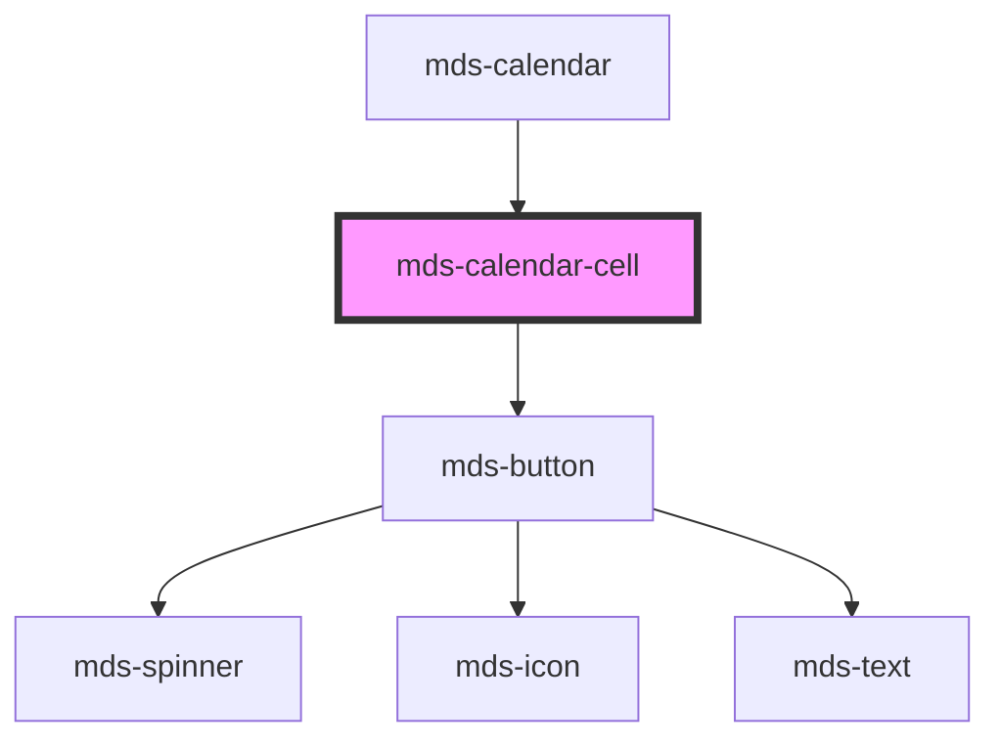

# mds-calendar-cell

<!-- Auto Generated Below -->

## Properties

| Property      | Attribute     | Description                                                    | Type                                                              | Default        |
| ------------- | ------------- | -------------------------------------------------------------- | ----------------------------------------------------------------- | -------------- |
| `date`        | `date`        | Specifies the date of the cell                                 | `string \| undefined`                                             | `undefined`    |
| `disabled`    | `disabled`    | Specifies if the cell is disabled                              | `boolean \| undefined`                                            | `undefined`    |
| `label`       | `label`       | Specifies the label of the cell                                | `string \| undefined`                                             | `undefined`    |
| `month`       | `month`       | Specifies if the current month or a weekend                    | `"current" \| "other" \| "weekend" \| undefined`                  | `'current'`    |
| `orientation` | `orientation` | Specifies the selection orientation of the cell                | `"both" \| "horizontal" \| "vertical" \| undefined`               | `'horizontal'` |
| `preview`     | `preview`     | Specifies if the selection is a preview or the final selection | `boolean \| undefined`                                            | `false`        |
| `selection`   | `selection`   | Specifies the point of selection of the cell                   | `"end" \| "middle" \| "none" \| "single" \| "start" \| undefined` | `undefined`    |
| `today`       | `today`       | Specifies if the cell is today                                 | `boolean \| undefined`                                            | `undefined`    |

## CSS Custom Properties

| Name                                                                        | Description                                               |
| --------------------------------------------------------------------------- | --------------------------------------------------------- |
| `--mds-calendar-cell-background`                                            | Background of calendar cells.                             |
| `--mds-calendar-cell-boundaries-background`                                 | Background for selection boundaries.                      |
| `--mds-calendar-cell-boundaries-color`                                      | Color for selection boundary lines.                       |
| `--mds-calendar-cell-boundaries-padding`                                    | Padding inside selection boundaries.                      |
| `--mds-calendar-cell-color`                                                 | Text color of calendar cells.                             |
| `--mds-calendar-cell-disabled-background`                                   | Background for disabled days.                             |
| `--mds-calendar-cell-disabled-color`                                        | Text color for disabled days.                             |
| `--mds-calendar-cell-other-month-background`                                | Background of days from adjacent months.                  |
| `--mds-calendar-cell-other-month-color`                                     | Text color of days from adjacent months.                  |
| `--mds-calendar-cell-preselection-current-month-background`                 | Background for preselected days (current month).          |
| `--mds-calendar-cell-preselection-current-month-boundaries-background`      | Boundary background for preselected days (current month). |
| `--mds-calendar-cell-preselection-current-month-boundaries-color`           | Boundary color for preselected days (current month).      |
| `--mds-calendar-cell-preselection-current-month-color`                      | Text color for preselected days (current month).          |
| `--mds-calendar-cell-preselection-other-month-background`                   | Background for preselected days (other months).           |
| `--mds-calendar-cell-preselection-other-month-boundaries-background`        | Boundary background for preselected days (other months).  |
| `--mds-calendar-cell-preselection-other-month-boundaries-color`             | Boundary color for preselected days (other months).       |
| `--mds-calendar-cell-preselection-other-month-color`                        | Text color for preselected days (other months).           |
| `--mds-calendar-cell-preselection-today-background`                         | Background for today's date in preselection state.        |
| `--mds-calendar-cell-preselection-today-color`                              | Text color for today's date in preselection state.        |
| `--mds-calendar-cell-selection-boundaries-border-radius`                    | Border radius for day selection boundaries.               |
| `--mds-calendar-cell-selection-current-month-background`                    | Background for selected days (current month).             |
| `--mds-calendar-cell-selection-current-month-boundaries-background`         | Boundary background for selected days (current month).    |
| `--mds-calendar-cell-selection-current-month-boundaries-color`              | Boundary color for selected days (current month).         |
| `--mds-calendar-cell-selection-current-month-color`                         | Text color for selected days (current month).             |
| `--mds-calendar-cell-selection-current-month-weekend-background`            | Background for selected weekend days (current month).     |
| `--mds-calendar-cell-selection-current-month-weekend-boundaries-background` | Boundary background for selected weekend days.            |
| `--mds-calendar-cell-selection-current-month-weekend-boundaries-color`      | Boundary color for selected weekend days.                 |
| `--mds-calendar-cell-selection-current-month-weekend-color`                 | Text color for selected weekend days (current month).     |
| `--mds-calendar-cell-selection-other-month-background`                      | Background for selected days (other months).              |
| `--mds-calendar-cell-selection-other-month-boundaries-background`           | Boundary background for selected days (other months).     |
| `--mds-calendar-cell-selection-other-month-boundaries-color`                | Boundary color for selected days (other months).          |
| `--mds-calendar-cell-selection-other-month-color`                           | Text color for selected days (other months).              |
| `--mds-calendar-cell-selection-week-boundaries-border-radius`               | Border radius for week selection boundaries.              |
| `--mds-calendar-cell-size`                                                  | Size (width/height) of each day cell.                     |
| `--mds-calendar-cell-weekend-background`                                    | Background for weekend days.                              |
| `--mds-calendar-cell-weekend-color`                                         | Text colorfor weekend days.                               |

## Dependencies

### Used by

 - [mds-calendar](../mds-calendar)

### Depends on

- [mds-button](../mds-button)

### Graph

----------------------------------------------

Built with love @ [Gruppo Maggioli](https://www.maggioli.com) from [R&D Department](https://www.maggioli.com/it-it/chi-siamo/ricerca-sviluppo)
