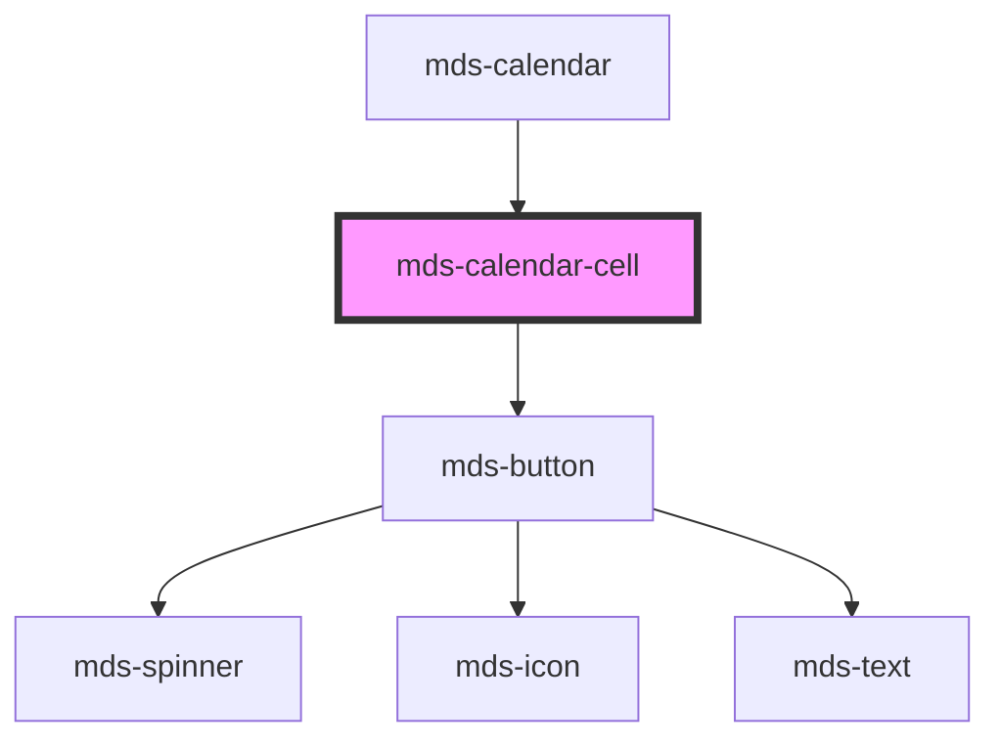

# mds-calendar-cell

<!-- Auto Generated Below -->

## Properties

| Property      | Attribute     | Description | Type                                                              | Default        |
| ------------- | ------------- | ----------- | ----------------------------------------------------------------- | -------------- |
| `date`        | `date`        |             | `string \| undefined`                                             | `undefined`    |
| `disabled`    | `disabled`    |             | `boolean \| undefined`                                            | `undefined`    |
| `month`       | `month`       |             | `"current" \| "other" \| "weekend" \| undefined`                  | `'current'`    |
| `orientation` | `orientation` |             | `"both" \| "horizontal" \| "vertical" \| undefined`               | `'horizontal'` |
| `preview`     | `preview`     |             | `boolean \| undefined`                                            | `false`        |
| `selection`   | `selection`   |             | `"end" \| "middle" \| "none" \| "single" \| "start" \| undefined` | `undefined`    |

## Dependencies

### Used by

 - [mds-calendar](../mds-calendar)

### Depends on

- [mds-button](../mds-button)

### Graph

----------------------------------------------

Built with love @ [Gruppo Maggioli](https://www.maggioli.com) from [R&D Department](https://www.maggioli.com/it-it/chi-siamo/ricerca-sviluppo)
