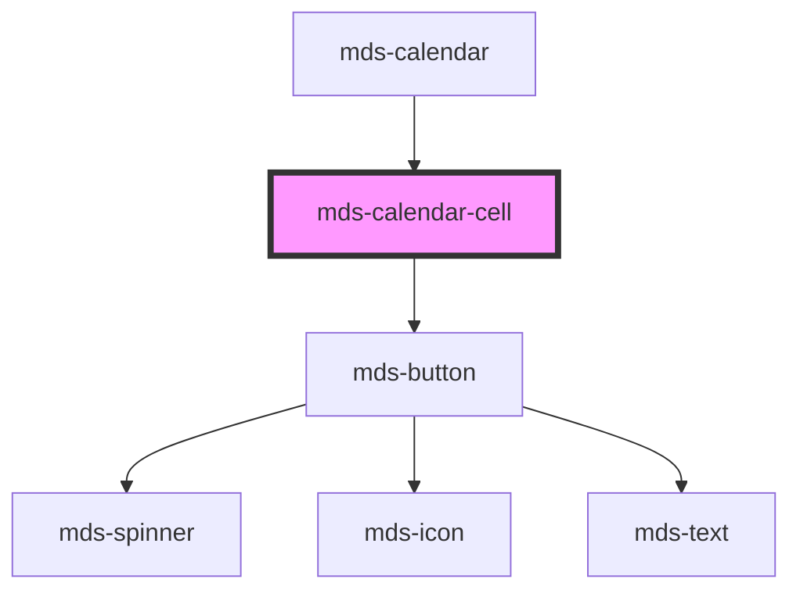

# mds-calendar-cell


<!-- Auto Generated Below -->


## Usage

### 1. Description

The `<mds-calendar-cell>` web component represents a single selectable day inside the [`<mds-calendar>`](../../mds-calendar) grid. It is a presentational child that renders the day number and exposes attributes the parent calendar drives to express the day's role and its position within a selection range.

#### Semantic Behavior

- **Compound child only**: It must be rendered as a child of `<mds-calendar>`, which generates one cell per day of the visible month grid; it is not used standalone, repeated outside that grid, or mixed with unrelated child types.
- **Parent-driven selection**: The cell holds no internal selection state. The parent calendar drives the `date`, `selection` and `preview` attributes to paint range boundaries and intermediate days; the cell only reflects what it is given.
- **No own events**: Clicks and hover are handled by the parent (range building, preview, and the `mdsCalendarChange` / `mdsCalendarPreselect` events from `<mds-calendar>`). The cell itself emits nothing.
- **Disabled state**: When `disabled` is set the day cannot be activated; the parent applies this for days outside the calendar's `min`/`max` range.
- **Today marker**: `today` is a presentational flag the parent sets on the cell matching the current date, used only for styling emphasis.

#### Properties & Visual Configurations

Most props are state mirrors written by the parent rather than knobs a consumer tunes directly.

- **`month`**: Distinguishes how the day relates to the displayed month - `current` for in-month days, `other` for leading/trailing days spilling in from adjacent months, and `weekend` for weekend styling.
- **`selection`**: Marks the cell's position within an active range - `start`, `end`, `middle`, or `single` (a one-day or collapsed range); absence (or `none`) means unselected. This is what produces the connected range visuals across adjacent cells.
- **`preview`**: When `true`, the current selection is a transient hover/preview rather than a committed selection, allowing distinct styling while the user is still choosing the second boundary.
- **`orientation`**: Selection-connector direction. The type allows `horizontal`, `vertical`, and `both`, but only `horizontal` is currently supported.
- **`date`**: The cell's ISO `YYYY-MM-DD` date; the parent matches against it to compute selection state, so it is required for the cell to participate in range logic.


### 2. Pattern

Correct and idiomatic ways to use the `<mds-calendar-cell>` component, ordered from most common to most specialized. Patterns assume a working knowledge of the compound-component rules documented in [`docs/COMPONENTS.md`](../../../../../../docs/COMPONENTS.md) and the generic stencil rules in [`projects/stencil/SPEC.md`](../../../../SPEC.md).

Because `<mds-calendar-cell>` is an internal subpart, every pattern below shows it composed inside its real parent [`<mds-calendar>`](../../mds-calendar).

#### Basic Cell Inside a Calendar

The typical form - let the parent drive all cell attributes. Providing `date` in ISO `YYYY-MM-DD` format is required for range logic to work.

```html
<mds-calendar start-date="2024-06-01" end-date="2024-06-15">
  <mds-calendar-cell date="2024-06-10" label="10" month="current"></mds-calendar-cell>
</mds-calendar>
```

#### Today Marker

Set the `today` boolean attribute on the cell that matches the current date. The parent drives this automatically; when implementing a custom grid use it to apply the primary-tinted styling that distinguishes today from other days.

```html
<mds-calendar>
  <mds-calendar-cell date="2024-06-05" label="5" month="current" today></mds-calendar-cell>
</mds-calendar>
```

#### Selection Range - Start, Middle, and End Positions

Use `selection` to express where a cell falls inside the active range. The `start` and `end` values add rounded caps; `middle` fills the span between them; `single` applies both caps for a one-day selection.

```html
<mds-calendar>
  <mds-calendar-cell date="2024-06-03" label="3" month="current" selection="start"></mds-calendar-cell>
  <mds-calendar-cell date="2024-06-04" label="4" month="current" selection="middle"></mds-calendar-cell>
  <mds-calendar-cell date="2024-06-05" label="5" month="current" selection="end"></mds-calendar-cell>
</mds-calendar>
```

#### Single-Day Selection

Use `selection="single"` when the selected range collapses to one day. This applies a fully rounded pill on both sides rather than an open-ended bar.

```html
<mds-calendar>
  <mds-calendar-cell date="2024-06-10" label="10" month="current" selection="single"></mds-calendar-cell>
</mds-calendar>
```

#### Preview (Hover) Selection

Set `preview` while the user is hovering toward the second boundary of a range. The cell renders distinct preview styling until the selection is committed.

```html
<mds-calendar>
  <mds-calendar-cell date="2024-06-07" label="7" month="current" selection="start" preview></mds-calendar-cell>
  <mds-calendar-cell date="2024-06-08" label="8" month="current" selection="middle" preview></mds-calendar-cell>
</mds-calendar>
```

#### Days from Adjacent Months

Use `month="other"` for the leading and trailing days that fill the grid but belong to the previous or next month. These cells are visually dimmed and, unless selected, are hidden by default via the CSS `visibility` cascade.

```html
<mds-calendar>
  <!-- last days of previous month, shown as padding -->
  <mds-calendar-cell date="2024-05-30" label="30" month="other"></mds-calendar-cell>
  <mds-calendar-cell date="2024-05-31" label="31" month="other"></mds-calendar-cell>
  <!-- first day of the displayed month -->
  <mds-calendar-cell date="2024-06-01" label="1" month="current"></mds-calendar-cell>
</mds-calendar>
```

#### Disabled Day

Set the `disabled` boolean attribute on days that cannot be selected - for example, dates outside the allowed `min`/`max` range. A disabled cell removes pointer events and applies the muted color token automatically.

```html
<mds-calendar min="2024-06-10">
  <mds-calendar-cell date="2024-06-03" label="3" month="current" disabled></mds-calendar-cell>
</mds-calendar>
```

#### Styling Customization

Override the documented `--mds-calendar-cell-*` CSS custom properties to retheme cells. Set them on the `<mds-calendar>` host or a parent selector so every cell in the grid inherits the change together. Use Magma color tokens via `rgb(var(--<token>))` so dark mode keeps working.

```css
.booking-calendar mds-calendar {
  --mds-calendar-cell-selection-current-month-background: rgb(var(--variant-success-04));
  --mds-calendar-cell-selection-current-month-color: rgb(var(--tone-neutral));
  --mds-calendar-cell-selection-boundaries-border-radius: var(--radius-sm);
  --mds-calendar-cell-weekend-color: rgb(var(--variant-error-04));
}
```


### 3. Antipattern

Common incorrect uses of `<mds-calendar-cell>`. Each entry pairs the wrong form with the right one and a one-line reason. System-wide rules (boolean-as-string, shadow piercing, Tailwind color utilities, raw native event listening) live in [`docs/COMPONENTS.md`](../../../../../../docs/COMPONENTS.md#system-level-anti-patterns) - they apply here too but are not repeated.

#### Do Not Use the Cell Outside Its Parent Calendar

`<mds-calendar-cell>` is a compound child and must be a direct slot child of [`<mds-calendar>`](../../mds-calendar). Used in isolation it loses the gap context that drives range connector geometry and the parent cannot coordinate selection across cells.

```html
<!-- 🚫 INCORRECT -->
<mds-calendar-cell date="2024-06-10" label="10" month="current" selection="single"></mds-calendar-cell>

<!-- ✅ CORRECT -->
<mds-calendar start-date="2024-06-10" end-date="2024-06-10">
  <mds-calendar-cell date="2024-06-10" label="10" month="current" selection="single"></mds-calendar-cell>
</mds-calendar>
```

#### Do Not Manage Selection State Locally in the Cell

The cell is purely presentational - it holds no internal state. Setting `selection` directly on isolated cells and keeping them in sync by hand duplicates the logic the parent calendar already owns and will diverge on re-renders.

```html
<!-- 🚫 INCORRECT: manually wiring selection outside mds-calendar -->
<div class="custom-grid">
  <mds-calendar-cell date="2024-06-03" label="3" selection="start"></mds-calendar-cell>
  <mds-calendar-cell date="2024-06-04" label="4" selection="middle"></mds-calendar-cell>
  <mds-calendar-cell date="2024-06-05" label="5" selection="end"></mds-calendar-cell>
</div>

<!-- ✅ CORRECT: let mds-calendar own range state and drive cell props -->
<mds-calendar start-date="2024-06-03" end-date="2024-06-05"></mds-calendar>
```

#### Do Not Set Boolean Attributes to the String "false"

`disabled`, `preview`, and `today` are boolean props. Any non-empty string is truthy in HTML - setting `disabled="false"` leaves the cell disabled. Remove the attribute entirely to turn it off.

```html
<!-- 🚫 INCORRECT -->
<mds-calendar-cell date="2024-06-10" label="10" disabled="false" preview="false"></mds-calendar-cell>

<!-- ✅ CORRECT -->
<mds-calendar-cell date="2024-06-10" label="10"></mds-calendar-cell>
```

#### Do Not Use an Invalid `month` Value for Weekend Styling

Weekend visual treatment comes from the `month="weekend"` value, not from a separate boolean attribute or a custom CSS class. Using `month="current"` on a weekend day loses the weekend color token.

```html
<!-- 🚫 INCORRECT: weekend day treated as a plain current-month day -->
<mds-calendar-cell date="2024-06-08" label="8" month="current" class="weekend"></mds-calendar-cell>

<!-- ✅ CORRECT: declare the cell as a weekend to activate weekend tokens -->
<mds-calendar-cell date="2024-06-08" label="8" month="weekend"></mds-calendar-cell>
```

#### Do Not Pierce the Shadow DOM to Style Internals

The only supported customization surface is the documented `--mds-calendar-cell-*` CSS custom properties. Targeting the internal `.action`, `.inner-dot`, or `.area-background` parts via `>>>` or undocumented class selectors couples your code to the implementation and will break on minor releases.

```css
/* 🚫 INCORRECT */
mds-calendar-cell >>> .area-background {
  background: hotpink;
}
mds-calendar-cell >>> .inner-dot {
  display: none;
}

/* ✅ CORRECT */
mds-calendar mds-calendar-cell {
  --mds-calendar-cell-selection-current-month-background: rgb(var(--variant-primary-04));
  --mds-calendar-cell-selection-boundaries-border-radius: var(--radius-sm);
}
```

#### Do Not Omit the `date` Attribute

Without `date` the parent calendar cannot match the cell against the selected range, so `selection`, `today`, and `disabled` computations all fail silently. Always provide the ISO `YYYY-MM-DD` string.

```html
<!-- 🚫 INCORRECT: parent cannot resolve range position -->
<mds-calendar-cell label="10" month="current"></mds-calendar-cell>

<!-- ✅ CORRECT -->
<mds-calendar-cell date="2024-06-10" label="10" month="current"></mds-calendar-cell>
```


## Properties

| Property      | Attribute     | Description                                                    | Type                                                              | Default        |
| ------------- | ------------- | -------------------------------------------------------------- | ----------------------------------------------------------------- | -------------- |
| `date`        | `date`        | Specifies the date of the cell                                 | `string \| undefined`                                             | `undefined`    |
| `disabled`    | `disabled`    | Specifies if the cell is disabled                              | `boolean \| undefined`                                            | `undefined`    |
| `label`       | `label`       | Specifies the label of the cell                                | `string \| undefined`                                             | `undefined`    |
| `month`       | `month`       | Specifies if the current month or a weekend                    | `"current" \| "other" \| "weekend" \| undefined`                  | `'current'`    |
| `orientation` | `orientation` | Specifies the selection orientation of the cell                | `"both" \| "horizontal" \| "vertical" \| undefined`               | `'horizontal'` |
| `preview`     | `preview`     | Specifies if the selection is a preview or the final selection | `boolean \| undefined`                                            | `false`        |
| `selection`   | `selection`   | Specifies the point of selection of the cell                   | `"end" \| "middle" \| "none" \| "single" \| "start" \| undefined` | `undefined`    |
| `today`       | `today`       | Specifies if the cell is today                                 | `boolean \| undefined`                                            | `undefined`    |


## CSS Custom Properties

| Name                                                                        | Description                                               |
| --------------------------------------------------------------------------- | --------------------------------------------------------- |
| `--mds-calendar-cell-background`                                            | Background of calendar cells.                             |
| `--mds-calendar-cell-boundaries-background`                                 | Background for selection boundaries.                      |
| `--mds-calendar-cell-boundaries-color`                                      | Color for selection boundary lines.                       |
| `--mds-calendar-cell-boundaries-padding`                                    | Padding inside selection boundaries.                      |
| `--mds-calendar-cell-color`                                                 | Text color of calendar cells.                             |
| `--mds-calendar-cell-disabled-background`                                   | Background for disabled days.                             |
| `--mds-calendar-cell-disabled-color`                                        | Text color for disabled days.                             |
| `--mds-calendar-cell-other-month-background`                                | Background of days from adjacent months.                  |
| `--mds-calendar-cell-other-month-color`                                     | Text color of days from adjacent months.                  |
| `--mds-calendar-cell-preselection-current-month-background`                 | Background for preselected days (current month).          |
| `--mds-calendar-cell-preselection-current-month-boundaries-background`      | Boundary background for preselected days (current month). |
| `--mds-calendar-cell-preselection-current-month-boundaries-color`           | Boundary color for preselected days (current month).      |
| `--mds-calendar-cell-preselection-current-month-color`                      | Text color for preselected days (current month).          |
| `--mds-calendar-cell-preselection-other-month-background`                   | Background for preselected days (other months).           |
| `--mds-calendar-cell-preselection-other-month-boundaries-background`        | Boundary background for preselected days (other months).  |
| `--mds-calendar-cell-preselection-other-month-boundaries-color`             | Boundary color for preselected days (other months).       |
| `--mds-calendar-cell-preselection-other-month-color`                        | Text color for preselected days (other months).           |
| `--mds-calendar-cell-preselection-today-background`                         | Background for today's date in preselection state.        |
| `--mds-calendar-cell-preselection-today-color`                              | Text color for today's date in preselection state.        |
| `--mds-calendar-cell-selection-boundaries-border-radius`                    | Border radius for day selection boundaries.               |
| `--mds-calendar-cell-selection-current-month-background`                    | Background for selected days (current month).             |
| `--mds-calendar-cell-selection-current-month-boundaries-background`         | Boundary background for selected days (current month).    |
| `--mds-calendar-cell-selection-current-month-boundaries-color`              | Boundary color for selected days (current month).         |
| `--mds-calendar-cell-selection-current-month-color`                         | Text color for selected days (current month).             |
| `--mds-calendar-cell-selection-current-month-weekend-background`            | Background for selected weekend days (current month).     |
| `--mds-calendar-cell-selection-current-month-weekend-boundaries-background` | Boundary background for selected weekend days.            |
| `--mds-calendar-cell-selection-current-month-weekend-boundaries-color`      | Boundary color for selected weekend days.                 |
| `--mds-calendar-cell-selection-current-month-weekend-color`                 | Text color for selected weekend days (current month).     |
| `--mds-calendar-cell-selection-other-month-background`                      | Background for selected days (other months).              |
| `--mds-calendar-cell-selection-other-month-boundaries-background`           | Boundary background for selected days (other months).     |
| `--mds-calendar-cell-selection-other-month-boundaries-color`                | Boundary color for selected days (other months).          |
| `--mds-calendar-cell-selection-other-month-color`                           | Text color for selected days (other months).              |
| `--mds-calendar-cell-selection-week-boundaries-border-radius`               | Border radius for week selection boundaries.              |
| `--mds-calendar-cell-size`                                                  | Size (width/height) of each day cell.                     |
| `--mds-calendar-cell-weekend-background`                                    | Background for weekend days.                              |
| `--mds-calendar-cell-weekend-color`                                         | Text colorfor weekend days.                               |


## Dependencies

### Used by

 - [mds-calendar](../mds-calendar)

### Depends on

- [mds-button](../mds-button)

### Graph


----------------------------------------------

Built with love @ [Gruppo Maggioli](https://www.maggioli.com) from [R&D Department](https://www.maggioli.com/it-it/chi-siamo/ricerca-sviluppo)
