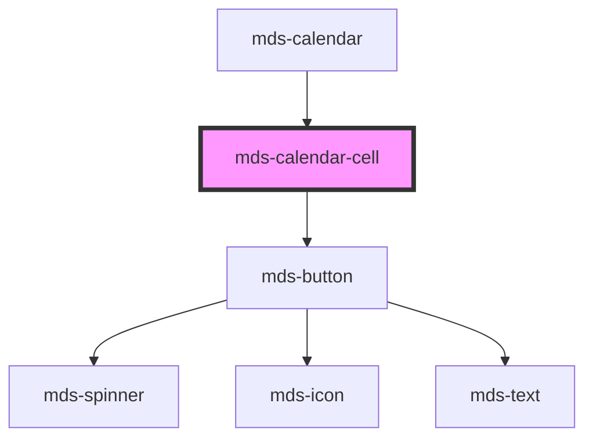

# mds-calendar-cell


<!-- Auto Generated Below -->


## Usage

### 1. Description

The `<mds-calendar-cell>` web component represents a single selectable day inside the [`<mds-calendar>`](../../mds-calendar) grid. It is a presentational child that renders the day number and exposes attributes the parent calendar drives to express the day's role and its position within a selection range.

#### Semantic Behavior

- **Compound child only**: It is rendered only by `<mds-calendar>`, which generates one cell per day of the visible month grid inside its own shadow DOM (the calendar has no default slot): consumers never write it, neither standalone nor as a child of the calendar.
- **Parent-driven selection**: The cell holds no internal selection state. The parent calendar drives the `date`, `selection` and `preview` attributes to paint range boundaries and intermediate days; the cell only reflects what it is given.
- **No own events**: Clicks and hover are handled by the parent (range building, preview, and the `mdsCalendarChange` / `mdsCalendarPreselect` events from `<mds-calendar>`). The cell itself emits nothing.
- **Disabled state**: When `disabled` is set the day cannot be activated; the parent applies this for days outside the calendar's `min`/`max` range.
- **Today marker**: `today` is a presentational flag the parent sets on the cell matching the current date, used only for styling emphasis.

#### Properties & Visual Configurations

Most props are state mirrors written by the parent rather than knobs a consumer tunes directly.

- **`month`**: Distinguishes how the day relates to the displayed month - `current` for in-month days, `other` for leading/trailing days spilling in from adjacent months. The type also allows `weekend`, which the calendar never sets and which has no styling of its own: the weekend color comes from the cell's position (the last two columns of the week).
- **`selection`**: Marks the cell's position within an active range - `start`, `end`, `middle`, or `single` (a one-day or collapsed range); absence means unselected (`none` is styled like a selected cell, so the calendar removes the attribute instead). This is what produces the connected range visuals across adjacent cells.
- **`preview`**: When `true`, the current selection is a transient hover/preview rather than a committed selection, allowing distinct styling while the user is still choosing the second boundary.
- **`orientation`**: Selection-connector direction. The type allows `horizontal`, `vertical`, and `both`, but only `horizontal` is currently supported.
- **`date`**: The cell's ISO `YYYY-MM-DD` date; the parent matches against it to compute selection state, so it is required for the cell to participate in range logic.


### 2. Pattern

Correct and idiomatic ways to use the `<mds-calendar-cell>` component, ordered from most common to most specialized. Patterns assume a working knowledge of the shared component rules in [`docs/agents/conventions.md`](../../../../../../docs/agents/conventions.md).

`<mds-calendar-cell>` is an internal subpart: its real parent [`<mds-calendar>`](../../mds-calendar) renders one cell per day inside its own shadow DOM and has no default slot, so cells written as its children are never shown. Every pattern below shows the `<mds-calendar>` markup that puts the cells in each state.

#### Basic Cell Inside a Calendar

The typical form - let the parent render the cells and drive all their attributes (`date` in ISO `YYYY-MM-DD` format, `label`, `month`, `selection`, ...).

```html
<mds-calendar start-date="2024-06-01" end-date="2024-06-15"></mds-calendar>
```

#### Today Marker

The parent sets the `today` boolean attribute on the cell that matches the current date, which applies the accent-tinted styling that distinguishes today from other days. Set `hide-today` on the calendar to drop it.

```html
<mds-calendar></mds-calendar>
<mds-calendar hide-today></mds-calendar>
```

#### Selection Range - Start, Middle, and End Positions

The parent sets `selection` to express where a cell falls inside the active range. The `start` and `end` values add rounded caps; `middle` fills the span between them; `single` applies both caps for a one-day selection.

```html
<!-- 3 June: start, 4 June: middle, 5 June: end -->
<mds-calendar start-date="2024-06-03" end-date="2024-06-05"></mds-calendar>
```

#### Single-Day Selection

The parent uses `selection="single"` for the day of a single picker, for a range whose two ends are the same day, and for the start of a range still waiting for its end. This applies a fully rounded pill on both sides rather than an open-ended bar.

```html
<mds-calendar single-picker start-date="2024-06-10"></mds-calendar>
```

#### Preview (Hover) Selection

While the user hovers toward the second boundary of a range, the parent sets `preview` on the cells between the start and the hovered day. The cells render distinct preview styling until the selection is committed.

```html
<!-- range mode with a start and no end: hovering a later day previews the range -->
<mds-calendar start-date="2024-06-07"></mds-calendar>
```

#### Days from Adjacent Months

The parent renders the leading and trailing days that fill the grid but belong to the previous or next month with `month="other"`. Inside `<mds-calendar>` these cells are dimmed and visible; set `--mds-calendar-cell-other-month-visibility: hidden` on the calendar to hide them.

```html
<mds-calendar view-date="2024-06-01" style="--mds-calendar-cell-other-month-visibility: hidden;"></mds-calendar>
```

#### Disabled Day

The parent sets the `disabled` boolean attribute on days that cannot be selected - the dates outside its `min`/`max` range. A disabled cell removes pointer events and applies the disabled color (`--mds-calendar-cell-disabled-color`) automatically.

```html
<mds-calendar view-date="2024-06-01" min="2024-06-10"></mds-calendar>
```

#### Styling Customization

The `--mds-calendar-cell-*` CSS custom properties are declared, with their defaults, on each cell inside the calendar's shadow DOM: a value set on the `<mds-calendar>` host or on a parent selector does not reach them. From outside, adjust the cells through the custom properties `<mds-calendar>` documents for them; the colors follow the semantic roles of the theme.

```css
.booking-calendar mds-calendar {
  --mds-calendar-cell-gap: calc(var(--spacing) * 100);
  --mds-calendar-cell-other-month-visibility: hidden;
}
```


### 3. Antipattern

Common incorrect uses of `<mds-calendar-cell>`. Each entry pairs the wrong form with the right one and a one-line reason. System-wide rules (boolean-as-string, shadow piercing, Tailwind color utilities, raw native event listening) live in [`docs/agents/anti-patterns.md`](../../../../../../docs/agents/anti-patterns.md) - they apply here too but are not repeated.

#### Do Not Use the Cell Outside Its Parent Calendar

`<mds-calendar-cell>` is rendered by [`<mds-calendar>`](../../mds-calendar) itself, one per day inside its shadow DOM. Used in isolation it loses the gap context that drives range connector geometry and no parent coordinates selection across cells; slotted into `<mds-calendar>`, which has no default slot, it is never shown. Let the calendar generate the cells.

```html
<!-- INCORRECT -->
<mds-calendar-cell date="2024-06-10" label="10" month="current" selection="single"></mds-calendar-cell>

<!-- CORRECT -->
<mds-calendar single-picker start-date="2024-06-10"></mds-calendar>
```

#### Do Not Manage Selection State Locally in the Cell

The cell is purely presentational - it holds no internal state. Setting `selection` directly on isolated cells and keeping them in sync by hand duplicates the logic the parent calendar already owns and will diverge on re-renders.

```html
<!-- INCORRECT: manually wiring selection outside mds-calendar -->
<div class="custom-grid">
  <mds-calendar-cell date="2024-06-03" label="3" selection="start"></mds-calendar-cell>
  <mds-calendar-cell date="2024-06-04" label="4" selection="middle"></mds-calendar-cell>
  <mds-calendar-cell date="2024-06-05" label="5" selection="end"></mds-calendar-cell>
</div>

<!-- CORRECT: let mds-calendar own range state and drive cell props -->
<mds-calendar start-date="2024-06-03" end-date="2024-06-05"></mds-calendar>
```

#### Do Not Pierce the Shadow DOM to Style Internals

The cells live in the shadow DOM of `<mds-calendar>`, and their own `--mds-calendar-cell-*` properties are declared on each cell, so from outside they are adjusted only through the custom properties `<mds-calendar>` documents for them. Targeting the internal `.action`, `.inner-dot`, or `.area-background` elements via `>>>` or undocumented class selectors couples your code to the implementation and will break on minor releases.

```css
/* INCORRECT */
mds-calendar-cell >>> .area-background {
  background: hotpink;
}
mds-calendar-cell >>> .inner-dot {
  display: none;
}

/* CORRECT */
mds-calendar {
  --mds-calendar-cell-gap: calc(var(--spacing) * 100);
  --mds-calendar-cell-other-month-visibility: hidden;
}
```


## Properties

| Property      | Attribute     | Description                                                    | Type                                                              | Default        |
| ------------- | ------------- | -------------------------------------------------------------- | ----------------------------------------------------------------- | -------------- |
| `date`        | `date`        | Specifies the date of the cell                                 | `string \| undefined`                                             | `undefined`    |
| `disabled`    | `disabled`    | Specifies if the cell is disabled                              | `boolean \| undefined`                                            | `undefined`    |
| `label`       | `label`       | Specifies the label of the cell                                | `string \| undefined`                                             | `undefined`    |
| `month`       | `month`       | Specifies if the current month or a weekend                    | `"current" \| "other" \| "weekend" \| undefined`                  | `'current'`    |
| `orientation` | `orientation` | Specifies the selection orientation of the cell                | `"both" \| "horizontal" \| "vertical" \| undefined`               | `'horizontal'` |
| `preview`     | `preview`     | Specifies if the selection is a preview or the final selection | `boolean \| undefined`                                            | `false`        |
| `selection`   | `selection`   | Specifies the point of selection of the cell                   | `"end" \| "middle" \| "none" \| "single" \| "start" \| undefined` | `undefined`    |
| `today`       | `today`       | Specifies if the cell is today                                 | `boolean \| undefined`                                            | `undefined`    |


## CSS Custom Properties

| Name                                                                        | Description                                               |
| --------------------------------------------------------------------------- | --------------------------------------------------------- |
| `--mds-calendar-cell-background`                                            | Background of calendar cells.                             |
| `--mds-calendar-cell-boundaries-background`                                 | Background for selection boundaries.                      |
| `--mds-calendar-cell-boundaries-color`                                      | Color for selection boundary lines.                       |
| `--mds-calendar-cell-boundaries-padding`                                    | Padding inside selection boundaries.                      |
| `--mds-calendar-cell-color`                                                 | Text color of calendar cells.                             |
| `--mds-calendar-cell-disabled-background`                                   | Background for disabled days.                             |
| `--mds-calendar-cell-disabled-color`                                        | Text color for disabled days.                             |
| `--mds-calendar-cell-other-month-background`                                | Background of days from adjacent months.                  |
| `--mds-calendar-cell-other-month-color`                                     | Text color of days from adjacent months.                  |
| `--mds-calendar-cell-preselection-current-month-background`                 | Background for preselected days (current month).          |
| `--mds-calendar-cell-preselection-current-month-boundaries-background`      | Boundary background for preselected days (current month). |
| `--mds-calendar-cell-preselection-current-month-boundaries-color`           | Boundary color for preselected days (current month).      |
| `--mds-calendar-cell-preselection-current-month-color`                      | Text color for preselected days (current month).          |
| `--mds-calendar-cell-preselection-other-month-background`                   | Background for preselected days (other months).           |
| `--mds-calendar-cell-preselection-other-month-boundaries-background`        | Boundary background for preselected days (other months).  |
| `--mds-calendar-cell-preselection-other-month-boundaries-color`             | Boundary color for preselected days (other months).       |
| `--mds-calendar-cell-preselection-other-month-color`                        | Text color for preselected days (other months).           |
| `--mds-calendar-cell-preselection-today-background`                         | Background for today's date in preselection state.        |
| `--mds-calendar-cell-preselection-today-color`                              | Text color for today's date in preselection state.        |
| `--mds-calendar-cell-selection-boundaries-border-radius`                    | Border radius for day selection boundaries.               |
| `--mds-calendar-cell-selection-current-month-background`                    | Background for selected days (current month).             |
| `--mds-calendar-cell-selection-current-month-boundaries-background`         | Boundary background for selected days (current month).    |
| `--mds-calendar-cell-selection-current-month-boundaries-color`              | Boundary color for selected days (current month).         |
| `--mds-calendar-cell-selection-current-month-color`                         | Text color for selected days (current month).             |
| `--mds-calendar-cell-selection-current-month-weekend-background`            | Background for selected weekend days (current month).     |
| `--mds-calendar-cell-selection-current-month-weekend-boundaries-background` | Boundary background for selected weekend days.            |
| `--mds-calendar-cell-selection-current-month-weekend-boundaries-color`      | Boundary color for selected weekend days.                 |
| `--mds-calendar-cell-selection-current-month-weekend-color`                 | Text color for selected weekend days (current month).     |
| `--mds-calendar-cell-selection-other-month-background`                      | Background for selected days (other months).              |
| `--mds-calendar-cell-selection-other-month-boundaries-background`           | Boundary background for selected days (other months).     |
| `--mds-calendar-cell-selection-other-month-boundaries-color`                | Boundary color for selected days (other months).          |
| `--mds-calendar-cell-selection-other-month-color`                           | Text color for selected days (other months).              |
| `--mds-calendar-cell-selection-week-boundaries-border-radius`               | Border radius for week selection boundaries.              |
| `--mds-calendar-cell-size`                                                  | Size (width/height) of each day cell.                     |
| `--mds-calendar-cell-weekend-background`                                    | Background for weekend days.                              |
| `--mds-calendar-cell-weekend-color`                                         | Text colorfor weekend days.                               |


## Dependencies

### Used by

 - [mds-calendar](../mds-calendar)

### Depends on

- [mds-button](../mds-button)

### Graph

```mermaid
graph TD;
  mds-calendar-cell --> mds-button
  mds-button --> mds-spinner
  mds-button --> mds-icon
  mds-button --> mds-text
  mds-calendar --> mds-calendar-cell
  style mds-calendar-cell fill:#f9f,stroke:#333,stroke-width:4px
```

----------------------------------------------

Built with love @ [Gruppo Maggioli](https://www.maggioli.com) from [R&D Department](https://www.maggioli.com/it-it/chi-siamo/ricerca-sviluppo)
