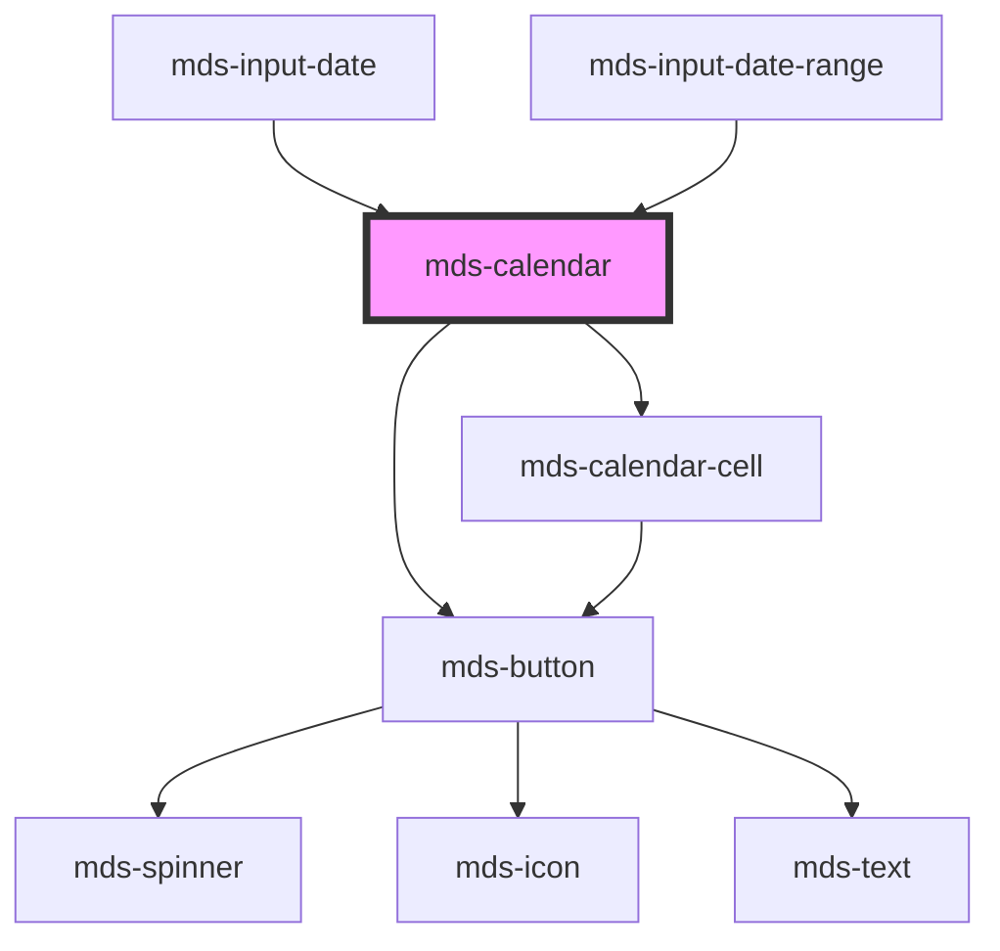

# mds-calendar

<!-- Auto Generated Below -->

## Properties

| Property      | Attribute      | Description | Type             | Default |
| ------------- | -------------- | ----------- | ---------------- | ------- |
| `endDate`     | `end-date`     |             | `null \| string` | `null`  |
| `max`         | `max`          |             | `null \| string` | `null`  |
| `min`         | `min`          |             | `null \| string` | `null`  |
| `rangePicker` | `range-picker` |             | `boolean`        | `true`  |
| `startDate`   | `start-date`   |             | `null \| string` | `null`  |

## Events

| Event          | Description | Type                                                                 |
| -------------- | ----------- | -------------------------------------------------------------------- |
| `datesEmitter` |             | `CustomEvent<{ startDate: string; endDate?: string \| undefined; }>` |

## Methods

### `updateLang() => Promise<void>`

#### Returns

Type: `Promise<void>`

## Dependencies

### Used by

 - [mds-input-date](../mds-input-date)
 - [mds-input-date-range](../mds-input-date-range)

### Depends on

- [mds-button](../mds-button)
- [mds-calendar-cell](../mds-calendar-cell)

### Graph

----------------------------------------------

Built with love @ [Gruppo Maggioli](https://www.maggioli.com) from [R&D Department](https://www.maggioli.com/it-it/chi-siamo/ricerca-sviluppo)
